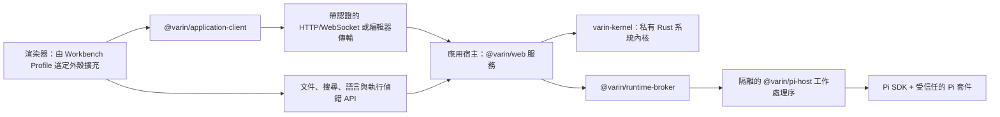

[English](../../README.md) | [简体中文](README.zh-CN.md) | 繁體中文 | [Français](README.fr.md) | [日本語](README.ja.md)

# Varin

<p align="center">
  
</p>

[](https://github.com/Youzini-afk/Varin/actions/workflows/ci.yml)
[](https://github.com/Youzini-afk/Varin/actions/workflows/docker.yml)
[](../../LICENSE)

**獨立的 Agent 工作台與完整 Harness，面向程式設計、研究和其他專案工作：以本地與桌面體驗為中心，
同時涵蓋 Web、編輯器與行動端。**

它內建 [Pi](https://github.com/earendil-works/pi) 執行時期；模型與提供商堆疊、工作階段樹、套件管理器與擴充模型
仍由 Pi 提供，而 Varin 負責周圍的工具環境、工作狀態、復原、檢索、上下文策略、任務治理與工作台介面。
它直接使用 Pi 的公開 SDK，而不是擷取終端輸出。

它的介面不是固定外殼。Varin 內建兩套官方工作形態：**Agent Workspace** 以工作階段、任務與
上下文為中心，**IDE Workbench** 以編輯器、搜尋、Git、診斷與偵錯為中心，並把智慧體作為可停駐
面板。兩者都是普通的 Varin 擴充，由 Workbench Profile 選擇，因此你可以整體替換其中任意一套，
也可以只替換其中某一個部分。

> [!IMPORTANT]
> Varin 目前仍處於 1.0 之前的活躍開發階段。各產品端與私有執行時協定會同步演進，較舊組建
> 不保證與較新組建互通。請備份重要工作區；長期部署時，請固定到已經驗證的映像摘要。

## 產品介面

以下截圖使用隔離的 `demo-workspace` 與匿名範例檔案產生。

### Agent Workspace

專案與工作階段始終可見，主區域將目前的智慧體、上下文工具與輸入框集中在同一個工作空間中。


### IDE Workbench

IDE Profile 將工作區導覽與編輯器基礎設施，和完整的 Pi 智慧體並排組合，而不是把聊天拆成另一個應用。


### 行動端工作空間

回應式介面在手機螢幕上保留同一套專案、智慧體控制、上下文介面與輸入框。

<p align="center">
  
</p>

## Varin 提供什麼

### 受治理的 Agent Harness

- **Thread、Run 與不可變工作狀態：** 工作被組織為 Thread 與 Run，其檔案變更以不可變 root 發布。
  智慧體在隔離的虛擬或具體化工作區中起草，再把經過審閱的結果合併回來，而不是對你的檢出目錄
  隨手修改。
- **唯一的權限門：** 單個 `tool_call` 確認涵蓋 harness 工具、Pi 內建工具、MCP 工具、套件工具與
  巢狀執行緒工具。工作階段授權始終繫結在獲批的工具、動作、工作區、路徑與網路目標上。
- **跟隨智慧體的復原：** Host 擁有的復原服務把智慧體的變更與你自己的編輯記入同一組檢查點，
  受影響檔案回退、復原/重做與當機復原可以跨越多次工具呼叫運作，無需掃描整個工作區。
- **原生的工具環境：** shell 監督器執行真實 PTY，支援自動轉入背景、`get_output`、
  `write_to_process` 與 `kill_shell`；`edit`/`write`/`apply_patch` 附帶編輯後診斷與按路徑租約；
  過長的結果變成可分頁的 `OutputRef`；套件管理器輸出按命令整理，而不是原樣傾倒。

### 上下文、檢索與知識

- **結構化上下文組裝：** Zone 2 層把觀察到的工作區事實——你的編輯、終端命令、診斷、Git 狀態——
  注入上下文，而不改動系統提示詞。memory keeper 以 off/assist/takeover 三種模式維護持久記憶，
  Host 側壓縮可以接管摘要工作且不產生額外模型呼叫。
- **分層檢索：** 精確比對用 `grep`；分組發現用 `explore`/`related`，由符號圖與 tree-sitter
  結構支撐；持久記憶用 `recall` 查詢每個工作區的知識庫，可選 embedding 與重排。每一層都可以
  直接使用，不要求上一層先失敗。
- **原生 Web 工具：** `webfetch` 帶 SSRF 與網域策略、正文擷取、PDF 與快取；`websearch` 走使用者
  設定的提供商；來源面板；桌面端離屏頁面渲染。

### 真正的程式設計工作空間

- **Pi 原生對話：** 支援串流回應、分支、工作階段樹導覽、壓縮、引導與後續訊息佇列、模型與思考
  級別選擇，以及工作階段重新命名、封存、還原與刪除。
- **工作區工具：** 檔案、Diff、Git、工作樹、終端、SSH 主機、遠端執行個體、程式碼評論與編輯器
  上下文，共用目前的 Pi 工作階段及其工作目錄。
- **編輯器級基礎設施：** 一套帶版本的文件權威與真實的衝突處理；桌面/Web 的 Agent 與 IDE 共用
  Monaco model、編輯器群組、工作區搜尋、宿主側語言伺服器與標準偵錯配接器，行動/嵌入式編輯器
  透過輕量 CodeMirror adapter 接入同一文件權威。智慧體的修改會與你未儲存的緩衝區協調，而不是
  直接覆蓋。
- **自訂提供商：** 設定 Pi 原生的提供商分層、認證、模型探索與自訂端點，不把憑證複製到
  渲染處理序儲存中。

### 可重組，涵蓋多端

- **不另造一套外掛系統：** 可以安裝、更新、移除與檢查 Pi `PackageManager` 接受的任意套件。
  尚未專門適配的擴充仍可使用通用的命令、工具、條目、通知與 UI 橋接。
- **常用外掛的專用設定介面：** 已維護的外掛擁有針對性的 GUI，同時繼續以外掛自己的原生
  JSON/JSONC 檔案、命令、資料庫與遷移邏輯為權威。
- **可重組的工作台：** 選擇 Agent 或 IDE Profile，也可以自建。既能替換整個外殼，也能只替換導覽、
  編輯器、面板、Composer、Timeline 或狀態列，並混用官方與社群貢獻。切換是即時的，不重新整理文件、
  不重啟 Pi 執行時、不遺失共用的工作區狀態。
- **多個產品端：** Electron、Web 與 Capacitor 行動端外殼共用一套 React UI，並透過明確的執行時
  能力與宿主通訊。
- **雲端與遠端運行：** 支援帶認證的 WebSocket、Relay/隧道、多架構容器，以及經過健康檢查和
  可回復的原子 SSH 部署。

## 已維護的擴充整合

Varin 不會 fork 這些擴充，也不會複製它們的私有狀態。已維護的配接器只消費各擴充公開的命令、
事件、設定檔案與能力協定——包括子智慧體集群、上下文管理、工作區歷史、MCP 服務、Web 存取、
記憶系統、背景任務與 LSP/工具鏈設定——因此外掛可以繼續獨立更新。

每個擴充的整合面——Varin 讀取或呼叫哪些命令、事件與原生設定，以及哪些檔案仍歸外掛所有——記錄在
[擴充整合契約](../../docs/design/extension-compatibility.md)。Varin 不逐版本認證外掛與 Pi 的搭配。

## 開發 Varin 擴充

Varin 應用擴充與 Pi 外掛是兩個獨立的產品物件：前者擴展 Varin 的工作台、頁面與可信宿主，
後者執行於 Pi 智慧體中。規劃中的 npm 工具鏈不要求檢出 Varin 原始碼，也不要求擴充匯入產品私有 UI；
`@varin/*` 套件尚未發布：

- `@varin/extension-contract`：清單、貢獻、服務、路由與探索協定及 JSON Schema；
- `@varin/extension-sdk`：與 UI 框架無關的 Surface、隔離執行域與 Host 開發 API；
- `@varin/extension-react`：可選的 React 19 配接器；
- `@varin/extension-surface`：供進階測試與替代宿主使用的底層生命週期與註冊表；
- `@varin/extension-cli`：專案初始化、檢查、組建與一致性測試。

這些套件發布後，可以用以下命令建立完整的擴充專案：

```sh
npx @varin/extension-cli init ./my-extension --id dev.example.my-extension --name "My Extension"
cd my-extension
npm install
npx varin-extension build
npx varin-extension test
```

完整的清單格式、能力、生命週期、儲存、發布與測試說明見
[Varin 擴充開發指南](../../docs/ops/varin-extension-authoring.md)。

## 下載桌面版

目前尚未發布 Varin 桌面套件。[GitHub Releases](https://github.com/Youzini-afk/Varin/releases) 頁面保留歷史
資產；在 Varin 套件發布前，請使用下方的原始碼或 Docker 方式。

## 從原始碼開始

### 環境需求

- Node.js 22.19 或更高版本；Node.js 24 是目前支援的原始碼開發基線
- Bun 1.3.14
- 與 `kernel/rust-toolchain.toml` 相符的 Rust 工具鏈（rustup 會自動選擇）
- Git
- 在 Windows 上執行 Pi shell 工具時，需要 Git for Windows 與 Git Bash

Rust 系統內核是必需的執行時元件，不是可選加速器。原始碼開發模式下，若沒有已暫存的二進位檔，
Host 會透過 Cargo 直接執行它；`bun run kernel:build` 產出套件配置要求的、附 manifest 校驗的
發行可執行檔。

Varin 內建捆綁的 Pi 執行時，並透過 Runtime Manager 探索使用者級 Pi 安裝，由它選擇、安裝或僅向上
升級 Pi；完成真實 Host 握手後即可使用，無需重啟 Varin。Electron 內建執行應用所需的 Node 環境，
但 Pi 本身仍作為獨立的使用者級工具存在。Windows、Linux 與 macOS 的 x64/ARM64 原生桌面套件均在
對應架構的 runner 上驗證應用啟動、Runtime Manager、健康檢查與終端生命週期；可選離線套件仍待後續
提供。容器固定內建經過驗證的 Pi 執行時，以保證無人值守部署可重現。

### 執行 Web 開發環境

```bash
git clone https://github.com/Youzini-afk/Varin.git
cd Varin
bun install --frozen-lockfile
bun run dev
```

開啟終端輸出的 Vite 位址。Varin 會選擇可用的開發連接埠，並同時啟動 UI 與可信 API/執行時服務。

### 執行桌面應用

```bash
bun run electron:dev
```

需要測試更接近安裝套件的內建資源模式時，執行：

```bash
bun run electron:dev:bundled
```

### 組建 Windows 安裝套件

請在 Windows 上執行：

```powershell
bun run electron:build:win
bun run electron:smoke:win
```

NSIS 安裝套件、更新中繼資料與 blockmap 會輸出到 `packages/electron/dist`。沒有設定程式碼簽署
憑證時，組建會有意產生未簽署安裝套件。簽署方式與其他平台說明見
[桌面套件指南](../../packages/electron/README.md#packaging)。

## 執行雲端映像

Compose 預設使用精簡映像 `ghcr.io/youzini-afk/varin-slim:latest`。在 Linux Docker 主機上執行：

```bash
mkdir -p data/varin data/ssh data/cloudflared workspaces
sudo chown -R 1000:1000 data workspaces
umask 077
printf 'VARIN_UI_PASSWORD=%s\n' "$(openssl rand -base64 24)" > .env
docker compose up -d
curl --fail http://127.0.0.1:3000/health
```

開啟 `http://127.0.0.1:3000`，使用剛產生的密碼登入。任何面向公網的部署都應置於 TLS 反向代理
或經過審核的隧道之後，具體轉發要求見[反向代理設定](../../docs/ops/REVERSE_PROXY.md)。生產環境請將
`VARIN_IMAGE` 固定為已驗證的不可變摘要，不要依賴浮動標籤。

若智慧體要在容器裡編譯 Python、Java、Go 或 Rust，疊加工具鏈覆寫層：

```bash
docker compose -f docker-compose.yml -f docker-compose.toolbelt.yml up -d
```

映像同時發布 `linux/amd64` 與 `linux/arm64` 版本，並帶有 provenance 與 SBOM 證明。持久化路徑、
環境變數、容器及 SSH 回復的完整約定見[雲端部署](../../docs/ops/cloud-deployment.md)。

## 架構



應用宿主是唯一的可信後端。每個宿主擁有一個私有 `varin-kernel` 子處理序，它是持久化與貼近機器
資源的生產權威：不可變工作狀態 root、內容物件與 GC、復原中繼資料、canonical 檔案資源與具體化、
PTY 與管道處理序樹、固定視圖的檔案與結構計算。宿主保留產品策略——actor 准入、文件協調、
Thread/Run 生命週期、知識與模型編排——並透過私有 framed stdio 協定與內核通訊，從不開放公開
連接埠。每類資源只有一個生產寫者，內核之後不再保留 TypeScript 兜底權威。

Broker 管理一個目錄工作處理序與每個工作階段各自的工作處理序。渲染器重新載入不會終止正在執行
的任務，Pi 工作處理序異常也不會讓渲染器一同當機。跨處理序傳輸的是 Varin 協定 DTO；SDK 回呼、
憑證物件與擴充實作細節不會越過這條邊界。

Electron 在主處理序裡執行同一個宿主，而不是再造一套桌面後端；只有視窗、選單、對話框這類真正的
原生能力才跨過 Electron preload 邊界。

第三方 Pi 套件是擁有目前使用者作業系統權限的可執行程式碼。Varin 會展示觀察到的能力，並對專案內
可執行資源設定授權門檻，但不會把受信任擴充宣傳成完整的沙箱。在公開遠端執行個體或安裝陌生程式碼
之前，請閱讀[安全政策](../SECURITY.md)和[安全模型](../../docs/design/security.md)。

## 儲存庫結構

| 路徑 | 職責 |
| --- | --- |
| `kernel/` | 私有 Rust 系統內核：工作狀態、檔案資源、處理序與計算 |
| `packages/application-client` | 與框架無關的 `RuntimeAPIs`、傳輸、帶類型錯誤與桌面 IPC 契約 |
| `packages/ui` | 共用的 Pi 原生 React UI、狀態、設定與擴充介面 |
| `packages/web` | 瀏覽器/遠端前端、可信 Application Host 與雲端 CLI |
| `packages/electron` | 原生桌面外殼、特權邊界、套件、SSH 與更新 |
| `packages/mobile` | 連接 Varin 服務端的 Capacitor iOS/Android 外殼 |
| `packages/protocol` | 帶版本且可安全 JSON 序列化的工作處理序/產品端協定 |
| `packages/runtime-client` | 可在瀏覽器中使用的執行時請求/事件客戶端 |
| `packages/runtime-broker` | 目錄/工作階段工作處理序的管理、路由與關閉 |
| `packages/pi-host` | 嵌入 Pi SDK 與擴充的隔離 Node 工作處理序 |
| `packages/settings-store` | 各 Host 共用的原子化設定檔持久化 |
| `packages/extension-contract` | 清單、貢獻、工作台、服務與探索協定 |
| `packages/extension-surface` | 與框架無關的歸屬域與交易式 Surface 註冊表 |
| `packages/extension-sdk`、`-react`、`-cli` | 公開的作者 SDK、React 配接器與作者工具鏈 |
| `packages/extension-host` | 可信應用宿主的目錄、構件、儲存與服務 |
| `packages/extension-loader` | 帶認證的 managed Surface 模組載入器與隔離執行域 |
| `packages/extension-builtins` | Varin 內建擴充的清單，含兩套官方外殼 |
| `packages/docs` | 面向使用者的文件站原始碼 |
| `docs` | 架構、harness、內核、工作台、遷移、復原、雲端與安全約定 |
| `scripts` | 開發、內核組建/測量、發布、雲端、部署與校驗工具 |

## 開發與校驗

以根目錄或各套件的 `package.json` 腳本為準。下面這組本地基線涵蓋 CI 的主要品質門檻：

```bash
bun install --frozen-lockfile
bun run type-check
bun run lint
bun run test:pi
bun run test:kernel
bun run test:cloud
bun run build
bun run test:pi:dist
```

`bun run kernel:check` 是 Rust 快速編譯檢查；`bun run test:kernel` 針對組建出的發行可執行檔
執行不可略過的原生權威套件。`bun run test:docs` 與 `bun run docs:validate` 分別校驗工程文件與
文件站內容。

CI 固定為三條職責不同的門禁：Ubuntu 原始碼品質、Windows 執行時行為與 Ubuntu 生產組建。
型別檢查、lint 與全倉測試只在權威門禁中執行一次；Windows 只補充平台相關測試。雲端/執行時輸入
發生變化時，Docker 工作流程只驗證容器契約，並組建配套的精簡與工具鏈基礎映像及應用映像；兩個
候選應用都通過不可變摘要煙測後，才會提升可安裝標籤。

參與貢獻前，請閱讀[工程開發指南](../../docs/development.md)、[貢獻指南](../CONTRIBUTING.md)和精簡的
儲存庫邊界說明 [AGENTS.md](../../AGENTS.md)。

## 設計與維運文件

- [工程開發與知識導覽](../../docs/development.md)
- [架構](../../docs/architecture.md)
- [路線圖](../../docs/roadmap.md)
- [Agent Harness 契約](../../docs/design/agent-harness.md)，附[交付狀態](../../docs/status.md)、[實施計畫](../../docs/plan/agent-harness-plan.md)與[決策日誌](../../docs/decisions/README.md)
- [Rust 系統內核設計](../../docs/design/rust-kernel-design.md)與[審查記錄](../../docs/plan/rust-kernel-audit.md)
- [可組合工作台與 IDE 約定](../../docs/design/composable-workbench.md)
- [統一檔案編輯器平台](../../docs/design/unified-file-editor-platform.md)
- [Varin 擴充平台](../../docs/design/varin-extension-platform.md)
- [從 OpenChamber 遷移到 Pi 的約定](../../docs/ops/openchamber-pi-migration.md)
- [外掛 GUI 與狀態歸屬設計](../../docs/design/plugin-gui-design.md)
- [復原模型](../../docs/design/recovery.md)
- [雲端部署](../../docs/ops/cloud-deployment.md)
- [安全模型](../../docs/design/security.md)

## 專案沿革與授權條款

Varin 是維護者 OpenChamber fork 的 Pi 原生重構。

Varin 作為組合後的完整作品，按照
[GNU Affero General Public License v3.0](../../LICENSE)（`AGPL-3.0-only`）發布。透過網路向使用者提供
修改版時，必須按照授權條款要求向這些使用者提供對應原始碼。
