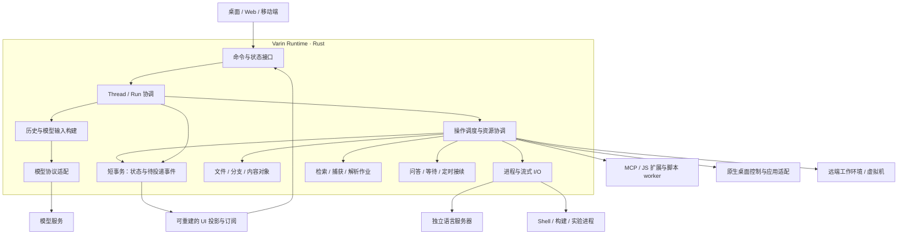

# Varin 原生 Agent 运行时：完整架构设计

状态：目标设计已进入实施，生产运行时尚未切换。当前行为、验证证据和未完成项见[实施台账](../plan/agent-runtime-implementation.md)；本文保留完整目标，不以局部通过代替整体验收。

日期：2026-10-09（Asia/Singapore）。现状核对基线：`bc39f604`。

本设计定义 Varin 的长期运行底座：低开销执行、及时的用户交互、可组合的能力与可替换的 Agent 策略。
覆盖完整 Pi 替代合同，同时重新划分 Rust 内核、Host、工具、扩展和 UI 的职责。扩展机制详见[原生运行时扩展设计](runtime-extensibility-design.md)。
既有实现见[架构](../architecture.md)。本文的目标结构和推荐决定不代表当前产品已经具备这些行为。

## 1. 设计结论

建议把现有 Rust 能力演化为 Varin 自有运行核心，直接拥有会话执行、模型续接、作业调度、资源协调和持久状态。
现有 Electron/Web/Mobile 展示层、可靠的原生文件与进程能力、语言服务器、应用驱动和可复用领域算法继续使用。

需要同时完成的结构变化：

1. 一个工作身份、一套执行状态；移除 Pi Session、Host Run 和前端推断之间的重复执行权威。
2. 耗时工作离开公共控制通道；存储事务只提交短小状态变化，不包住扫描、复制、网络或进程读写。
3. 每项操作独立受理、执行、观察、取消和恢复。按实际资源建立依赖。
4. 模型请求、工具调用和后台作业分别有生命周期；协议要求的结果配对由模型适配器处理。
5. 历史原文、模型输入、运行状态和 UI 投影各有明确用途，不能相互冒充。
6. 预热属于具体能力的准备工作，文件、会话和任务调度没有全局“全部服务就绪”门槛。
7. 副作用、取消和重启恢复按实际证据结算；收到请求、发出动作和完成动作分别记录。
8. 全部现有能力纳入替代范围，迁移完成后删除 Pi 循环、SDK 补丁、会话 worker 和兼容桥接。
9. 能力接口、实现和调用方分离，模型、环境、检索、上下文策略及工作台都可以独立组合；内置能力使用相同合同。
10. 依赖与 schema 在装配阶段解析，执行热路径使用已绑定句柄；普通读取不承担持久作业的整套写入成本。

### 1.1 此次原生化的范围

原生化指 Varin 直接定义并实现核心运行语义。核心推荐 Rust；UI 保持现有技术；JavaScript 扩展、脚本和特定算法可以在受管 worker 中执行。
worker 通过统一合同调用核心。扩展可以决定 Agent 的推进策略、上下文和模型选用；任务事实、模型交换记录及受管资源提交由核心持有。
策略返回下一步行动，由同一个执行器推进，不另设一份与核心竞争的会话或文件写入权威。

本次设计不要求重写语言服务器、数据库引擎、Git、浏览器、平台输入 API，也不改变已有前端产品形态。
这些组件的故障边界和调用成本需要重新接线。仅把当前 TypeScript 调用顺序翻译成 Rust，不满足本设计。

### 1.2 优秀底层的具体含义

- **响应快**：控制消息和可立即完成的查询直接推进，不等无关能力启动、插件钩子或大数据传输。
- **持续执行便宜**：稳定的服务、请求前缀和内容对象复用，消除空轮询、反复装配及重复复制。
- **扩展深入且局部生效**：可以替换执行环境或 Agent 策略，也可以只加一个工具；改变一个服务只影响实际依赖它的工作。
- **容易理解和维护**：每个事实有归属，每种等待有对象；内部采用已经成立的类型和前置条件，减少层层猜测与兜底。

这些目标对应后文的调用路径和成本约束。性能收益仍需实际实现和工作负载验证。

## 2. 从实际工作推导不变量

| 出发事实 | 必须得到的设计约束 |
| --- | --- |
| 用户委托的是持续工作，窗口和连接可以关闭、切换 | 工作身份及已受理操作独立于 UI、socket 和具体 worker 进程 |
| 模型是会失败、会中断、按协议交互的外部推理器 | 模型连接不能成为工具、权限或任务状态的权威 |
| 工具可能改变真实文件、进程、应用或远端系统 | 操作意图、实际效果和模型所见回执分别保留关联 |
| 不同工具通常没有数据依赖 | 一个调用慢或失败，不能自动成为整批工具的屏障 |
| 文件、键盘焦点等资源确实存在冲突 | 独立调度仍需准确资源身份、必要排序和提交前校验 |
| 文件系统、数据库与外部服务不共享事务 | 不承诺任意副作用 exactly-once；使用幂等身份和结果核对 |
| CPU、内存、磁盘及网络是共享的有限资源 | 隔离逻辑等待，按负载调度；不能承诺无关工作完全没有物理资源竞争 |
| 用户可能在运行中纠正、取消、改模型或接管电脑 | 控制通道必须及时受理；已发请求和动作按原身份收尾 |
| 模型输入的字节顺序影响缓存，材料来源影响可信度 | 输入快照稳定、来源明确，历史不被后台状态反复改写 |
| 调试信息与完成工作需要的信息不同 | 内部保留等待关系和错误事实，模型正文与默认 UI 只呈现相关信息 |

“完全解耦”的可交付含义：无关服务之间没有人为的准备依赖、长锁、串行执行或结果投递屏障。
共同硬件失效、运行核心崩溃和权威存储不可用仍可能影响多个能力；不能把这些情况描述成已经实现物理故障隔离。

## 3. 当前结构的证据与判断边界

| 已核对事实 | 设计影响 | 代码依据 |
| --- | --- | --- |
| Pi 拥有模型循环、原生历史、压缩、扩展与 MCP；Varin 修改队列、工具执行和上下文边界 | 替换范围覆盖运行合同及历史，不能只换模型请求函数 | [SessionHost](../../packages/pi-host/src/session-host.ts)、[Pi 补丁](../../packages/pi-host/patches/) |
| 工具调度曾因 `computer` 缺少资源计划形成全局等待，`bc39f604` 已补计划 | 并发合同必须来自统一工具注册，不依赖逐个补名单 | [tool-execution-resources](../../packages/pi-host/src/harness/tool-execution-resources.ts) |
| Rust 请求入口使用一个 Storage worker；捕获、物化、进程 RPC 经过它 | 原生语言不会自动消除共享排队；需拆开控制、数据和耗时执行 | [runtime.rs](../../kernel/crates/varin-kernel/src/runtime.rs)、[dispatch.rs](../../kernel/crates/varin-kernel/src/storage/dispatch.rs) |
| inventory 已改为独立 compute 作业；`file.capture` 仍逐文件租约、捕获、释放，复制及校验在 Storage handler 内 | 批量捕获必须成为服务自己的作业，控制线程只处理受理和提交 | [storage-adapter](../../packages/web/application-host/lib/kernel/storage-adapter.ts)、[file_resources](../../kernel/crates/varin-kernel/src/storage/file_resources.rs) |
| 默认 isolated dispatch 创建 preparing Thread 后，同步等待完整基线，之后才 Run 准入并返回 | 任务受理回执与工作区准备分离 | [thread-services](../../packages/web/application-host/lib/harness/thread-services.ts)、[thread-runtime](../../packages/web/application-host/lib/harness/thread-runtime.ts) |
| 非 Git 根当前枚举隐藏及 ignored 文件，递归排除 `.git`、`.varin`，随后多次核对路径和内容 | 首次完整捕获有真实成本；不能用“异步”声称成本消失 | [inventory](../../kernel/crates/varin-kernel/src/compute/source.rs)、[基线准备](../../packages/web/application-host/lib/harness/thread-runtime.ts) |
| native process 的 Host 投影反复 `processRead`，stdin 回执也靠轮询更新 | 进程数据直接流式投递，取消不排在输出读取之后 | [process-service](../../packages/web/application-host/lib/kernel/process-service.ts) |
| memory 在 Rust，问题记录和记忆快照在 Pi branch，follow-up 在 Rust，日历任务还有项目配置状态 | 需要完整的存储归属与投递合同，不能另加一个泛化状态库覆盖表面 | [记忆](../../packages/web/application-host/lib/memory/DOCUMENTATION.md)、[问答](../../packages/pi-host/src/extension-ui-bridge.ts)、[follow-up](../../packages/web/application-host/lib/harness/followups.ts)、[日历任务](../../packages/web/application-host/lib/scheduled-tasks/DOCUMENTATION.md) |
| UI 会话协议直接使用 Pi DTO，且省略若干 provider 私有字段 | UI 投影可精简；模型历史存储必须独立设计并保留续接信息 | [session protocol](../../packages/protocol/src/session.ts)、[projector](../../packages/pi-host/src/protocol-projector.ts) |

生产 `createKernelRecoveryDirectFacade` 已绕过旧 journal-engine 的工作区串行队列。不能把旧队列当作现行调用路径。
最近一次 `dispatch` 日志停在 `dispatch:baseline`；`diagnostics` 已返回 pending。这还不足以证明 LSP 直接阻塞了该次捕获。
本文根据已核实的公共等待点设计新边界，不把缺少阶段证据的故障强行归因于 Pi 或 LSP。

## 4. 目标结构与部署



图中模块不等于一模块一进程。推荐一个原生运行核心，以内部模块调用协调本地工作；按真实故障或执行边界使用 worker/进程：

- 语言服务器、第三方扩展、长期脚本、平台驱动和用户命令独立执行。
- 文件扫描、内容捕获、解析和哈希在各自执行器中运行，不占控制循环或数据库事务。
- 现有内容对象、文件事务、进程 guardian 等能力向新核心迁入，保持单一资源写入者。
- Electron 负责窗口与系统界面；Web gateway 可以继续承载现有 HTTP/静态资源，但不再决定 Run 或工具的生命周期。
- 核心可以随桌面应用启动，也可作为无 UI 的 Host 运行；关闭窗口和结束后台工作是不同的明确操作。

同一运行实例有一个协调权威。扩展进程与远端执行端只拥有被授予的操作或资源，不复制整套会话协调状态。

### 4.1 核心接口边界

| 接口 | 合同 |
| --- | --- |
| `submit(command)` | 校验调用身份和命令前置修订，持久受理后返回 receipt；不等待耗时工作完成 |
| `query(request)` | 从已绑定能力执行结果型读取，持有可取消的内存调用身份；不先写一条持久作业记录 |
| `observe(subject, cursor)` | 返回明确修订的快照或后续事件；发现游标缺口时要求重新取快照 |
| `cancel(scope, reason)` | 固定取消范围，沿独立通道通知执行者，分别确认请求和实际收尾 |
| `readOutput(reference, cursor)` | 消费输出或对象的指定部分，不改变操作执行状态 |
| `generate(requestSnapshot)` | 由模型适配器发出规范化流事件，并保留原协议续接材料 |
| `execute(operation, permit)` | 执行端核对实际资源、owner 和世代，返回可关联的效果/终态回执 |

命令和事件使用唯一的 wire schema，生成 Rust/TypeScript 类型及边界校验；领域内部类型可以不同，不能手写多份失配的状态枚举。
跨边界的执行消息携带所需的调用身份、owner、世代及因果关联；单纯的数据块沿已建立的流关联，不重复整份上下文。
同进程内采用类型化接口和引用，不把模块调用编码成内部 JSON-RPC。大载荷沿独立内容流传递。
`permit` 由权威签发，在实际执行边界验证；同进程可使用受控句柄，不要求每个内部函数重新验签。
模型参数或前端自报线程 ID 不构成执行授权。

## 5. 身份模型：去掉重叠概念

| 实体 | 含义与寿命 | 关键关系 |
| --- | --- | --- |
| Thread | 持久工作及其对话身份，主任务和子任务使用同一模型 | 可关联项目、Bot、父任务和资源；不依赖 cwd 存在 |
| HistoryBranch | 对话原文的一条祖先路径与当前 head | 属于 Thread；分支导航不隐式回滚文件 |
| Run | 一次接受输入后推进到明确结束或暂停的执行过程 | 固定所属 Thread/branch，记录配置世代及输入集合 |
| ModelStep | 一次实际模型生成及其协议续接单位 | 保存 request snapshot、provider 状态、usage、tool call 集合 |
| ToolCall | 模型发出的一次完整工具调用 | 属于 ModelStep；绑定注册表版本、规范化参数与 Operation |
| Operation | 一项实际工作，可超过一次工具返回的寿命 | 有 owner、依赖、目标、效果、取消和恢复合同 |
| ResourceRef | 某个环境中的位置、对象、进程或桌面 | 与项目分类、聊天 ID、显示路径分别表达 |
| SourceView | 实际读取的磁盘、草稿、固定分支或材料修订 | 内容版本及来源可追溯；不通过当前侧栏选择推断 |
| Wait | 等待某个事件、结果、用户输入或时间的持久条件 | 有事件游标和所属执行，不以活跃 Promise 充当存储 |
| Delivery | 某项事实对某个观察者的交付记录 | 模型、UI、线程接收方各用自己的游标 |

旧 Session ID 可以保留为导入来源标识，但新系统不再让 Session 与 Thread 分别拥有一套执行状态。
Provider 的 `response_id`、连接 session、MCP session 和系统 PID 均是外部关联标识，不能替代这些本地身份。

一个对话分支同时只有一个提交模型历史的执行权威；需要并行思考时使用独立子 Thread/branch。
工具、后台作业和事件投递可以并发，不因此产生两个向同一分支无序提交的模型循环。
标题、压缩等辅助模型作业可以并发生成候选，但不能自行追加主对话或切换 head；其发布由当前分支协调者按修订条件完成。

## 6. 状态机与结束语义

### 6.1 Run

```text
accepted → preparing → runnable → generating ↔ executing
                                  ↕             ↕
                                waiting ←───────┘
                                   ↓
                      completed / failed / cancelled
```

waiting 必须带对象，例如一个用户问题、子任务或能力准备 Operation。恢复只重新准入实际需要的资源。
暂停等待释放模型请求名额，不等于丢弃历史、销毁后台进程或完成任务。

Thread 的归档状态、Run 的执行状态和“有待处理问题/结果”是不同维度。已结束子任务不能因一个旧问题记录被改画成“正在等待输入”。
已完成的定时发生项退出活跃输入区，历史仍可查看；再次取消返回其现有终态。

### 6.2 Operation

```text
accepted → preparing → queued → running → settling → terminal
              ↕          ↕         ↕
                         waiting
```

`terminal` 的 outcome 为 succeeded、failed、cancelled 或 indeterminate。阶段与结果分别表达。
`cancelRequested` 是控制事实，不能在收到取消按钮时直接把结果写成 cancelled。
这是统一的状态语义，执行器可以跳过不需要的阶段。内存查询不为每个阶段写库；内部解析、映射等纯函数不各自创建 Operation。

独立记录 `effect = none | dispatched | partial | confirmed | unknown`。
例如电脑动作的 driver acceptance 只证明 dispatched；工具返回正常也不能把尚未确认的页面变化写成 confirmed。

一项操作至少能回答：由谁拥有、在等什么、实际执行端是谁、取消请求是否收到、最后确认的效果是什么。
这些字段首先服务程序协调；工具正文不固定打印一整套内部字段。

### 6.3 任务结束与作业寿命

操作的寿命明确绑定到 call、run、thread 或 environment，由工具能力合同决定并在受理时固定。
普通前台读取通常属于 Run；已移交的子任务、持久 Shell 或定时定义可以继续存在。
模型输出 final 只结束该轮模型工作，不伪造其他操作的完成事实。

Run 结束必须结算其前台调用，或有明确的后台移交回执。关闭窗口不会隐式修改操作寿命。

## 7. 受理、执行与提交

### 7.1 按恢复需要决定写入成本

| 工作 | 执行与持久化 |
| --- | --- |
| 可信能力上的文件读取、LSP 查询、状态查询 | 参数与身份在入口解析一次；用内存调用句柄直接执行。面向模型的最终结果进入历史，不另写受理和逐阶段日志 |
| 用户输入、dispatch、持久后台命令、提问及定时发生项 | 先在短事务中持久受理，再返回可跨重启追踪的身份；准备与执行异步推进 |
| 文件修改、外部动作及其他不可安全重放的副作用 | 发送前具备可恢复的意图/调用身份，结束后提交效果回执；已经提交的模型调用或受管文件事务记录可以承担该职责，不重复记账 |
| token、检索进度、光标动效、截图预览 | 使用可合并的数据流；按需要保存内容，不把每个显示更新写成领域事务 |

“读取”由可信能力合同确定，不能凭 HTTP GET、工具名字或外部 MCP 的 readOnly 提示推定无副作用。
长读取如需跨重启继续或提前交付作业身份，明确成为作业型调用。两类调用使用同一执行器、权限和资源语义，仅持久化义务不同。

### 7.2 通用执行路径

入口解析来源和 schema，规范化资源；从已装配配置取得能力句柄，建立本次执行上下文。
需要持久受理的命令提交身份及待投递事实；结果型查询直接准入。随后仅等待本次真正依赖的准备或资源，执行并发布结果。
面向模型的结果先提交到对应历史，再用于后续请求。面向 UI 的临时观察不要求先经过 ConversationStore。

受理入口只核对本地可判断的身份、规则和能力合同。权限询问、OAuth 刷新、远端探测和服务启动进入该操作的 preparing/waiting，
不在公共入口等待。受理不等于授权执行，授权尚未完成的操作不能发送副作用。

持久命令使用幂等身份：同一个键重复提交相同输入，返回原操作；同键不同输入直接报告冲突。
键不依赖随机重试 ID。传输 request ID、模型 tool call ID 与持久 Operation ID 保持关联，但分别承担职责。

事务和资源锁都不能跨越模型、用户输入、网络、语言服务器或整个目录捕获的等待。
外部效果之间的空隙由恢复合同处理，不用长数据库事务假装覆盖。

## 8. 调度：依赖真实资源

### 8.1 工具注册表的一份合同

每个原生工具注册输入/输出 schema、能力依赖、资源解析、完成方式、取消方式、效果分类和恢复方式。
工具描述、参数校验、调度计划和 UI 呈现从这份合同派生，避免 `executionMode` 和独立白名单逐渐失配。

权限决定能否执行，资源计划决定何时执行。两者不能互相替代。
第三方 MCP 的 annotations 只是提示，不能自动获得权限或被当作可靠的副作用声明。[MCP 工具规范](https://modelcontextprotocol.io/specification/2025-11-25/server/tools)

### 8.2 建立依赖的情形

| 操作组合 | 推荐行为 |
| --- | --- |
| LSP 查询 + dispatch + computer list | 分别推进 |
| 两个固定修订上的读取 | 并发，不持有可变文件锁等待下游 |
| 同一文件的两次修改 | 按受理顺序提交，校验各自前置修订 |
| 多文件编辑 | 先解析完整写集合，按规范资源顺序准入，统一预检并按对应存储合同提交 |
| 同一真实桌面的键鼠输入 | 按桌面控制归属和动作顺序执行 |
| 不同桌面或虚拟机操作 | 各自准入，可并行 |
| 同一持久脚本环境的单元格 | 保留绑定与顺序；嵌套工具仍走公共调度合同 |
| 等待用户、模型或服务准备 | 不占用文件写锁、桌面输入执行槽或 CPU worker |

资源解析可能需要先查询。先用只读快照生成完整计划，再取得写资源并校验版本；不在持有部分写锁时等待未知的新资源。
父调用编排子调用时，不把自身占用的资源作为子调用必须重新排队取得的前置条件。

Shell 和任意外部程序的完整文件效果通常不可静态推断。声明其受管环境及 writer 活动，用文件版本和隔离工作区处理冲突。
不能通过猜测命令文本，承诺对第三方写入实现全局互斥；需要强隔离的任务使用真实隔离环境。

### 8.3 公平性与负载

控制事件、交互请求、计算密集工作、长时阻塞服务和后台维护使用不同的可执行队列。
按用户工作/任务族保持公平，避免一个任务提交大量检索后饿死其他任务。
优先级影响等待顺序，已经发生的副作用不能因优先级改变而被重放或抢占一半。

并发量和缓冲依据实际 CPU、内存、设备/远端容量及用户配置确定；不预设无依据的工具次数或固定任务硬上限。
资源不足时保留排队身份和原因。模型 provider 的实际限额单独处理，不占用本地文件或进程 I/O 的准入名额。

## 9. 控制与数据传输

当前 `process.read` 与 stdin acknowledgement 的轮询应改为推送式流：进程 guardian 持续发送数据及确认事件，调用方用游标消费。
取消、状态查询和终态通知独立于 stdout、截图和文件载荷的数据通道。

本地使用独立的控制连接与可背压数据流，具体映射到 Windows named pipe 或 Unix socket；远端同样分离控制与大载荷传输。
同一个大 JSON/base64 消息不能长期占住所有结果和取消消息的写锁。

二进制载荷通过流或内容对象传递；JSON 保留描述、身份和引用。UI 订阅落后时合并可替代的进度，保留终态；
完整日志由有游标的输出存储负责，截图/视频由观看通道负责。慢 UI 不反向堵住语言服务器的协议读取。

CPU 解析与不可中断的同步库不能直接放进 async 控制任务。Tokio 的已启动 `spawn_blocking` 任务不能靠 abort 停止，
因此短计算需要协作取消，长期或可能卡死的调用需要独立执行器/进程及实际终止机制。[Tokio 说明](https://docs.rs/tokio/latest/tokio/task/fn.spawn_blocking.html)

## 10. 工具结果与后台作业

工具合同提供两类完成方式：

- 结果型调用：返回本次所需内容或明确失败，如普通文件读取、定义查询。
- 作业型调用：返回“已受理、当前阶段、作业身份”，实际结果通过同一 Operation 后续交付，如 dispatch、后台命令、实验。

一次调用可以支持显式等待作业，但等待只影响调用方需要的结果。不能到某个任意秒数后，把结果型工具偷偷改成成功的空回执。
`pending` 必须能区分“快照尚无对应数据”和“有一个仍在执行的作业”，后者必须有可查询身份。

对已受理作业的 wait 使用持久事件条件。恢复时传递一次有效完成事实，不要求模型反复轮询。
纯进度更新只刷新 UI。后台活动本身不自动产生额外模型请求。

### 10.1 取消的作用范围

| 用户动作 | 实际作用 |
| --- | --- |
| 停止当前模型生成 | 取消当前 ModelStep，不把已经发生的工具效果回滚 |
| 停止本轮执行 | 取消该 Run 的生成、未移交前台操作和等待；已独立移交作业按自己的 owner 保留可见状态 |
| 停止任务及其子任务 | 沿任务归属取消指定范围的 Run 和受管作业，不扩大到无关任务 |
| 取消电脑操作 | 只取消选定电脑作业，沿第 19 节清理，不撤销本轮权限 |
| 取消一次观察等待 | 解除该 Wait，不隐式杀掉被观察的 Shell、子任务或共享准备服务 |

用户界面必须表达实际作用范围。正常完成、用户停止、消息插入和关闭窗口不能共用一个含糊的 abort 分支。
取消先沿独立控制通道请求执行端停止，再结算持久状态；Catalog 暂不可用时，本机紧急输入停止仍应生效，
但 UI 不能据此虚构已经持久提交的 cancelled 回执。

### 10.2 模型批次和实际执行分别处理

所有独立工具可以同时启动、分别完成并立即刷新界面；下一次模型请求按对应 provider 的续接规则构造。
Claude 当前要求并行工具的结果在下一条 user 消息中逐一配齐。这种协议配对不应变成宿主执行顺序。
已受理后台作业可以用其真实受理回执完成工具交换，后续结果作为明确来源的新事件送达。[Claude 并行工具合同](https://platform.claude.com/docs/en/agents-and-tools/tool-use/parallel-tool-use)

不得用伪造的结果提前闭合调用，再把真正结果冒充同一次 tool result。能力不支持异步回执时，就保留模型层的必要等待，
其他工具、会话和用户控制仍独立推进。

## 11. Agent 循环与运行中输入

协调者按事件推进，执行流程为：输入受理 → 冻结请求视图 → 发起 ModelStep → 接收完整输出项 → 注册工具调用 → 收集合法回执 → 续接或结束。
不为每个聊天启动一份拥有完整工具环境的常驻 Node AgentSession；模型连接与作业按实际使用持有资源。

默认 AgentPolicy 实现这条流程。其他策略可以编排检索、并行子任务、多模型或用户等待，返回明确的下一步行动与策略状态；
核心负责行动的受理、协议配对、取消和历史提交。策略本身需要慢模型/网络工作时，将其表示为依赖的 Operation，不能占住协调循环。

流式参数只作为候选展示；参数完整、schema 有效、权限通过且调用身份固定后才允许执行。
有副作用的调用必须有完整可恢复的调用记录。若对只读调用进行流式提前准备，也不能把未被模型正式发出的调用记成已执行事实。

新用户输入有明确模式：当前边界加入、当前生成中断后加入、排到后续执行。记录所选模式及输入 ID。
中断旧模型流不能让其迟到的工具调用进入新 Run；已受理的实际操作按自己的 owner 和取消合同结算。

新输入立即持久受理并呈现，不等待服务预热或压缩结束才解除“发送中”。待发队列的编辑使用修订条件；已经送入请求的输入保留原文，
后续改动作为新指令。Provider 不允许在未闭合工具交换中插入 user 消息时，先合法结算旧交换，再编译用户新输入，保留其实际到达顺序和时间。
流中断留下的残缺参数只保留为中断记录，不能补造参数执行，也不能作为完整 tool call 送入下一请求。

模型选择等显式配置变化在下一安全请求边界形成新配置世代；已经发出的请求和已受理工具仍使用原快照。
权限撤销立即影响新的副作用，不为了缓存而延后。工作台布局、选中项目和打开侧栏不会自动更换运行配置。

期望配置与已激活配置分别保存。新 provider、扩展或服务世代先准备并校验，成功后再发布；失败不销毁仍有效的旧实例。
用户明确选择的新目标不可用时，新请求应说明该目标的问题，不能悄悄改用旧模型产生费用。旧实例继续负责其已受理工作。

## 12. 模型适配、认证与推理能力

### 12.1 原生模型接口

适配器接收不可变 RequestSnapshot，产出规范化事件，同时保留用于后续调用的 provider 原始项。
接口覆盖文本、多模态内容、工具调用、reasoning/签名、服务端工具、延迟结果、usage、错误和取消。

内部区分：

1. 可展示内容：文本、可展示的思考摘要、图片、引用等。
2. 模型续接材料：opaque reasoning、签名、provider item/response ID、服务端工具交换。
3. 操作事实：工具参数、结果、权限和副作用。

UI DTO 可以省略第 2 类；持久历史和请求编译器不能采用省略后的 UI DTO 作为原文。
OpenAI Responses 的 reasoning 与工具交换存在保留要求，不能统一拍平成 assistant 文本。[OpenAI reasoning 合同](https://developers.openai.com/api/docs/guides/reasoning)

跨 provider 切换通过语义历史重新编译请求，不把某一 provider 的 opaque 签名发给另一家。
多模态内容以类型、来源和内容引用保存；当前模型不支持的输入必须明确处理，不静默丢弃。
usage 缺失或估算与实际回执分别保存；价格按连接/模型的配置版本计算，不将中断请求记为确定零费用。

### 12.2 完整适配范围

以当前配置和锁定 SDK 的实际合同建立覆盖清单：OpenAI completions/Responses、Azure Responses、Codex Responses、Anthropic Messages、
Bedrock Converse、Google Generative AI/Vertex、Mistral Conversations，以及已配置的其他 transport（包括 pi-messages）。
此处列出待替代的 API 家族，不能把 SDK 中出现的名称当作所有远端端点已经可用。

同协议下的第三方 base URL、模型 ID、headers、模型覆盖和思考能力继续支持。不能把“兼容 OpenAI”解释成全部字段行为相同。
未知 provider 扩展通过版本化适配接口接入；不让一个新 provider 接管整个 Agent 循环。

chat、embedding、rerank、decision、image 等用途分别建模，共用连接和凭据引用，按各自协议执行。
快速决策和重排不能强行转成聊天补全；配置后的实际调用条件仍在对应设置面板说明。

### 12.3 认证、网络与重试

凭据留在用户凭据权威或平台 credential broker，历史和 UI 只存引用。覆盖 API key、OAuth 刷新、云身份及实际支持的环境授权。
OAuth 刷新按凭据身份合并在飞请求；失败只影响该连接。默认值继承和可信项目覆盖保留现有明确边界。

代理、DNS、TLS、自定义证书、请求路径和流式取消统一交给出站连接层，避免聊天和后台推理各自实现不同网络行为。
连接层处理传输，不替任务决定换模型、换 provider 或增加付费调用。

重试只重试适合重试的阶段：未开始生成的暂时错误、明确可恢复的 provider 作业等。
已经开始的输出、工具副作用或远端效果不明时，不把整个 ModelStep/Run 从头重放。
服务器返回的限流等待、用量和错误码保持事实；重试预算和服务截止时间属于具体能力合同。

## 13. 上下文、历史与缓存

### 13.1 一份原文，多种视图

ConversationStore 保存不可变消息/内容项及分支关系。ContextCompiler 从中生成 RequestSnapshot；UI 从运行事件和原文生成展示。
压缩改变活跃输入的组成，不删除原文，不重写旧工具结果。

一次 RequestSnapshot 固定：历史分支范围、配置世代、工具 schema 版本、指令来源、记忆 checkpoint、附件引用、环境事件游标及 provider 序列化结果。
重试复用该身份；没有实质配置变化时保持稳定的系统前缀、工具顺序和内容编码。
其中不保存 API key、Authorization header 或刷新令牌；认证在发送边界按凭据引用解析。

来源角色在内部保持真实身份：用户指令、工具数据、网页/文件内容、其他 Agent 消息、环境事实分别表达。
映射成某个 API 的 user/tool 字段，不提升其指令权限。

### 13.2 记忆与后台压缩

保留已经讨论确定的合同：记忆写入立即提交权威；本会话的系统记忆快照不随每次写入改动。
新增/删除通过工具回执或尾部事件进入当前工作，成功压缩时一起提交新摘要、边界、记忆快照及有效系统提示。
候选失败、取消或被新分支取代时，保留原输入。

后台压缩固定一段祖先范围 A，保留近期原文 B；准备期间新追加 N 不使候选天然失效。
提交依据祖先身份和工具配对边界，用 `摘要(A) + B + N` 构造后续输入，不要求反复追赶最新 leaf。
原文回读、用户修正、未完成工具交换和 provider opaque 项必须保持完整关联。

不以节省 token 为理由默认每步打分、删旧材料或额外生成总结。没有变化就不注入空状态块；
已结束且无待处理事项的子线程退出当前状态快照，原结论保留在原文和结果交付记录中。

团队范围始终排除当前 Thread 自身。环境事实与工具自身已经返回的效果按来源/修订去重。
事件被选入候选请求、实际发出请求和完成一次有效交付分别记账；请求失败重试不能提前消费未交付事实，
同一请求重试也不能重复追加历史。交付记录证明内容进入了哪个请求，不宣称模型已经理解或执行。

### 13.3 提示词与动态能力

提示词按实际角色和启用能力装配；普通 Agent 不带 Bot 专属说明。工具文案说明用途、参数和结果，不强加固定工作流程。
工具发现和动态注册保留 schema 世代：正在执行的调用使用已冻结版本，后续请求在合法边界使用新版本。
不为了前缀缓存，让已经撤销的权限继续有效；运行授权与模型看到的描述各自负责正确性。

缓存命中和成本来自 provider 真实回执，不能从“前缀稳定”直接推出固定提速或费用折扣。

## 14. 持久化与恢复

### 14.1 存储职责

| 数据 | 权威与存储原则 |
| --- | --- |
| Thread/Run、持久 Operation/Wait/Delivery、配置世代 | 原生 Catalog 中的结构化记录与短事务；瞬时查询状态按第 7 节留在内存 |
| 消息、模型原始项、工具结果 | ConversationStore；元数据和引用参与 Catalog 提交，大正文使用内容对象 |
| 文件版本、固定分支、材料及日志 | 已有原生内容对象和专用流存储，引用可追溯 |
| 记忆、计划和用户配置 | 保留各自领域 owner，由统一事件投影关联工作 |
| 检索索引、向量、结构缓存 | 派生数据，可独立重建，不决定源文件是否可访问 |
| UI 缓存 | 通过 snapshot + cursor 恢复的投影，不是执行权威 |

推荐继续使用 SQLite/WAL 管理事务元数据，保留现有内容寻址存储能力。
SQLite WAL 仍只有一个同时写入者，因此必须缩短写事务，不能把它包装成所有工作的执行线程。[SQLite 并发合同](https://www.sqlite.org/wal.html)
历史正文、日志和索引不在每个 token 上共同争夺一次权威事务。大对象先持久化，再原子提交引用；孤立对象由现有回收机制清理。

新原生历史是用户资产。现有内核对可替换内部 catalog 的重建规则不能直接用于含会话、笔记和工作成果引用的新存储。
明确区分可重建索引、临时执行状态和用户持久内容；不支持的数据格式必须保留并报告，不能清空后当作首次启动。

持久状态变更和待投递事件在同一事务中提交；订阅者收到的事件可以重复，按 ID/revision 幂等消费。
不另造要求全系统按一条全局事件日志串行回放的框架。每个 owner 保持自己的有序修订，跨 owner 用明确因果引用协调。
同一提交边界内的关联记录可以合并写入。不能为凑批让用户输入或必要的副作用意图长期等候，也不能在落盘前回报持久受理。

### 14.2 恢复矩阵

| 中断位置 | 恢复行为 |
| --- | --- |
| 输入已受理，模型尚未请求 | 从原输入身份继续，避免重复建立 Run |
| 瞬时读取中断、结果未进入历史 | 原调用标明中断；仍需要结果时按可信读取合同重新执行，不恢复每个内部准备阶段 |
| 模型已输出部分内容 | 保留已记录的部分并标注中断；核对 provider 是否支持原请求恢复 |
| 工具尚未发送副作用 | 可按同一操作身份重新准入 |
| 受管文件事务已提交、回执未投递 | 查询原操作回执并补投递，不重复写入 |
| 进程仍存活 | 由原生 guardian/执行端提供真实状态，重接已有句柄 |
| 外部动作可能发生但无确认 | 记录 indeterminate，先观察/对账，不盲重放 |
| 终态已提交、UI 未收到 | 从事件游标补齐状态，不重新执行 |
| 等待用户/线程/时间期间重启 | 恢复 Wait 与未消费事件，条件满足时准入一次续接 |

主机实例、worker 和桌面控制带世代身份；旧实例的迟到消息不能提交到新执行。
模型原始 token 流是数据流，最终消息是持久事实。流式检查点的频率需依据写入开销和可接受恢复粒度确定，
不能宣称突然断电时每个已显示字符都已落盘；用户输入受理及副作用意图/终态必须有明确持久化承诺。

### 14.3 清理与资源寿命

临时目录、reader pin、草稿对象、流缓冲和 worker 都有 owner 与释放条件。终态、取消、连接断开和启动恢复都走同一回收入口。
未确认停止的执行者所占资源不能假装已经回收。业务效果未知与资源仍占用分别记录：输入已停止而页面变化尚未确认时，
不应永久占住桌面。对话仍引用的结果和日志不能按临时流清掉；回收检查实际引用及保留策略。
删除历史、删除用户成果和清理临时对象分别授权、分别记录。

## 15. 文件、工作视图与子任务基线

### 15.1 位置、项目与视图

项目负责组织，不是会话资格、文件权限或所有工具数据的存储根。cwd 只解释本次相对路径。
语言工程根、Git 根、任务选择的工作根和访问权限分别保存。

资源身份包含 environment/host、规范位置与内容视图；Windows 盘符、UNC、junction、MSYS 路径和非 BMP 字符在统一入口处理。
显示保留用户可识别路径，内容 hash 不替代文件位置身份。新文件使用真实父目录身份；字符位置明确 UTF-16、字节及行列的转换。

读取得到内容版本后释放短期文件协调资源。LSP、模型或向量服务消费固定字节，不继续持有源文件租约。
写入对实际目标和期望修订做条件提交；多段 edit 对同一原文匹配，并在写入前完成唯一性和重叠检查。

### 15.2 三种工作方式

| 工作方式 | 语义与适用范围 |
| --- | --- |
| 版本化观察 | 每次读取返回真实来源和修订；用于检索、讨论及普通观察，不声称全目录同一时刻快照 |
| 固定隔离分支 | 基于完整固定的任务资源视图，写入独立，按 base/source/target 集成 |
| 显式共享工作 | 直接操作共享现场，按权限和资源协调执行 |

按任务 profile、实际工具能力和显式选项决定工作方式；不从自然语言“别修改文件”偷偷改权限，也不把失败隔离任务自动降为 shared。
只读任务不应为了获得代码阅读能力而创建可写工作副本。
写入隔离仍保留固定 base 和结果整合语义，不能用实时 parent fallback 假装一个不可变分支。

### 15.3 基线捕获的成本与正确性

父工作已经有不可变 root 时，子任务通过引用/pin 取得视图，后续写入共享未变对象。
Git 工作根使用 commit/tree 与明确捕获的 staged/unstaged/untracked/草稿覆盖，保留 filter、mode、symlink 和 captureScopes 语义。

非 Git 目录首次完整固定视图确实需要枚举和读取内容，或依赖真实的文件系统快照能力。
支持原生快照/clone 的环境可以复用；不支持时用独立作业捕获，不能假设所有 Windows 文件系统都有同样能力。
稳定的增量目录账本、已持有内容对象和 watcher 变更记录用于复用；watcher 丢事件或外部修改无法证明时重新核对相关范围。

固定 root 只保证提交后的读取稳定。跨文件捕获是否对应原子时间点，取决于源后端：
记录 `atomic-snapshot`、`git-base-with-overlay` 或 `stable-capture` 等真实一致性来源，不能把多次扫描等同于 OS 原子快照。

捕获作业在执行器中批量处理文件，流式 hash/复制和可恢复对象安装；Catalog 仅登记意图、checkpoint 与最终 root。
避免每个文件通过 Host 反复跨 IPC 请求租约、捕获、释放，也避免分页重新扫描全树。
必须保留的稳定性核对可以批量完成；减少 I/O 的方案不能降低承诺的视图一致性。

任务资源范围在受理时明确。不能把聊天的宽泛 cwd 自动变成所有相邻仓库、缓存和安装产物的快照范围；
也不能从任务正文中的一个路径擅自缩小用户选定范围。未给更窄范围时沿公开默认值准备，并真实呈现其成本。

### 15.4 回滚、草稿与组合恢复

对话回退只移动 HistoryBranch，文件恢复按明确的 checkpoint 和目标状态执行；组合恢复把两者关联成一项可恢复操作。
Git 状态、用户外部修改与未保存草稿保持独立来源，不能因为回退聊天就被覆盖。

恢复先形成目标资源及当前前置修订的计划，再协调受影响编辑器和进程；不冻结整个 Host 或无关项目。
用户新修改引起前置条件变化时返回冲突。取消已经开始的恢复，依实际已提交部分清理或补偿，不能抹掉发生过的事实。

不可变分支的多文件更新可通过一次 root CAS 提交；物理文件系统的多个 rename 不构成通用跨文件原子事务。
磁盘侧使用预检、操作日志、逐项提交和可恢复补偿，保留需要处理的部分结果。
组合恢复在文件阶段与历史 head 切换之间记录进度；崩溃后按同一操作核对并完成或报告冲突，不重新执行模型或旧工具。

## 16. dispatch 与协作

dispatch 首先持久受理子 Thread、输入、资源绑定与准备 Operation，立即返回可追踪回执。
视图准备、模型服务准备和 Run 准入分别发生；父 Agent 可继续无关工作。准备失败也有明确终态和一次结果通知。

```text
dispatch
  → accepted(threadId, preparationOperationId)
  → preparing source view / awaiting capacity
  → runnable
  → child Run
  → result / failure / cancellation
```

UI 显示实际阶段和已观察进度，例如正在捕获哪些资源、已处理数量；没有总量时不捏造百分比。
等待准备的是该任务，不是工具批次、会话初始化或整个工作区。

主/子/兄弟通信通过真实发送者、目标和消息 ID 投递。发出消息不回灌给自己；完成结果与状态快照去重。
`wait` 保存条件并释放不需要的执行资源。普通进度不触发新模型请求。

结果分开保留报告、文件改动、产物和事实。没有文件变更的子任务可以正常完成；merge 返回没有待集成改动，不能暗示报告丢失。
代码提交继续采用固定来源与目标前置状态，保留冲突和部分应用事实，不覆盖主任务后来的独立修改。

## 17. LSP 与检索服务

### 17.1 LSP 的独立边界

语言服务实例按实际工程根、语言配置和 SourceView 划分；共享相同视图，不按聊天数量重复创建完整服务。
编辑器未保存内容与 Agent 磁盘/固定分支有差异时，使用明确文档身份或独立视图，不能混用文本版本。

服务键为 environment、projectRoot、language/configGeneration、viewIdentity；文档绑定保存 URI、源 revision 与 LSP documentVersion。
结果只更新对应绑定的缓存。迟到诊断和旧进程世代消息不能覆盖新文本；push/pull 诊断按服务器真实能力处理。

视图一致性也覆盖被分析文件的依赖。普通语言服务器会自行读取磁盘上的 imports/配置，因此仅用 didOpen 替换目标文件，
不能证明它分析的是整个隔离分支。固定/虚拟分支需要相应物化视图，或具有完整视图解析能力的语言适配器；
这项准备只属于该语言视图。磁盘/草稿查询仍按实际依赖来源表达，不冒充固定全工程快照。

语言服务器通过独立进程流连接，读取和写入由异步 I/O 驱动，不经过文件捕获或 Catalog 的长队列。
查询前固定字节和修订，之后释放文件协调资源；只保留该语言会话必要的文档协议顺序。
语言进程卡住时，该实例的请求可以失败、取消和重建，其他服务继续工作。

诊断是按来源/版本更新的数据：`available`（含真实零条）、`pending`、`unsupported`、`unavailable`、`stale` 分别表达。
读取诊断快照应结束调用；显式等待诊断更新则返回/持有 Wait。pending 不表示它仍占着一把文件锁。
不能把“没有收到诊断”画成 clean，也不能为了等到 clean 阻塞任务调度。

### 17.2 检索与预热

文件读取、关键词检索、结构解析、语义索引、选材模型各自有准备状态。查询捕获自己的 PipelinePlan 和来源版本。
冷索引不会使基础读取不可用；确实未覆盖的语义材料在结果中简短说明，不假装完整召回。

用户选择的模型模式决定实际调用职责。失败时如何保留来源排序遵守配置，不暗中换成另一种付费模型。
角色配置及是否可用在代码检索设置面板呈现；内部调用阶段不重复倾倒到每个工具正文。

进入已选项目时可预热语言服务、语法资源、文件盘点和实际启用的索引；共用在飞准备任务，避免重复启动。
预热使用后台资源，交互请求可提升它真正依赖的准备作业。一个调用方取消等待，不杀掉其他调用方仍需要的共享服务。
关闭/切换配置时按引用和世代释放旧服务，不设置隐藏的固定闲置销毁规则，不新增默认付费模型保温请求。

## 18. 用户提问、计划、定时与接续

### 18.1 Goal 与持续工作

Goal 保存用户明确建立的持续目标、状态、可选预算和实际用量，不能从普通任务自动创建。
它与某一次 Run 分开：Run 可以结束或等待，Goal 仍然有效；新输入可以修改当前目标的约束。
目标完成、用户暂停、明确受阻和用户预算耗尽分别记录，预算接近耗尽不能冒充任务完成。
历史回退不回退已发生用量，也不自动恢复被用户暂停或取消的目标；会话分叉不隐式复制一份自动运行授权。

等待依赖以 Wait 表达，并抑制无意义的自动续接；不能为等待而覆盖用户的手动暂停，再在定时回调中擅自恢复它。
自动续接沿原目标和输入身份准入，检查是否还有未结算操作或未满足依赖。
用量归属到实际 ModelStep/推理操作，再按明确规则汇总到 Goal，避免嵌套工具或投影重复计费。
下一步建议、标题、用户选择的目标评估模型等辅助请求保留配置和发生项身份，不成为每轮必跑的模型链。

### 18.2 问答与计划

问答记录归属于 Thread/branch，保存问题、答案、状态和可选续接条件。弹窗只是记录的展示入口。
默认选择不是回答，等待到期不是批准。断线后问题仍可展示；重复相同回答幂等，冲突回答保留实际冲突。

todo 由一个 schema 和领域记录定义，用户编辑、工具更新和工作概览使用同一 revision。
兼容的状态别名在入口规范化；无效值给简短合法值提示，不维护一份不同于 schema 的文案枚举。

### 18.3 事件等待与日历发生项

follow-up 恢复当前工作；日历任务按定义创建新工作或明确指向既有工作，两者共享发生项的受理、取消与去重机制。
日历定义包含时区、重复规则和遗漏发生项的策略；发生项 ID 包含定义世代及实际 occurrence，避免重启重复启动。
默认保留现有的单次逾期补执行一次、循环任务跳过错过时槽的行为，配置的不同策略必须显式表达。

等待保存事件条件和游标，采用事件通知及实际到期时间唤醒。休眠、时钟调整、夏令时和离线恢复按同一规则计算。
恢复策略在设置中明确；不用“后台仍有一个 timer”作为任务存活证据。

登记 Wait 时记录来源游标，持久登记后重新检查条件并接续该游标后的事件，避免事件恰好在订阅建立期间到达而丢失唤醒。
消费触发事件与登记续接意图在同一事务中完成；执行前再次核对 Goal、Run、问题或定时定义的当前世代。
可证明的循环依赖报告实际等待关系，不靠超时反复唤醒模型来碰运气。

取消已结束发生项返回已结束；删除定义阻止后续发生项，不自动删除已经产生的会话和成果。
结束的项目从活跃卡片移走，避免留下可点击却找不到取消对象的入口。

## 19. Computer Use 与人工控制

协调资源是实际图形会话/桌面。一个桌面的全局键鼠只有一个受管输入执行者；不同 VM/桌面独立。
主任务分配子任务的桌面使用权，子任务能发现能力并提出请求，不能通过脚本绕过相同分配。

一次电脑作业包含分配、观察、动作、反馈和收尾。观察 ID、窗口身份、坐标基准和控制 epoch 随动作核验。
工作概览、观看界面与底部控制条读取同一作业状态；反馈窗口不抢焦点，不把动画完成当作应用动作完成。

用户明确点击接管才改变人工/Agent 控制归属。鼠标移动或拖拽不自动变成接管；意外目标/焦点变化终止受影响输入并返回事实。
交还后发一次通知，重新观察并取得新绑定，旧动作队列不能自动续发。

取消电脑作业停止该作业的脚本和待发输入、释放受管按键及分配，通知 Agent；不封禁本轮后续 Computer Use 权限。
清理确认后横幅消失。无法确认清理时显示实际问题，不假称已停止。

紧急停止输入的本地通道独立于 UIA 查询、截图、模型和存储队列。进程重启或远端断连后的控制权必须由执行端确认。
Varin 自身窗口的枚举/截图排除与不激活覆盖层继续保留；它们不能创造第二套物理鼠标或保证任意本机应用后台输入。

## 20. MCP、扩展、技能与脚本

MCP 成为原生能力服务，覆盖配置来源、连接、工具/资源/提示发现、OAuth、通知、取消和交互请求。
不再需要作为基础集成加载 Pi MCP adapter。配置来源、发现缓存和连接成功数分别展示，不能把缓存工具数当作在线服务数。

服务支持 MCP Tasks 时，把其 task ID 和状态映射到本地 Operation；不支持时保留普通 RPC 生命周期。
MCP Tasks 在所核对规范中仍为实验特性，需要能力协商，不能假定每台 server 都可恢复长任务。[MCP Tasks](https://modelcontextprotocol.io/specification/2025-11-25/basic/utilities/tasks)

扩展平台由能力合同、作用域组合、执行绑定与界面贡献组成。沿用现有 Host/Surface、服务路由和候选世代机制，
将其连接到原生核心；不新增一套竞争的插件管理器。详见[原生运行时扩展设计](runtime-extensibility-design.md)。

扩展不仅能注册工具，还能提供模型、文件/进程环境、LSP/检索、桌面后端、记忆/压缩策略、Agent 推进策略和工作台。
原生内置实现直接绑定；JavaScript 服务通过受管 worker 绑定；MCP/远端能力通过协议绑定。相同合同不要求相同部署方式。
配置和依赖在装配时形成可复用的执行计划，调用时取得选定服务句柄，不遍历插件树或试用一串候选实现。

事实订阅、纯变换和影响执行的决策有不同合同。事实观察者异步消费；确实参与决策的扩展成为该项工作的明确依赖，
不能让日志、UI 或无关插件的异步监听器卡住工具完成。工具 schema 与配置在 ModelStep 边界固定，热更新不改写正在执行的调用。

第三方执行模式沿用扩展平台的 managed、隔离与显式 trusted-native 区分。若扩展具有任意 Node/系统调用权限，
其直接 I/O 仍属于外部副作用，不能假称全部被核心拦截；需要限制这类访问时必须依赖实际 OS 沙箱。
进程隔离提供故障与生命周期边界，不宣称等价于完整操作系统沙箱。

持久 JavaScript/codemode 支持完整 async 单元格、返回 Promise、显式输出和绑定寿命。
嵌套工具仍保留真实调用 ID、权限、取消和提交回执；memory 等必要提交事实不能依赖脚本恰好执行了 print。
原生 registry 统一工具直接调用、搜索发现和 codemode 的能力集合，避免禁用工具后仍能从另一入口使用。

指令文件、技能、附件和用户 prompt 编辑保留作用域及来源。加载材料不把其中的文本提升成更高优先级指令。
Pi 专属扩展 API 不承诺二进制/运行时兼容：列明相应 Varin 接口和转换工作，保留用户原文件，移除最终产品中的 Pi 执行依赖。

## 21. UI 投影、错误与可解释性

UI 通过 snapshot + cursor 订阅持久状态，临时进度使用单独的流序号和最新快照。每次领域提交同时产生可投递事件，
工作概览、侧栏、输入区和任务详情使用相同 identity/revision；重连遇到游标缺口时重新取快照。

模型名称区分当前请求实际模型与下一请求的配置；todo、子任务、等待问题和电脑作业在提交后独立刷新。
时间线导航按完整 Run/用户轮次组织，ModelStep 与工具消息作为内部段落，避免把一轮 Agent 工作拆成无意义的指针刻度。

展示层最多依据真实阶段显示“正在准备工作区”“等待用户回答”等信息，不用统一旋转图标掩盖所有等待。
标题生成属于配置模型上的独立作业，失败不阻塞会话；用户手工改名后，迟到的自动标题用修订条件拒绝覆盖。

内部 Operation 保留 `waiting_on`、阶段起止、执行端和原始错误关联，便于追踪同一次故障。
默认错误只说明实际问题与必要下一步；完整堆栈和内部调用信息按需查看，不统一附加来源/阶段/建议段落。
产品不自动建设另一套监控平台。解决本次无限等待所需的关联信息来自运行状态本身。

## 22. 多环境、远端与平台

延续前端、Harness、工作环境和操作电脑分别部署的模型。环境引用固定到操作，不跟随用户切换侧栏或连接而重定向。
远端执行端拥有其进程、文件和桌面事实；协调端保存意图、关联和交付状态。

命令受理、执行及结果同步分别确认。连接断开不等于进程退出或桌面输入已停止；重连按原 operationId 查询。
同一任务协调权交接需要持久 epoch 和执行端 fencing；默认不靠启动第二个 Host 进行隐式故障接管。

核心和原生协议应同时适用于 Windows/macOS/Linux、桌面与无 UI Host。
平台驱动已有缺口仍需真实实现；本次原生化不能被用来宣称 macOS、Wayland 或全部 VM 后端已成熟。

## 23. 效率设计与成本依据

### 23.1 关键路径的工作量

| 路径 | 应有工作 | 从路径中移走的工作 |
| --- | --- | --- |
| 一次本地只读工具 | 一次外部参数解析、已绑定服务调用、实际读取、必要结果编码/历史提交 | 每调用全量服务扫描、重复 schema 校验、持久受理事务、无关 hooks、JS/Rust 来回转发 |
| 一段模型输出 | 协议解析、追加内容块、向订阅者发布增量 | 重建整个会话对象、每 token 写库、依次等待所有扩展 |
| 已就绪环境的新 ModelStep | 固定输入视图、编译变化部分、发出请求 | 重启服务、重建完整扩展树、重新扫描全部技能和工具说明 |
| dispatch 受理 | 校验任务目标、提交 Thread/准备作业、返回身份 | 在回执前完成目录捕获、复制或子 Agent 启动 |
| 停止/接管 | 沿控制通道定位执行者并发出取消，分别收集停止与持久回执 | 等待截图/日志排空、LSP 回复、插件观察者或目录扫描 |

服务绑定通常为哈希表/类型化句柄访问；依赖排序按受影响组合的图计算，发生在配置/能力变化时。
跨进程边界才做协议序列化，同进程复用不可变块与引用。必要的第三方脚本边界仍有 IPC 和编码成本，不能宣传为零开销。
静态可信工具元数据在注册时编译验证器；模型参数每次验证一次。内部函数接收已验证类型，不反复转换 `unknown`。

### 23.2 当前成本的替换

| 当前成本 | 目标机制 | 可以预期减少的工作 | 仍存在的实际成本 |
| --- | --- | --- | --- |
| 为会话装配多层 Pi/Host hooks 和 worker | 自有循环、版本化 registry、按能力装配 | 重复初始化、桥接和状态投影 | 模型连接、必要扩展实例 |
| 进程输出和输入确认轮询 | 有背压的推送流 | 空轮询、重复 JSON 编解码、跨 IPC 往返 | 实际日志传输与存储 |
| 目录分页重扫、逐文件多次 RPC | 原生批量 inventory/capture 作业 | 重复遍历和每文件传输控制 | 首次枚举、读取、哈希和必要核对 |
| 全局处理线程执行长操作 | 短控制事务 + 独立执行器 | 无关请求的队首阻塞 | 同设备 CPU/磁盘竞争 |
| 相同服务多次冷启动 | 按工程/视图复用与可取消的共享准备 | 重复启动、解析和盘点 | 首次真实准备及配置失效重建 |
| 反复注入状态、改写 system 前缀 | 稳定 checkpoint + 有交付身份的新增事实 | 冗余上下文和无效前缀变化 | 新事实与 provider 实际缓存成本 |
| 全量会话和大载荷过前端 | 版本投影、分页、对象引用和独立媒体流 | 拷贝、渲染和 UI 回压 | 用户实际查看的内容 |
| 服务调用逐次扫描 provider 并复制 JSON 值 | 装配阶段选定实现，边界解码后调用类型化句柄 | 每调用随已安装服务数增长的查询及同进程复制 | 实际外部边界的编解码 |

不预先宣称固定倍数提速或固定内存降幅。模型推理时间、项目规模、远端网络和平台驱动决定实际结果。
选择背压容量、计算并发和预热范围时，以实际工作负载和硬件能力为依据，保留配置入口，不将测量目标写成新的产品硬限制。

长上下文在程序内使用不可变内容块与引用，不为每个订阅者复制整段历史；流式输出按块追加，避免不断拼接越来越大的字符串。
请求编译可以缓存稳定前缀的序列化片段和分段 token 计算，按 adapter/config/schema/content 世代失效。
Provider 要求发送完整历史时仍发送完整合法请求，不能把程序内的增量处理声称为远端支持增量上下文。
模型输入容量包含工具定义、格式开销、附件和新事件；无法精确计算的部分明确使用估算，避免缓存旧计数后漏算新材料。

### 23.3 启动、预热与后台工作

启动只恢复必要运行事实和选中的组合；索引、LSP、MCP 发现和模型认证各自准备。进入项目时按已启用语言/能力预热，
同一环境与配置复用准备结果；打开普通会话不会等待全部已安装插件。用户明确选择且为当前工作必需的能力仍需就绪。

服务依赖、共享准备、进程 I/O 和作业完成由事件唤醒。只对不支持通知的外部接口保留相应轮询，不以轮询驱动内部 Promise 或状态同步。
预热与交互使用相同服务身份，前台到来提升既有准备工作的优先级，不启动第二份相同服务。
后台 CPU 工作按当前负载让出执行机会；数据流按接收端能力背压，临时进度合并，完整日志转入其输出存储。

### 23.4 校验与失败处理的归属

| 位置 | 保留的职责 | 避免的重复 |
| --- | --- | --- |
| 外部参数、网络/worker 消息、持久数据读取 | 边界解码与 schema 检验；生成明确类型 | 后续每个内部 helper 再解析同一载荷 |
| 扩展装配 | 必需依赖、合同版本、顺序和实现选择一次确定 | 每次调用 `has → get → try → fallback` |
| 可变资源的提交/实际副作用边界 | 校验当前修订、授权与执行世代 | 提交前没有实际变化可能性却层层重复检查 |
| 领域实现 | 区分正常缺失、等待与失败，保持单一错误来源 | 把所有异常吞成空结果，或反复包装同一错误 |
| 恢复和释放 | 按已知副作用语义对账；在明确 owner 处释放 | 通用重试包围所有调用、多个层各自补偿同一效果 |

避免防御性编程的落实方式是减少可无效表示的状态、让依赖提前成立、让规则只由其 owner 执行。
必要的并发版本核对和外部边界校验仍然保留；它们对应已存在的文件冲突、迟到结果及非可信输入。
没有具体失败模式就不新增超时、配额、熔断、备用实现或特殊禁用规则。需要重试的协议明确由哪一层负责以及能否重放。

### 23.5 能支持判断的观察

记录既有操作的受理等待、能力准备、执行、提交和交付耗时；CPU/内存及读取字节只在需要回答性能问题时取得。
重点比较首轮与后续轮、单任务与并发任务，以及一个服务卡住时无关任务的完成情况。
不在普通工具结果里报告整套性能数据，不启动额外模型来评估系统是否健康。

## 24. 完整能力替代清单

下表定义交付范围。某项没有实现或无法可靠迁移时，必须显式记录，不能用新循环能聊天代表原生化已经完成。

| 能力域 | 必须保留/完成的合同 | 新权威或入口 |
| --- | --- | --- |
| 会话 | 流式消息、附件、队列编辑/删除、steering、停止、重连、分支、历史回读 | ConversationStore + RunCoordinator |
| 模型 | 现有配置的 API 家族、认证、模型覆盖、思考、多模态、usage/cache、延迟结果 | Provider adapters + Credential broker |
| 上下文 | 指令/技能、角色化提示、工具发现、原文保留、压缩、记忆 checkpoint | ContextCompiler |
| 文件 | 跨根读写、路径规范、编码/行尾、修订、草稿、原子编辑和恢复 | Documents view + native file service |
| Shell | 前后台、PTY、stdin、输出游标、进程树终止、退出与回执 | Native process service |
| 代码智能 | LSP 各查询、诊断快照、结构/符号图、关键词/语义检索与模型选材 | Independent language/retrieval services |
| 协作 | 主/子/兄弟、工作范围、独立准备、消息、等待、事实、报告与代码集成 | ThreadCoordinator + Operations |
| 计划/记忆 | UI 与工具共享 revision、作用域、删除/冲突、即时提交与稳定提示 | Domain records + ContextCompiler |
| 持续目标/辅助推理 | 显式 Goal、暂停/恢复、预算与用量、自动续接条件、配置的建议/评估模型 | Goal domain + RunCoordinator |
| 提问/续接 | 非阻塞问题、真实回答、跨重启等待、follow-up、日历发生项 | Questions + Waits + Schedules |
| Computer Use | 观察、脚本、输入、反馈、请求分配、VM 并行、手动接管、取消与交还 | Desktop control service |
| MCP/扩展 | 原生 MCP、配置来源、认证、资源/工具发现、codemode、Host/Surface 扩展 | Capability registry + workers |
| 深层定制 | 能力替换、分作用域组合、Agent/上下文策略、可查询合同、候选更新与在途调用保留 | CompositionPlan + extension platform |
| Web/材料/科研 | 网络搜索读取、PDF、材料引用、研究检索、实验与产物 | Existing domain services through Operations |
| Bot | 独立身份和记忆、主动任务、睡眠/恢复、长期工作 | Bot domain over same Thread/Operation model |
| 工作台 | Agent/IDE/Research/Bot 模式、标题、工作概览、终端、编辑器、通知 | Shared typed projections |
| 环境/发布 | 本地/远端绑定、平台组件、安装升级、无 UI Host、数据保留 | Runtime supervisor + environment adapters |

## 25. 模块边界与替代方式

推荐在原生 workspace 内分开 runtime core、protocol、conversation/context、model adapters、operations、resources 和 platform 模块。
crate 边界按单向依赖和编译维护成本确定，不机械地把每个表或状态枚举做成一个库。

| 当前位置 | 目标处理 |
| --- | --- |
| `packages/pi-host` 的 AgentSession/SessionManager 装配、扩展钩子和补丁 | 由自有循环、上下文和协议适配替代，完成后移除 |
| `packages/runtime-broker` 的 Pi worker 生命周期 | 由原生任务协调及必要 worker supervisor 替代 |
| `packages/protocol` / application-client 的 Pi DTO | 换为 Varin 身份、内容与状态合同，生成 Rust/TS 类型及边界校验 |
| Host 的 Thread/Run/wait/follow-up 状态协调 | 收敛到原生协调权威；保留领域行为，删除重复调度 |
| 现有 Rust 文件/对象/分支/进程实现 | 复用经过核对的语义，移走长 Storage handler，改进批量与流接口 |
| Documents Registry / UI buffer | 保留编辑器草稿权威，与原生资源版本通过明确接口同步 |
| 领域检索、材料、科研、Bot 逻辑 | 接入统一 Operations；适合现有语言的算法可留在受管服务 |
| extension-contract/host/sdk 与 workbench contributions | 延续公开能力合同、作用域和候选更新；将执行路由编译到原生能力绑定，删除重复中转 |
| Electron/Web/Mobile | 更新协议消费者与投影，不维护另一套后端生命周期 |

单个数据域和执行权始终只有一个活动写入者。不能让新旧循环同时推进同一 Thread，不能在切换期间把用户动作双写两套状态。
施工先后按合同依赖安排，但交付范围以完整能力表为准；所有接口在实施前一起设计，不能靠后续补丁重新解释基本语义。

### 25.1 用户资产与切换

工作区文件、Git、原 Pi JSONL、用户配置、凭据和扩展源文件属于用户资产，不能按“内部格式可替换”删除。
为已知 Pi 历史格式设计一次性导入：保留原 entry ID、来源、分支、工具配对、压缩记录和 opaque provider 项，建立来源映射。
原文件保持可导出/检查；遇到未知扩展项保留原始载荷并标注解释范围，不能静默丢失或伪造正常执行。

模型/MCP 配置和凭据引用单独转换，无法直接转换的扩展列出所需接口适配。新活动数据只进入新权威，
最终运行不依赖启动 Pi 来读取或继续历史。内置实现可以替换，用户配置的行为差异需要明确呈现。

切换前结算旧前台执行，核对仍存活进程与外部作业，再按可证明的句柄接管或保留中断状态。
不能复制一份数据库就声称外部进程、授权、桌面和消息都已无缝迁移。

## 26. 设计取舍

| 选择 | 推荐判断及依据 |
| --- | --- |
| 继续在 Pi hooks 上增加运行时行为 | 不能实现本次自有执行权目标，且保留历史/队列/调度的多层协调成本 |
| 新总控进程继续把全部操作交给旧串行 Storage handler | 保留当前主要公共等待点，不满足隔离目标 |
| 每个工具都启动独立进程 | 启动、内存、绑定和恢复成本过高；仅真实隔离边界用进程 |
| 一个 async executor 承担所有同步解析与 I/O | 阻塞或长计算仍会影响其他任务；需要分类执行器 |
| 每个领域都独立数据库/微服务 | 引入分布式事务和运维成本；同 Host 的短元数据事务可集中，执行与数据流分离 |
| 以增加超时和重复重试解决 pending | 不能建立正确的等待身份和效果结算，可能放大副作用 |
| 模型看到所有内部状态和调用阶段 | 增加上下文与文案噪声；状态用于调度和按需解释 |
| 移除 LSP 或预热来避免准备问题 | 丢失有用能力；应保留服务能力并移除不必要依赖 |
| 所有内部函数都包成持久 Operation 或跨进程服务 | 增加调度、写入及编解码；只在实际工作、恢复或隔离边界引入这些机制 |
| 用通用异步 hook 链承接所有扩展 | 任一观察插件都可能成为公共屏障；分开观察、变换、决策和服务绑定 |

## 27. 设计验收场景

这些场景用于实现验收。2026-10-09 原设计修订仅核对源码；后续实际测试范围与环境阻塞记录在[实施台账](../plan/agent-runtime-implementation.md)，不能据局部检查推断下表全部通过。

| 场景 | 应观察到的结果 |
| --- | --- |
| LSP 永不响应，同时 read/dispatch/computer list | 无关操作独立完成；LSP 有明确等待对象和可取消调用 |
| 非 Git 大目录首次 isolated dispatch | 立即取得受理身份；捕获可见、可取消，普通操作和状态投递继续 |
| 捕获大文件时输入 Shell 或取消电脑动作 | 控制及进程 I/O 不等待哈希/复制完成 |
| 一个 UI 断开或不消费大量输出 | 执行与终态可结算；重连由游标/快照恢复 |
| 工具并行乱序完成、provider 要求整批结果 | UI 各自更新；模型交换合法且一一配对 |
| 取消发生在副作用发送前、发送后、回执投递前 | 分别得到未发生、已发生/未知、可重取回执，旧结果不污染新执行 |
| 编辑器草稿和 Agent 文件不同版本 | 语言查询、读取和写入都使用正确来源，不串文档 |
| 内存写入、UI 改记忆、压缩和模型重试交错 | revision 与交付不重复，system 快照只在明确边界更换 |
| 子任务结束、被取消、再次收到关联消息 | 终态和新续接分开；不反复注入旧结论或冒充待输入 |
| 提问时关闭窗口，稍后回答；定时触发时重启 | 原问题/发生项恢复并只准入一次有效续接 |
| 用户拖鼠标、明确接管、交还、取消电脑作业 | 分别遵守已确认产品语义，清理后无残留横幅 |
| 多 VM、远端掉线、同名路径和不同桌面 | 资源不混淆，失联不伪造完成，独立环境可继续 |
| 普通 Agent 与 Bot、不同 provider、MCP 动态工具变化 | 指令、凭据、工具及续接材料按正确身份隔离 |
| 旧历史导入与新运行时切换 | 用户资产和语义保留，无双写、重复模型调用或副作用重放 |
| 慢日志/界面观察插件与正常工具并发 | 已完成工具独立提交，观察插件不成为其完成条件 |
| 更新检索 provider，旧查询仍执行；新候选启用失败 | 成功切换只影响后续调用；失败保留旧组合；在途结果按原身份返回 |
| 增加未启用扩展、打开无关项目 | 普通工具不增加逐调用插件扫描，首条消息不等待全部能力预热 |

验收应覆盖关键状态边界、生产入口与实际平台；静态检查和模拟结果不能代替运行证据。
已有有效检查优先复用，只为明确失败模式补充必要场景，不按文件数量或覆盖率堆测试。

## 28. 尚待实证的事项

目标合同已在本文给出；下列内容需要实现与实际工作负载提供证据，不能在设计阶段宣称完成：

- 各 provider 的完整认证、序列化、流事件、opaque 项及模型切换兼容性。
- Windows/macOS/Linux 的非阻塞 I/O、原生复制/快照、进程树收尾与桌面停止能力。
- 大目录、多任务、冷/热启动条件下的内存、交互延迟和吞吐收益。
- Pi 历史与用户扩展的实际转换覆盖，以及原生发行包的依赖和体积。
- SQLite 事务、数据流缓冲与 CPU 调度在真实机器上的参数；没有依据时不写入臆造硬上限。
- 扩展数量、作用域数量与长时作业增加时，组合计划复用、旧世代释放及跨 worker 调用的实际开销。

这些未知影响工程选型和参数，不改变无关工作独立推进、单一状态权威、明确副作用回执及完整能力替代的目标。
