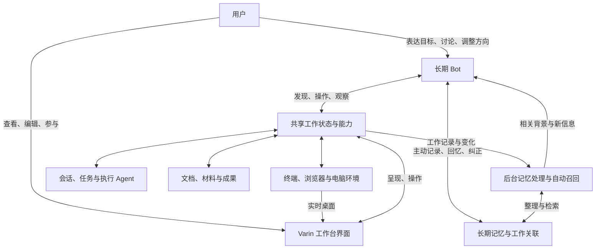

# Varin Bot 操作工作台：长期记忆与人机共同工作环境

Status: discussion draft / design-only；记录产品方向与待深化问题，尚未实施

Last updated: 2026-09-28

本文整理关于 Bot 形态及其记忆系统的设计讨论。已明确的方向是：让一个长期存在的 Bot 操作 Varin 工作台，
用户主要向 Bot 表达意图，随时可以进入同一工作台查看、修改和参与工作。第一阶段聚焦单 Bot。
记忆由后台自动处理与 Bot 主动使用共同维持，复用 TDB 底座，并引入快速决策模型参与局部语义判断。
文中的对象划分与运行方式是设计方向，不代表已经确定接口、物理存储结构或实施计划。
图形操作、持久电脑环境、实时观看与人工接管的共享设计见 [Computer Use](computer-use-design.md)。
实施顺序、源码基线与改动归属见 [BC0–BC9 实施计划](../plan/bot-computer-use-plan.md)，当前尚未实施。

现有系统的交付事实以 [architecture.md](../architecture.md)、[status.md](../status.md) 和代码为准。
本文不修改现有权限、知识写入或工作台契约；需要改变的部分应在后续设计中明确替代关系。

## 1. 产品判断：让 Agent 进入工作环境

传统 Agent 工作台围绕人的操作组织：人选择项目和会话、派发任务、整理材料、检查输出，
再把不同会话的结果联系起来。即使单个 Agent 已能自主执行，人仍承担着工作组织与跨时间连续性的主要责任。

Bot 形态希望把这些责任逐步交给 Agent。用户可以离开工作台，通过日常对话交代目标、补充信息和调整方向；
Bot 留在工作环境里，找到相关工作、调用已有能力、维护上下文，并在条件满足时继续推进。

因此，本设计的核心是：

> Bot 是工作台的长期操作者。Varin 工作台既是 Bot 开展工作的环境，也是用户随时进入现场的界面。

单纯增加消息渠道、进度面板或一台可观看的虚拟机，不能独自实现这一目标。
需要转移的是原本由人承担的组织、记忆和续接工作，而不只是发起工具调用的入口。

用户仍然可以把 Varin 当作工作台直接使用。采用 Bot 形态不要求用户放弃已有操作方式，也不要求每次工作都经 Bot 转述。

## 2. 已明确的方向与第一阶段范围

本轮讨论形成以下方向：

1. **用户指挥 Bot，Bot 操作已有工作台。** 继续利用 Varin 的会话、执行 Agent、文档、终端、检索和任务能力。
2. **记忆也是 Bot 的工作。** 自动记忆覆盖日常经历，Bot 主动回忆、记录和纠正认识，支持跨会话、跨任务、跨时间的沟通与决策。
3. **人和 Bot 使用同一工作现场。** 用户打开工作台，看到的是 Bot 实际使用的会话、资源和成果，并可直接参与。
4. **先做单 Bot。** 一个长期 Bot 可以组织多项工作并调用多个执行 Agent；单 Bot 不等于只允许一个任务或一个子 Agent。
5. **后续再设计多 Bot。** 多 Bot 的记忆归属、工作环境与查看视图需要分开考虑，本轮不确定集群拓扑。
6. **复用 TDB 与快速决策能力。** 存储和候选检索继续使用已有底座；语义组织、选材与检索动作判断由适合的模型参与。
7. **Computer Use 是共享执行能力。** Bot 和人工工作台任务都可以操作本机或独立电脑，用户随时查看同一桌面并接管。
8. **直接建设正式产品。** 沿现有架构增量发展，不为验证单个场景另建原型、临时后台或第二套执行状态。

本阶段不以新增多少连接器、是否附送云电脑或使用哪个聊天平台定义完成。
执行环境可以是本机或远端；具体渠道与部署方式围绕上述工作关系选择。

## 3. 同一工作环境，两种参与方式

图中的“工作环境”是能够被持续使用的资源、执行能力和工作关系，不等于一个桌面窗口或某个项目目录。
Bot 不应依赖 renderer 打开才能读取任务、派发工作或等待结果。界面关闭后，只要执行宿主仍在线，工作可以继续；
宿主停止后的恢复能力需要按具体执行类型判断，不能把持久记录等同于进程仍然存活。

Bot 与用户可以有不同的关注位置。Bot 正在处理任务 A 时，用户可以在工作台查看任务 B；
用户切换项目、页签或工作台布局，不应自动改变 Bot 正在执行的目标、路径或上下文。
Bot 打开和读取一份材料，也不意味着必须抢走用户当前编辑器的焦点。

“切换到工作台”首先是呈现方式和参与深度的变化，无需复制一份任务或重新启动一个 Agent。

## 4. Bot 的身份与执行会话分开

长期 Bot 需要跨对话延续身份、协作习惯和工作关联。它可以使用多个会话处理不同话题，
也可以恢复已有工作；不能把 Bot 的生命期绑定到某一个永不结束的模型上下文。

| 概念 | 在此模式中的职责 |
| --- | --- |
| 用户 | 表达意图、改变目标、提供判断，也可直接参与工作 |
| 长期 Bot | 理解用户、组织工作、维护跨时间联系，决定自己执行还是派发 |
| 对话 / Session | 一段具体交流及其模型上下文，不独自承担 Bot 的全部记忆 |
| 工作 / Thread / Run | 关联目标、执行、结果与后续事项；具体映射应复用现有对象 |
| 执行 Agent | 处理需要独立上下文、专门能力或并行推进的工作 |
| 工作台 | 共享能力与工作状态，以及用户查看和参与这些状态的界面 |

这张表用于厘清职责，不要求每一行新增数据库或调度服务。已有任务、运行、产物和等待记录能够表达的信息，
继续由原对象保存。Bot 需要补充的是长期身份和关联能力，而不是再建一份平行的任务事实库。

Bot 可以直接回答问题和完成短任务。是否派发由工作需要决定，不固定成“所有请求先由 Bot 转述给另一个 Agent”。
执行 Agent 的每条工具输出也不必再经 Bot 转述；用户可以直接进入对应现场，Bot 按需要读取和综合。

## 5. 记忆承接原来由人维持的连续性

### 5.1 记住什么

以前用户知道哪个会话负责什么、哪条路线试过、哪些结论不可信、昨天为什么停下。
Bot 接手组织工作后，需要能够保存和使用这些联系。

| 内容 | 例子 | 设计方向 |
| --- | --- | --- |
| 用户与协作习惯 | 用户不希望无意义地重复测试；偏好的输出语言 | 保留适用范围、来源与后续纠正，避免把一次性要求泛化为永久规则 |
| 长期目标与工作联系 | 某次发布依赖哪个构建任务、哪份文案和哪个分支 | 关联真实工作对象，支持跨会话找回 |
| 决策与经历 | 为什么放弃某个方案、哪个问题已调查过 | 保存依据和适用条件，允许修正与取代 |
| 未完成事项与承诺 | 构建结束后继续发布、等待用户提供材料 | 优先落在任务和 follow-up 等可查询记录中，不能只靠相似度召回 |
| 可复用经验 | 某个服务需要怎样操作、某类问题如何定位 | 与单次尝试区分；形成可复用操作时关联原有技能或流程能力 |

Bot 的记忆应包含对自身工作的认识，但不靠人格叙述替代任务记录。
“我熟悉发布流程”无法替代找到正确产物、确认本次状态并继续执行。

### 5.2 当前事实、历史证据与理解分开

文件内容、执行结果、运行状态和外部操作回执仍由各自的服务负责。
Bot 记忆保存理解和关联，并指向这些事实；需要行动时读取与本次判断有关的当前状态。

例如，记忆可以保存“上次在 Linux 打包阶段发现依赖问题，以及当时的处理理由”。
本次构建是否成功应从本次运行取得，不能从“上次成功过”的记忆推断。

这种区分也适用于人主动修改现场：文档已更新时，Bot 的旧摘要不能覆盖文档；
用户改变要求时，旧偏好不能继续作为当前任务的决定。

### 5.3 记忆不等于完整历史，也不等于上下文压缩

三种材料各有用途：

- 原始对话、操作记录和产物提供可追溯证据。
- 当前模型上下文承载正在进行的理解与推理；压缩用于继续当前执行。
- 长期记忆保留以后仍可能需要的事实、经验、偏好和工作关系。

不能每次都把全部历史塞入上下文，也不能把一次压缩摘要直接视为完整、永久正确的长期记忆。
向量检索可以帮助发现相关经历，但明确的待办、工作归属和未兑现承诺要能直接查询。

推荐的恢复方式是：先找回相关工作及其仍有效的约定，再读取必要现场和历史依据。
记忆应帮助 Bot 减少重复调查，同时保留在新证据出现时重新判断的能力。

### 5.4 自动处理与主动记忆共同工作

后台负责持续覆盖经历、补记遗漏、整理关联和提供相关背景；Bot 可以主动查找、记录、关联和修正记忆。
两条路径使用同一套记忆与来源记录，不维护互不相知的“自动库”和“主动库”。

主动记忆是 Bot 的正常工作能力。长期 Bot 主要负责沟通、组织和决策，回忆过去、比较经历、保存决定本身就能改善工作。
不能把执行 Agent 应专注局部任务的原则，扩大成 Bot 不应花注意力维护记忆。衡量价值应看是否减少重复说明、错误判断和返工，
不能只看是否多调用了一次记忆工具。

| 路径 | 主要价值 | 与另一条路径的配合 |
| --- | --- | --- |
| 自动形成记忆 | 从真实交流与工作结果中提炼有持续价值的经历，覆盖 Bot 没有主动记录的部分 | 识别已处理来源；已有主动条目可被补充，不反复生成同一记忆 |
| 自动召回 | 根据当前工作提供已有关联和可能有用的经历 | 为 Bot 提供起点；Bot 在思考中可以提出新的检索问题 |
| 主动形成记忆 | 保存参与决策时理解到的理由、适用条件、承诺与经验，纠正旧认识 | 进入同一整理和来源体系，后台能够识别其覆盖范围 |
| 主动召回 | 沿新假设追查历史，阅读原始依据，确认当前材料是否遗漏关键背景 | 结果直接服务于当前思考，不要求重新走一次同目的自动判断 |

例如用户要求“继续发布”，自动召回能找回发布工作；Bot 思考后可能主动追问“上次用户为什么不满意文案”
或“之前推迟的功能是否已经完成”。这些问题未必与当前消息最相似，却可能改变本次决定。

提示说明应让 Bot 知道记忆能力、材料来源和适用场景，不规定每轮必须查询、写入或反思。
日常连续性不依赖 Bot 每次主动调用；主动能力也不应被降为只能在自动机制失败后使用的补救工具。

### 5.5 从经历形成记忆

来源包括用户交流、有效决定、执行结果、人工修改和任务进展。以能够独立理解的事件或工作片段为单位，
保留发生了什么、涉及什么、结果或意义，以及以后可能适用的条件；原始材料通过引用找回。

建议区分以下处理结果：形成新记忆、补充已有记忆、修正旧认识，以及已经检查但无需形成记忆。
最后一种结果仍需记录处理进度，避免后台反复提炼普通寒暄或没有新增信息的片段。
主动写入和后台整理需要共享来源覆盖与更新记录；来源后续被修改时，重新处理受影响的部分。

用户明确表达的新要求直接进入当前工作并生效，长期整理随后完成，不等待记忆提炼才开始遵守。
用户明确要求记住的信息应直接落实；语义价值评分用于整理，不成为第二道批准门。

记忆需保留可区分的内容性质：用户要求、观察到的结果、Bot 的判断、尚未完成的计划。
“决定发布”与“已经发布成功”不是同一个事实。一次例外也不能因为被提炼成简短句子而变成永久偏好。
用户应能查看来源、纠正和删除记忆；删除结果不能被后台从同一旧材料中立即重建。

后台任务可按真实交流和工作完成的边界合并处理，不为每条工具输出生成一份摘要。
具体触发、保留和整理策略需要结合实际负载确定，不在此固定条数、周期或额外模型数量。

### 5.6 自动召回与主动追查

召回输入应包含当前目标、关联工作、有效约定和必要的最近变化，不能只拿最后一句用户消息做相似度查询。
“继续吧”需要通过工作关系解析出它在继续什么。

两类材料共同构成回忆的起点：

- **明确关联材料**：相关任务、未完成事项、既有决定和成果，可直接按工作关系取得。
- **联想材料**：相似经历、跨任务经验和可能适用的偏好，通过文本、向量和图关系检索发现。

明确的待办和承诺不能因为没有进入相似度 Top-K 就消失。另一方面，检索候选与模型实际接收的记忆分开，
候选需要结合当前用途、互补关系和已知材料选择；排名变化不应造成整份上下文反复重排。

Bot 可以继续按事件、时间、人物、对象或决策依据追查，查看来源并提出新问题。
执行 Agent 也应能取得与自己任务有关的记忆，不必通过 Bot 转发每一次读取；需要解释和判断时再咨询 Bot，见 6.2。

### 5.7 TDB、快速决策模型与生成式模型的分工

记忆复用 Varin 已有 TriviumDB（TDB）底座及资源、任务记录。此处不重新选择数据库，也不复制 infOS 的整套存储实现。
Bot 的逻辑记忆归属与物理分库方式分开；用户知识、项目知识、Bot 经历和工作关联的具体映射仍需细化，
不能因界面切换、对话归档或目录变化丢失长期联系。

| 层次 | 承担的工作 |
| --- | --- |
| TDB 与确定性程序 | 持久存储、索引、文本/向量候选、图遍历；维护来源、修订、覆盖和已有工作引用 |
| 快速决策模型 | 对实际材料做局部语义判断：事件归类、关系选择、用途评分、候选选择、继续检索的动作判断 |
| Bot / 生成式模型 | 理解开放目标，提出新的检索问题，生成记忆叙事，解释经历并作复杂综合判断 |

Jev 类模型适合参与下列判断，具体模型通过通用快速决策能力绑定，不把领域接口固定成某个供应商：

| 使用位置 | 需要判断的问题 | 后续行为 |
| --- | --- | --- |
| 记忆形成 | 有无持续价值；属于新事件还是旧事件补充；是长期偏好还是本次约定 | 选择已有来源/候选和处理方式；需要新叙事时由生成式模型完成 |
| 关系整理 | 两条记录是补充、纠正、例外，还是不同事件；材料是否支持因果关系 | 更新有来源的关系与有效性，保持历史依据 |
| 当前召回 | 是否影响这次判断、补充缺失背景、避免重复错误；与已选材料是否重复 | 选择实际有用且互补的记忆，不只按话题相似排序 |
| 继续检索 | 沿哪个真实关系、事件或来源深入，是否需要新的查询表达 | 从可执行候选中选择；新问题或关键词由 Bot/生成式模型提供 |
| 上下文交付 | 新条目是否提供增量意义、是否纠正已有认识 | 交付相关新材料或更新；同修订去重等确定性工作仍由程序完成 |

不要用一个“重要度”分数同时决定长期保留、当前召回和待办执行。“明天发送文件”可能只在短期重要，仍须可靠履行。
模型判断补充语义理解，不替代真实完成回执、版本比较和来源身份；低相关分也不自动删除原始记录或取消承诺。
候选缺失时，重排无法找出不存在于候选中的材料，应沿明确关系继续查找，或由 Bot 改变查询方向。

同一批材料上的独立判断可以合并请求；目标、材料及判断条件均未变化时不反复评价。同一判断选用一个合适的消费者，
避免先算法重排、再专用重排、再快速决策、最后 LLM 重排的机械叠加。明确对象读取不需要先经过模型选材。
未配置快速决策时已有存储与检索仍可用；调用失败不伪装成无相关记忆，也不据此作失效或删除判断。

通用合同与配置沿 [fast-decision-model-design.md](fast-decision-model-design.md) 扩展真实记忆消费者。
2026-09-28 源码核查确认 TypeSafe/Jev adapter 已存在，用途已注册 `explore/web/scholarly`；
记忆消费者尚未接入，具体增量按 BC 计划完成，不重复实现供应商 adapter。
模型输出结构合法不证明判断正确，效果应看实际经历能否被找回并改善工作，不预先承诺普遍优于现有算法或固定延迟。

### 5.8 记忆演变与上下文缓存分别处理

后台记忆可以持续演变；当前执行已经接收的消息与工具结果尽量保持原样。数据库更新不要求重新编译请求前部。

推荐的交付方式：

1. 身份、稳定协作说明与能力定义组成可复用的请求前部；动态时间、检索结果和工作状态不混进这一段反复改写。
2. 初次进入工作时按需提供相关背景。后续自动召回只追加有用的新材料；主动查询结果沿普通工具结果追加。
3. 仍在当前上下文中的同一记忆修订不重复灌入；旧认识被纠正时追加明确的更新与适用范围，使当前判断及时改变。
4. 容量需要压缩或新执行需要重建时，再整合当前有效记忆和工作状态。该次重建有实际成本，不承诺缓存永久有效。

例如本次输入为“稳定说明 + 已有历史 H + 新记忆 M1 + 新消息”，后续沿这条历史追加结果和 M2，
不把 M1 原地替换成最新排序列表，再把 H 全部重发成另一种结构。压缩和重建沿既有上下文机制进行，
不为缓存保留过时指令，也不延迟用户纠正。

后台判断请求与 Bot/执行 Agent 请求分别组织可复用输入；内容相同不意味着跨模型或跨 provider 一定共享缓存。
实际效果还取决于 provider 的缓存配置、输入序列化、工具定义和有效期。缓存优化服务于有效输入与完成工作，
不通过禁用主动记忆、减少必要材料或为保活而不断调用模型来追求命中率。

### 5.9 infOS 的借鉴及其边界

参考源码来自本地 `D:\project\infOS\infOS`，核查基线为 `cfffcc8`（2026-09-28）。
本轮仅核对设计与代码链路，没有运行模型效果或缓存命中测试。部分旧文档描述 Python/旧记忆架构，以下结论以 TypeScript 实现为准。

| 已观察到的设计/实现 | 对 Varin 的启发 | infOS 源码入口（相对其仓库） |
| --- | --- | --- |
| 事件记忆包含叙事、时间、参与者、主题及原始消息来源 | 保留完整经历和可追溯依据，不只收集孤立偏好 | `packages/shared/src/types/event-memory.types.ts` |
| 主动草稿在回复持久化后提交；后台补记未覆盖片段，共用覆盖记录 | 自动与主动协作，已审阅但无需形成事件也能记录进度 | `packages/backend/src/services/memory/eventNoteDraftCommitter.ts`、`eventMemoryFallbackService.ts` |
| 自动召回补充最新事件和命中事件前驱；主动查询可展开关系 | 让回忆保留前后联系，具体补充策略仍需适应工作任务 | `packages/backend/src/services/memory/eventMemoryService.ts` |
| 反思整理关系、修订事件、归档被覆盖条目 | 记忆可演变，保留来源；不将所有整理都转交用户 | `packages/backend/src/services/memory/eventReflectionService.ts` |
| Social 子应用可临时咨询主 Agent；主 Agent 调用自身上下文与记忆链路回答 | 执行者按需要借用长期背景与判断；重要决定须有持久落点 | `packages/apps/social/runtime/index.ts`、`packages/backend/src/container.ts` |

infOS 默认槽位中，250 的临时工作状态、700 的召回记忆和 750 的近期历史会随轮次重新组装进 system prompt；
窗口移动和较早位置的变化会损害跨轮前缀复用。一次 ReAct 内部则主要追加消息，不能把两种情形等同。
其 Anthropic adapter 未设置 `cache_control`，检查到的 Anthropic/OpenAI 兼容用量归一化也未保留缓存明细；
这些说明存在结构与接入层缺口，不构成实际命中率为零的证据。

Varin 继承的是长期主体、事件记忆和按需咨询的工作关系。infOS 的短历史窗口、状态槽位排序、工作材料固定轮次过期，
以及 SA-PPR/ContextRNN 等可选增强算法，不作为必须照搬的默认方案。

### 5.10 与现有知识机制的关系

[harness-knowledge.md](harness-knowledge.md) 描述了跨会话知识、来源、取代和召回机制，
其中持久知识提议、人工审阅与显式自动接受的规则，反映的是已有工作台形态。

新方向要求后台和 Bot 都能自然形成记忆，日常连续性不应依赖用户逐条审阅。
这是需要在实施中明确修改的产品语义，不能把既有提议托盘原样接到 Bot 前面就视为完成。
同时，自动形成的判断不能冒充用户明确作出的决定，用户修改和遗忘仍要可操作。

后续需要明确旧知识条目与新记忆职责的统一方式、写入和召回入口的替代范围，再沿现有存储权威完成改造。
本文确立方向，不改变现有运行行为，也不新增另一套并行知识库；当前调用方的具体替代合同仍待设计。

## 6. 让 Bot 真正能够使用工作台

### 6.1 面向工作的操作能力

Bot 需要面向工作的操作入口。例如：找到相关会话、阅读原始结果、创建或续接任务、给执行 Agent 补充要求、
检查成果、编辑文档、启动执行、安排结果就绪后的后续工作。这些入口应使用已有领域服务。

| Bot 的需要 | 工作台应提供的能力语义 |
| --- | --- |
| 接续昨天的事情 | 找到工作关联、最近有效决定、未完成事项及现场入口 |
| 安排具体执行 | 复用或创建合适的会话 / 任务，给出目标与相关资源 |
| 理解进展 | 读取实际状态、增量结果和必要原文，分辨运行中、等待与不可用 |
| 检查或修改成果 | 访问同一份文档、代码差异、材料和产物 |
| 调整方向 | 将要求送达具体执行对象，区分已接收与已经生效 |
| 等待后继续 | 引用真实执行或外部条件，沿已有 follow-up 能力续接 |

以上是期望语义，不规定新工具名称，也不代表现有 API 已全部满足 Bot 使用。
实施前需核对哪些能力已经可由 Agent 调用，哪些目前只在 UI 里，以及是否依赖界面挂载或前台选择。

对 Varin 自己的功能，优先暴露结构化操作与结果，不要求 Bot 通过截图寻找按钮。
外部应用或只有图形入口的工作仍可以使用计算机操作能力；它与工作台 API 共同服务于任务。

“可调用”也不等于“会使用”。Bot 需要知道有哪些相关能力、如何找到工作对象，以及操作后的实际结果。
这些说明应围绕它要做的事组织，不把全部内部接口和实现细节一次性塞入提示词。

### 6.2 Bot 与执行 Agent 双向交换信息

派发工作时，Bot 给出目标、必要背景、相关资源和已有决定。执行 Agent 拥有自己的连续执行上下文，
不必继承 Bot 的全部私人交流或长期历史，也不需要 Bot 逐条转述工具结果。

执行中可以有两种按需入口：直接查询相关记忆和工作事实；向 Bot 询问需要解释、权衡或补充意图的问题。
例如“上次为何放弃方案 A，现在的变化是否足以重新考虑”。Bot 也可以根据新要求主动向对应任务补充信息。
单 Bot 下的这种协作仍是 Bot 与执行者的分工，不提前引入多 Bot 集群协议。

每次交换需要关联实际工作和请求，使回答回到正确的执行上下文；Bot 的回答表达当前判断，实际执行结果继续由执行对象提供。
咨询可结合相关记忆与现场进行，不要求每次都重编译整份主聊天历史，也不要求所有查询经过 Bot 模型中转。

内部交流可以不逐条显示在用户主聊天中，但有效决定、承诺、目标调整和未解决事项应记录在相应工作中，
并可按需要形成长期记忆。用户进入工作台能够找到这些依据；隐藏主聊天噪声不等于丢弃后续推进所需的信息。

### 6.3 操作电脑与共享桌面现场

Computer Use 与文件、终端、检索共同构成 Bot 可以使用的工作能力，普通工作台任务也使用同一入口。
需要避免干扰本机时，Bot 可使用本机独立虚拟机或远程持久电脑；用户通过工作台的实时桌面视图查看和接管。
Bot、电脑和桌面会话保持独立身份，不固定成一 Bot 一虚拟机，也不因聊天结束销毁电脑。

Agent 按决策需要读取界面、截图和动作结果；用户观看的持续画面独立传输，不把视频逐帧塞进模型上下文。
人工接管停止对应桌面的自动输入，交还后按新现场继续。用户关闭本机后还需持续决策时，协调 Host 也要在远端运行。
具体环境、控制、交接、恢复和成果归属统一遵循 [Computer Use 设计](computer-use-design.md)。

办公与 Bot 共用长期连续性和电脑操作基础。需要直接编辑或比较成果时，用户继续在工作台参与，
不要求为办公再建一套 Agent，也不强制每项办公任务都转成后台 Bot 对话。

## 7. 持续工作与人工参与

### 7.1 长期存在不要求模型一直运行

Bot 的身份、记忆和未完成工作可以持久存在；模型在需要理解、判断或行动时执行。
用户消息、已有任务的新结果、约定的时间或条件可以使它继续工作。

没有相关变化时不需要反复调用模型问进展。程序能判断的运行状态和条件沿既有执行观察与续接机制处理。
这与 [agent-follow-up-design.md](agent-follow-up-design.md) 的方向一致，但跨任务的 Bot 续接关系仍需设计。

恢复时要先找回真实工作，区分仍在运行、已经完成、结果未知和需要重新执行。
不能仅因为 Bot 的对话上下文重建，就再次提交已经受理的外部操作或启动重复任务。

### 7.2 进入工作台即进入同一现场

用户应能从 Bot 对话进入它使用的相关会话、任务、文档或执行环境。
这些入口打开真实对象，而不是另生成一个汇总副本，或启动一个需要重新交代背景的 Agent。

用户可以直接补充执行会话、编辑草稿或调整任务。Bot 在继续相关工作时应取得这些变化，
并尊重当前有效要求和成果修订；无需把所有操作先转述给 Bot 才能生效。
变化的送达应复用现有事件与上下文增量，避免另建一份只对 Bot 可见的现场镜像。

用户接管某项实际操作时，只协调受影响的对象。接管一个浏览器不意味着整个 Bot 必须停工；
编辑一份文档也不应成为所有任务的全局锁。具体并发语义沿对应资源的真实能力设计。

### 7.3 查看能力服务于协作

用户需要时能看到：Bot 正在组织哪些工作、作了哪些影响结果的决定、成果在哪里，以及下一步依赖什么。
原始过程和工具记录按需展开。远程桌面是其中一种工作面，无法独自呈现通过 API、终端和文件完成的全部工作。

默认通知围绕可用结果、需要判断的问题和影响任务的重要变化；详细现场由用户主动进入。
不以不断汇报、逐步确认或新增目录限制来替代有效的工作组织与记忆。

## 8. 一个贯穿场景

本节用于说明正式产品应如何协作，不要求为该场景建设独立原型或专用实现。

用户告诉 Bot：“继续上次那个版本的发布，构建好了就整理说明给我。”

1. Bot 找到相关发布工作，回忆已确定的范围与用户偏好，读取本次构建和现有文案的实际状态。
2. 已有执行会话能够继续时就沿用；确有独立工作需要时再派发执行 Agent。文案执行者可查询既有偏好，
   若不清楚上次修改理由，则咨询 Bot；Bot 主动追查相关经历后回答，影响本次工作的决定留在任务中。
3. 构建尚未完成时，登记与真实构建关联的后续工作。用户离开，工作不依赖聊天页面保持打开。
4. 用户后来进入工作台，看到同一批任务、实际构建和文案，并直接修改其中一段说明。
5. 构建结果到达后，Bot 读取新的结果与文案修订，继续用户已交代的工作；是否对外发布取决于已有用户要求。
6. 本次结果和后续事项归入对应工作。Bot 可以主动记下决定及理由，后台补记尚未覆盖的经历，
   快速决策模型帮助关联旧事件；这些变化不原地改写执行者已使用的请求前部。下一次交流能够找回这些联系。

这个场景同时检验：Bot 是否接过人的组织责任、记忆是否真的支持行动，以及人和 Bot 是否共享同一现场。
完成一次聊天回复或打开一台虚拟机，只覆盖其中很小的一部分。

## 9. 与现有 Varin 设计的衔接

| 设计基础 | 对此模式的意义 | 尚需核对或深化 |
| --- | --- | --- |
| [可组合工作台](composable-workbench.md) | 多种界面共享文档、执行与运行时身份 | Bot 可用操作与界面选择解耦；不依赖 renderer 存活 |
| [Computer Use](computer-use-design.md) | 本机/独立电脑控制、实时桌面与人工参与 | 沿共享执行架构接入平台驱动、环境管理和控制交接，不建立 Bot 私有桌面系统 |
| [任务与资源 Harness](resource-oriented-harness-design.md) | 工作与资源不再被单个项目目录捆绑 | Bot 能自然组织跨项目材料；不恢复可变操作目录前置流程 |
| [知识机制](harness-knowledge.md) | 来源、有效性、取代与检索基础 | 长期 Bot 归属、自主记忆、工作关联和纠正语义 |
| [快速决策模型](fast-decision-model-design.md) | 通用候选选择、判断与评分能力 | 增加记忆形成、关系组织和召回等实际消费者；不把现有 `explore` 接线当成全部已具备 |
| [上下文机制](harness-context.md) | 当前执行历史、环境变化与协作信息的呈现 | Bot 记忆如何进入上下文；避免重复注入和依赖巨大常驻历史 |
| [等待与续接](agent-follow-up-design.md) | 事件与时间驱动的继续工作 | Bot 对多项工作承担连续性，不靠反复轮询模型 |
| [办公连续性](office-work-continuity-design.md) | 材料、决定、成果、行动与等待之间的联系 | 工作对象可以复用；Bot 模式不限定于办公，也不要求先实施全部办公功能 |

这里引用的是设计关系，不是对现有代码完备性的验收。
继续保留 Host、Pi、Rust 和各资源服务的职责，不为 Bot 新建一套 Electron 后端或平行文件状态。

## 10. 单 Bot 与后续多 Bot

单 Bot 首先解决长期身份、记忆、工作台操作和人工参与这条完整链路。
它可以跨项目工作，也可以拥有多个执行中的任务；“一个 Bot”不把工作环境收窄成一个文件夹或一个模型请求。

多 Bot 以后可能需要独立的工作现场与查看视图，但以下问题尚未决定：

- 哪些记忆属于用户共同知识，哪些属于某个 Bot 的经历与角色？
- 多个 Bot 共用一个工作台资源集合，还是分别拥有工作环境，哪些对象可共享？
- 工作由谁负责，何时转交，用户查看一个 Bot 时应看到哪些参与关系？
- 多个视图如何呈现各自关注的现场，同时保持共享文件和任务事实的一致性？

现在区分 Bot 身份、会话、工作关联与资源；电脑环境沿共享 Computer Use 设计建设。
不提前实现多 Bot 集群调度、跨 Bot 通信协议，也不固定为一 Bot 一虚拟机的部署结构。
单 Bot 中使用多个执行 Agent，仍然属于当前 Bot 组织工作，不等同于多个长期 Bot。

## 11. 后续需要形成的具体设计

下一步优先回答会影响产品成立的问题：

1. **记忆归属与生命周期。** 细化用户、Bot、工作与项目记忆的关联；定义来源覆盖、纠正、遗忘，以及现有知识机制的替代合同。
2. **主动与自动的调用链。** 定义后台整理和自动召回的触发、Bot 的主动操作与执行者咨询，明确重要决定怎样留下来。
3. **快速决策的真实用途。** 选择首批值得接入的语义判断，提供足够材料与可执行候选；复用现有绑定并确认实际效果。
4. **上下文交付。** 明确记忆修订的增量交付、跨会话恢复、压缩与重建，结合实际 provider 请求检查缓存表现。
5. **工作台操作与人工参与。** 核对已有领域能力和 UI 生命周期依赖，定义直接编辑、要求变化与局部接管的继续方式。
6. **电脑环境与图形操作。** 沿 Computer Use 设计收敛平台驱动、远端桌面、观看/输入通路和成果接入。

存储底座沿用 TDB；具体表结构、工具名、消息平台、默认模型和部署套餐留到这些问题清楚后选择。
本文件不启动实施，也不新增发布阶段或已完成状态。

后续实现直接进入现有产品与共享架构，按实际依赖逐步完成，不能以验证某个场景为由建设平行系统。
正式产品应让用户完成真实的跨时间工作：离开后能继续、回来能直接参与、再次交代时无需重建背景。
重点观察重复说明和重复调查是否减少、记忆能否纠正、人工修改能否被接续，以及执行成果是否真实可用。
这些场景用来判断模式是否成立，不是要求每次改动都跑一套新的全量测试。

## 12. 外部参考及证据范围

以下资料于 2026-09-28 查阅，支持机制选择，不作为 Varin 已接入或取得效果的证明：

- [TypeSafe Introduction](https://docs.typesafe.ai/introduction)：Choice、Score、Noul 与同次独立问题判断；适合有实际材料的局部决策。
- [TypeSafe 重排示例](https://docs.typesafe.ai/cookbooks/rerank_typesafe)：候选召回后进行语义评分；重排不能找回候选中不存在的材料。
- [Jev 1.13 已知边界](https://docs.typesafe.ai/model-jaggedness/jev-1.13)：具体模型的能力边界；类型合法不等于语义正确。
- [Jev-Mem](https://arxiv.org/abs/2609.23986)：研究快速决策参与记忆分类、关系组织、检索路由和候选判断的分工；其报告结果不直接外推到本产品。
- [Anthropic Prompt caching](https://platform.claude.com/docs/en/build-with-claude/prompt-caching)：前缀复用、缓存启用方式及失效因素；不同 provider 分别按实际协议处理。
