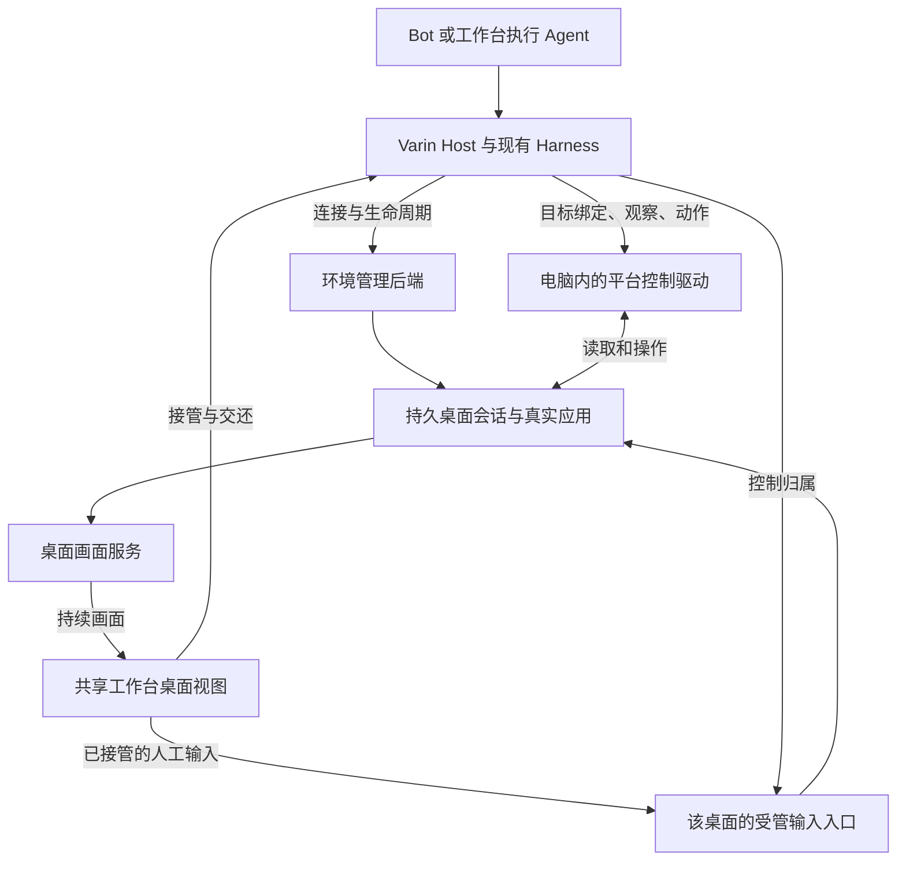

# Varin Computer Use：共享电脑控制与持久桌面环境

Status: accepted direction / design-only；定义正式产品架构，尚未实施

Last updated: 2026-09-28

本文定义 Computer Use 在 Varin 中的职责，以及本机、独立虚拟机、远程电脑、实时观看和人工接管的统一设计。
它与 [Bot 操作工作台](bot-operated-workbench-design.md)、[办公连续性](office-work-continuity-design.md)
共同发展，复用现有 Harness、执行宿主、资源服务与工作台，不建设演示专用或验证专用的执行系统。

本文是后续正式实现的设计依据，不代表平台驱动、远程桌面或虚拟机管理已经交付。
当前实现事实仍以代码、模块文档和 [status.md](../status.md) 为准。
具体阶段、平台工作与环境后端选择见 [BC0–BC9 实施计划](../plan/bot-computer-use-plan.md)。

## 1. 产品定位与实施原则

Computer Use 是 Agent 观察和操作图形应用的能力，包括界面读取、截图、点击、输入、滚动、拖拽及操作结果观察。
它应成为与文件、终端、检索并列的共享执行能力，同时服务于：

- 长期 Bot 在用户离开后组织和推进工作。
- 用户在工作台内直接发起的单项 Agent 任务。
- 办公、开发、科研中需要操作浏览器或桌面应用的步骤。

办公工作与 Bot 的持续沟通、记忆和调度存在大量重叠，因此先建设 Bot 的共享基础是合理顺序。
需要直接编辑、比较材料或反复调整的工作仍适合工作台。两种参与方式使用同一任务、资源和执行环境，
无需为办公建立另一套 Agent loop，也无需把所有图形操作包进 Bot 才能使用。

实现直接进入现有产品架构。可以按依赖关系逐步完成平台适配与能力接线，每一步都形成正式服务或正式消费者，
不先建设孤立的单场景原型、另一套后台或临时桌面应用，再为演示结果补整合层。
真实任务用于发现问题和判断质量，不能反过来把系统设计成只为通过某个演示流程而存在。

## 2. 工作台、电脑与 Bot 各自是什么

工作台组织任务、材料、成果和人的参与；电脑提供真实应用、桌面会话和文件/进程环境；Bot 使用这些能力持续工作。
三者的身份和生命周期分开。

| 对象 | 职责 | 与已有系统的关系 |
| --- | --- | --- |
| Bot / 执行 Agent | 理解目标、决定操作、处理结果 | 沿现有 Session / Thread / Run 执行与记忆机制 |
| 协调 Host | 接受任务、安排模型与执行、关联结果 | 沿现有 Application Host 与远程协调职责 |
| 电脑环境 | 指向实际本机、虚拟机或远程机器，呈现可用能力与状态 | 复用连接、目标机器和资源身份，不等同于项目目录 |
| 桌面会话 | 一套实际登录、显示、应用窗口和输入现场 | 归属于某台电脑；与 Varin 聊天会话不同 |
| Computer Use 驱动 | 在指定桌面内观察与操作应用 | 平台适配能力，不另拥有任务、记忆或模型循环 |
| 桌面视图 | 在工作台、Web 或移动端观看和人工操作该桌面 | 同一现场的客户端，不是另一份执行状态 |

一个 Bot 可以使用多台电脑，一台电脑也可以承载多项工作。初期聚焦单 Bot，不因此把 Bot ID、桌面 ID、Run ID 或虚拟机 ID 合并。
同一个桌面上争用焦点和输入的任务需要协调；不共享这些资源的任务可以并行。

文件和成果始终保留执行环境与实际位置。同样的 `/home/user/report.pdf` 在两台机器上不是同一文件；
切换侧栏项目、打开另一个桌面页签或切换 Workbench Profile，不改变进行中的操作目标。

## 3. 正式支持的环境形态

| 形态 | 产品用途 | 需要如实呈现的影响 |
| --- | --- | --- |
| 用户当前桌面 | 使用本机已有应用、登录状态和工作现场 | 具体动作可能改变窗口、焦点或输入；不能普遍承诺完全不打扰 |
| 本机独立虚拟机 | 使用本机资源，同时分开用户桌面与 Agent 桌面 | 占用本机资源；本机休眠或关闭后的持续运行受宿主状态影响 |
| 远程持久电脑 | 长期工作、跨设备进入现场、避免占用用户当前桌面 | 依赖远端桌面与协调者的实际运行状态 |

“不要影响我正在用的电脑”应能够直接对应到独立桌面环境的选择，不能只靠后台点击技巧作保证。
用户已经配置合适环境时，任务可沿该默认值开始；只有任务需要不同操作系统、应用或数据位置时才改变选择。
缺少环境时提供正常的连接或创建入口，不让用户先理解内部服务拓扑。

独立图形会话、容器和虚拟机不是同一种环境。独立图形会话可以分开焦点与窗口，但不因此获得整机隔离；
已有服务器能否承载所需应用，由其实际操作系统、桌面与能力决定。产品按实际提供的环境命名。

### 3.1 持久内容与运行状态

长期电脑应保留用户选择的浏览器配置、应用数据、安装的软件、下载文件和工作成果。
任务结束、关闭观看页或聊天压缩，不自动销毁这套环境。任务需要一次性环境时，可明确选择其生命周期。

创建、连接、启动、停止、重启和销毁分别表达。停止电脑不等于删除持久磁盘；重启也不等于能够恢复任意程序内存。
实际支持哪些操作由环境管理后端声明，不为不具备快照恢复能力的机器显示虚假的“原地续跑”。

### 3.2 本机关闭后的连续性

需要分别说明三件事：远端应用是否仍运行、桌面是否可连接、Bot 是否还能继续决策。
远端只部署控制驱动时，本机协调 Host 停止后，已经启动的应用可能继续运行，但不会因此自行产生下一次模型调用。

希望关闭本机后仍持续推进工作时，协调 Host / Bot 执行应运行在常驻远端。
沿 [受管远程设计](research-cluster-design.md) 保持同一工作的唯一协调者，不能在连接恢复时又启动一个重复 Bot。
Computer Use 接入不改变既有普通 shell、受管作业和 Agent Run 各自的持久性边界。

## 4. 观察控制、实时画面与环境管理分别负责

图中是职责划分，不要求一框一个进程或数据库。驱动和画面服务可以由同一平台组件提供，
环境管理可以连接用户已有机器，也可以使用其已配置的虚拟化或云服务。

### 4.1 Agent 观察与动作

Agent 在需要判断时读取界面结构、文本和截图，执行动作，再观察结果。
观察结果需要对应明确的机器、桌面、窗口和采集时刻，并保留截图尺寸、显示缩放等解释坐标所需的信息。
元素引用属于对应的观察与目标，不把一台电脑或上一窗口里的数字索引拿到另一个现场使用。

界面变化后，优先使用仍有效的语义定位或重新读取相关部分。只在证据不足以定位目标时要求新的观察，
不为每个微小页面变化增加全屏重读或重复模型检查。

### 4.2 用户实时观看

用户看到持续更新的桌面，模型只接收本次决策需要的观察。实时画面走远程桌面/媒体传输，不走 LLM 工具结果流。
用户打开、缩放或关闭观看视图，不推进 Agent 的观察游标，不替换它持有的元素映射，也不自动唤醒模型。

有观看者时按实际画面变化和网络能力传输；无人观看时可停止相应画面订阅，桌面和 Agent 工作继续。
分辨率、刷新和带宽策略根据环境能力调整，不预设所有平台共用的硬限制。
画面暂时中断应显示最后更新或断开状态，不能让静止的旧帧冒充正在直播。

### 4.3 环境管理

环境管理处理连接、准备桌面组件、启动或停止电脑、查询实际运行情况。
SSH 可用于接入、准备和隧道；只有 SSH 连通不能宣称图形桌面已经就绪。
状态应区分机器在线、桌面可用、驱动可操作和画面可观看，某一项失败只影响依赖它的能力。

在用户已配置的虚拟化或远程服务上创建环境属于同一产品路径，不能为 Bot 的云电脑另建一套账户、凭据或机器清单。
托管服务、用户服务器和本机虚拟机通过实际环境后端接入，具体后端按应用兼容性和部署需求确定。
本设计不承诺附送云资源，也不把某家商业平台作为使用 Computer Use 的前置条件。

## 5. Computer Use 操作面

### 5.1 结构化界面与视觉观察结合

应用暴露可靠元素语义时，可直接读取和操作按钮、输入框、菜单、选区等对象。
画布、自绘控件或语义缺失区域使用截图和坐标。浏览器已有结构化操作能力时可以继续使用，
需要桌面交互时进入同一浏览器所在的桌面，而不是悄悄另开一份账号和状态不同的浏览器。

支持能力需要按平台和当前应用返回：能否取得界面树、截图、语义动作、坐标动作、文本输入和拖拽等。
不能把“有辅助功能接口”解释为能无差别操控所有软件，也不能因为某个驱动缺少坐标操作而永久禁止该类任务。
平台实现按实际缺口补齐，或明确返回当前不可用原因。

### 5.2 结构化调用与脚本编排共享同一驱动

面向模型可提供直接操作接口和持久 JavaScript 编排入口，具体工具形态在现有 Harness 中收敛。
二者都调用相同的观察和动作服务，不分别维护应用发现、截图缓存或输入实现。

脚本适合把已经明确的动作、等待和结果读取组合在一次调用中，减少不必要的模型往返。
需要根据新界面作语义判断时返回模型，不预先猜测一长串未知页面，也不以固定 sleep 冒充操作完成条件。
操作结果区分输入已提交与预期界面已经出现；例如键盘事件发送成功不直接证明表单已提交。

应用绑定显式指向电脑与桌面，不依赖用户当前查看的页签。脚本变量可以跨工具调用保留，
其生命周期仍属于执行运行时；重置脚本不关闭真实应用，应用继续运行也不意味着脚本内存已经恢复。
取消和人工接管需要贯穿排队动作与脚本执行，不能只停止模型输出后仍继续发送剩余点击。

### 5.3 平台策略与不打扰体验

本机桌面优先采用应用支持的语义操作和定向输入，但应如实说明哪些操作会改变前台。
确实需要普通键鼠输入、拖拽或切换窗口时，能力应在合适的桌面环境中可用。
独立电脑内可以正常使用其桌面，不将“保护本机用户焦点”的策略机械变成远程电脑上的功能禁用。

正常工作不增加项目目录白名单、逐点击审批或额外的统一时间/并发配额。
已有用户授权、账户访问与操作系统必需权限继续生效；真实平台限制和共享输入冲突由对应层处理并说明。

## 6. 观看、接管与交还

观看和控制是不同操作。用户打开实时画面默认进入观看状态，不因此抢占 Agent。
接管时，受管服务停止向该桌面发出新的自动输入，撤销尚未执行的旧输入，并让人工输入进入同一现场。
已经开始的短动作需要收尾或返回实际状态，不能把“接管请求已收到”冒充“自动输入已经停止”。
中止拖拽或组合键时，驱动应释放本次受管操作仍按下的键鼠，避免交给用户一个保持按下状态的输入现场。

人工控制期间，Agent 可以继续不影响该桌面的工作，也可以读取允许的观察等待用户交还。
所有能够改变同一桌面状态的受管入口，包括元素操作、坐标输入和脚本批次，都应服从这次交接，
不能只暂停一条鼠标通道而让另一条自动输入继续。

交还后，Agent 先取得当前必要观察和用户补充，再决定下一步。旧窗口引用、旧坐标和接管前排队的动作不能直接继续执行。
用户关闭观看页不自动销毁桌面；持有人工控制时失联，也不能假定用户已经完成操作并自动交还。
重新连接后应能看到实际控制归属并主动交还或恢复控制。

控制协调的范围由真实共享输入和焦点决定。同一图形会话中多个窗口可能共享键盘焦点，不能仅按窗口名假装相互独立；
不同桌面、独立浏览器执行会话和普通后台作业可以按各自资源并行，不设全局 Bot 锁。
该机制协调 Varin 的受管输入，不宣称能够隔离操作系统里所有第三方程序或任意外部脚本。

本机用户的物理输入无法依靠远程视图接管按钮完全管理；需要共同使用时按实际平台能力处理。
用户要求持续不受干扰时，产品应提供独立桌面环境，而不是承诺所有应用都能后台操作。

## 7. 连续性、断线与恢复

画面订阅、Computer Use 驱动、桌面会话、机器和 Agent Run 有各自生命周期。
查看连接断开不取消任务；驱动重连不重建电脑；电脑重启后，旧元素句柄和截图定位需要重新取得。

动作响应丢失时，先读取当前界面或实际结果，区分未执行、已执行与无法确定。
不能通用地重放“最后一个动作”：提交表单、发送消息、购买或覆盖文件可能已经成功，
即使截图没有返回也不能直接再点一次。服务可沿已有执行记录保存动作受理与回执，但不能声称所有 GUI 动作都能事务化。

恢复使用实际环境身份和桌面会话，无法恢复原现场时如实呈现。需要新桌面、新登录或新执行时明确建立新的关系，
不把一台空机器伪装成恢复完成，也不把看不到窗口静默解释为任务已经结束。

等待应用加载、下载结束或外部结果继续沿已有事件/条件观察和 follow-up 能力；
需要理解时才调用模型，不为保持桌面活跃或画面刷新持续生成模型请求。

## 8. 文件、账号、成果与记忆

电脑中的文件、浏览器配置、应用登录和任务成果属于持续工作现场。任务可以复用用户选择的现有环境，
不默认每个子 Agent 都重新安装应用、重新登录和复制全部数据。

远端下载或生成的成果应能成为现有任务 Artifact 或资源引用：包含实际机器、路径、版本与可访问状态。
用户需要本地文件时，经已有传输和资源服务取得；同名路径不能作为本地副本已同步的证明。
文档经 GUI 修改后，工作台文件/编辑器状态沿原有观察与修订协调，不创建一份 Computer Use 私有草稿权威。
只有需要编辑相同资源时才协调具体冲突，不因为电脑正在工作而锁住整份项目。

凭据和连接沿现有可信配置持有；浏览器登录可以由用户在目标桌面直接完成。
不把密码、完整 cookie 或每次截图写成 Bot 长期记忆。
记忆保存有价值的工作经历、操作方法、环境线索和成果引用；画面与操作证据按实际需要保留，
不默认全程录像或逐帧提炼。过往操作流程可以指导下一次工作，但实际页面发生变化时仍需重新观察。

## 9. 与模型及上下文的关系

Computer Use 是执行能力，不绑定某个聊天模型或强制使用专用的另一层 Agent。
当前执行者可以直接操作；长任务需要独立上下文时，也可以沿现有派发能力由执行 Agent 承担。

视觉判断使用实际支持相应图像输入的模型。辅助功能文本可以减少视觉输入，但不能假称覆盖画布、排版或视觉结果。
快速决策模型可按实际模态能力参与元素候选选择和局部动作判断；仅支持文本的 Jev adapter 不因此获得看截图的能力。
复杂页面理解与开放规划仍由具备相应能力的模型处理。

模型输入只包含必要观察、动作结果和新增工作事实。持续画面不进入对话历史；
新截图与工具结果按发生顺序追加，不因用户观看或窗口刷新反复重写请求前部。
脚本批次和结构化观察减少的是无意义往返，不减少完成工作所需的判断材料。

## 10. 现有架构中的归属

| 位置 | 应承担的职责 |
| --- | --- |
| `packages/application-client` | 框架无关的电脑/桌面操作与观看入口合同，真实能力、状态及错误类型 |
| `packages/protocol` 与现有运行时通路 | 执行目标、观察引用、动作和状态的传输；复用当前请求、取消与结果关联方式 |
| `packages/web` Application Host | 电脑与桌面服务装配、控制交接、连接/环境后端集成、任务与成果关联 |
| Pi Host / Harness | 面向 Agent 的工具或脚本接口、模型输入与实际工具结果；不拥有第二份电脑目录 |
| Rust kernel 与目标平台组件 | 复用既有进程、文件和资源能力；平台驱动负责 OS 特有截图、辅助功能与输入 |
| `packages/ui` | 共享桌面视图、控制归属、环境管理呈现；挂入现有 Workbench，不拥有桌面生命周期 |
| Electron / Web / Mobile | 各自客户端与平台接入；Electron 提供必要原生装配，Web/Mobile 连接同一 Host |

平台驱动可作为目标机器上的受管组件运行，复用现有生命周期和连接设施。
macOS 的系统权限、Windows 的登录桌面、Linux 的显示与会话总线等要求，由实际平台适配承担。
不要求所有驱动用同一种语言重写，也不允许平台组件旁生任务调度、模型账户或知识库。

现有远程实验的机器身份、连接、凭据、文件与受管执行是可以复用的基础，
图形桌面服务是在此基础上的新能力。不能把“远程命令能运行”当作 Computer Use 已经具备，
也不能用新增桌面后端替换原有远程执行权威。

## 11. 技术路线与参考项目

### 11.1 `open-codex-computer-use` 的可借鉴范围

本地参考目录为 `D:\project\opencr\open-codex-computer-use`，核查基线 `51f3a59`（2026-09-28）。
本轮核对了架构、JS 编排接口及部分原生实现，没有进行跨平台运行验收。

| 已观察到的能力 | 在 Varin 中的用途 | 核查入口（相对参考仓库） |
| --- | --- | --- |
| macOS Accessibility 与窗口截图，Windows UIA、Linux AT-SPI 适配 | 平台控制驱动候选，复用界面语义与视觉结合的思路 | `docs/ARCHITECTURE.md`、`packages/OpenComputerUseKit/Sources/OpenComputerUseKit/`、`apps/OpenComputerUseWindows/`、`apps/OpenComputerUseLinux/` |
| MCP 原生操作面与持久 Node.js REPL | 共享同一驱动，支持程序化动作编排 | `docs/references/js-repl.md`、`scripts/node-repl/open-computer-use-repl.mjs` |
| app-bound API 与显式观察 | 将已确定动作合并，判断点再读取界面 | `scripts/node-repl/open-computer-use-repl.mjs` |
| 快照与元素索引 | 需要绑定正确目标和观察；不直接作为跨重启的稳定资源身份 | `apps/OpenComputerUseWindows/main.go` |

该项目当前主要面向本地控制，未提供本设计要求的远程画面、虚拟机管理和完整人工交接。
其 Windows/Linux 文档明确标为实验性实现。Windows 当前每次动作启动 PowerShell bridge，截图通过屏幕区域拷贝；
这些分别带来交互延迟和遮挡情况下观察准确性的潜在问题。Windows 的普通全局坐标点击也并未实现为通用能力。
Linux 的 Wayland 截图与事件合成存在其文档已说明的能力边界。

因此可以在正式平台 adapter 中复用适合的实现，但不把它包装为 MCP 后就宣称产品完整可用。
需要补齐的能力进入同一驱动/服务体系；保持代码与资源各自许可要求，不直接沿用不适合本产品的动作限制、默认等待或视觉资源。

### 11.2 实时桌面技术

持续画面与人工输入优先复用成熟远程桌面协议，不自行建设视频编解码器。
远程 Linux 独立桌面可采用 Xvnc 提供图形会话、noVNC 作为工作台内客户端的路线；
Windows/macOS 及需要不同媒体表现的环境由对应后端提供，不将这一具体实现写死到 Agent 工具合同中。

Xvnc 的虚拟显示不等于虚拟机本身。虚拟机创建、持久磁盘和资源管理仍由环境管理后端负责，
桌面流与控制入口通过已有可信连接或隧道接入，不能把公共裸桌面端口当成产品连接方式。
协议与客户端应独立于 Bot 数量和 Workbench 布局，后续更换传输实现不迁移任务和记忆。

## 12. 正式建设顺序与交付质量

按依赖推进同一套正式实现：厘清电脑与桌面的资源关系，接入平台控制和环境后端，
提供共享实时视图及人工交接，再将 Bot、普通工作台任务和成果管理接到这些能力上。
开发过程中可以按平台逐步交付，但不为首个平台或首个任务另建特殊对象、临时服务或绕过现有权威的调用链。

以下是正式能力应具备的产品行为，不是独立原型的阶段门槛：

- 用户能选择实际执行环境，知道任务在哪台电脑、哪个桌面运行。
- Bot 与工作台任务使用同一控制能力，用户查看的是对应的真实现场。
- 接管后自动输入确实停止，交还后根据新现场继续；无关工作不被全局暂停。
- 观看断线、机器离线和协调 Host 停止分别呈现，恢复不会重复提交有副作用的操作。
- 文件、成果和操作依据回到已有任务与资源体系，跨设备继续不依赖重新讲述全部背景。
- 各平台按实际具备的操作能力交付，缺失能力如实说明，不用统一外壳掩盖差异。

验证针对上述实际行为与修改风险进行，使用真实产品接线及必要的局部夹具，
不新增全量测试的固定前置流程，不将演示成功或某一套测试全绿替代实现质量判断。

仍需在正式实现设计中收敛：各平台的驱动复用范围、环境后端选择、图形会话准备方式、
现有 API 的具体扩展，以及桌面服务的打包与升级方式。这些选择服务于统一产品，不改变本文的共享归属与连续性目标。

## 13. 参考与关联

- [Bot 操作工作台](bot-operated-workbench-design.md)：长期身份、记忆与工作组织。
- [办公连续性](office-work-continuity-design.md)：材料、成果、行动与后续事项。
- [可组合工作台](composable-workbench.md)：共享状态与不同呈现形态。
- [任务与资源 Harness](resource-oriented-harness-design.md)：资源寻址、执行目标与跨目录工作。
- [科研集群与受管远程](research-cluster-design.md)：远端作业、协调者与恢复职责。
- [快速决策模型](fast-decision-model-design.md)：局部选择与真实模态能力。
- [Open Computer Use](https://github.com/iFurySt/open-codex-computer-use)：本次使用本地检出的上述基线作为源码依据。
- [Xvnc](https://tigervnc.org/doc/Xvnc.html)、[noVNC](https://github.com/novnc/noVNC)：2026-09-28 查阅的虚拟显示与浏览器远程桌面客户端资料。
