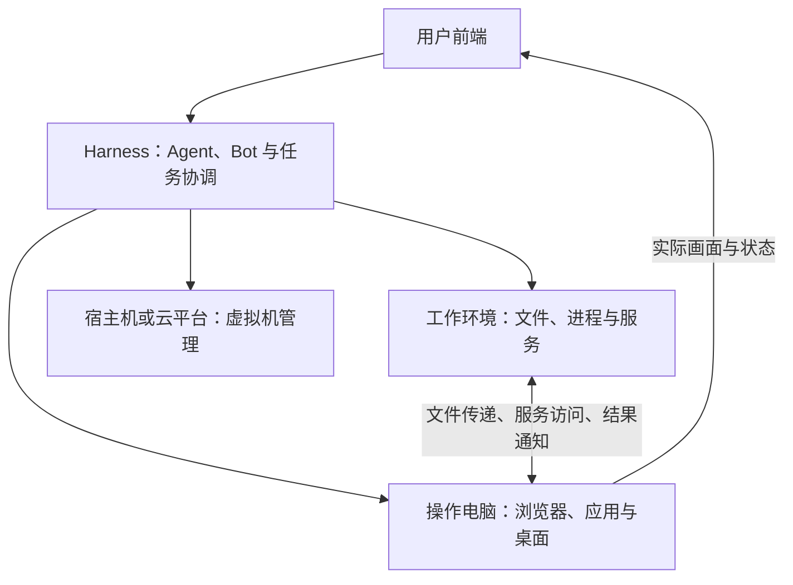

# Varin 可组合执行环境：Harness、工作环境与操作电脑

Status: accepted design direction / incremental implementation pending（D-338）。本文记录维护者已确认的产品方向；既有实现基础见第 12 节，不能据此宣称任意部署组合、应用接口或环境模板已经交付。

Last updated: 2026-09-30

本文汇总关于本机、本地虚拟机、远端环境、系统镜像与 Agent 操作能力的设计讨论。前端、Harness、工作环境和
Computer Use 环境分别选择位置，用户通过 Harness 管理工作与环境。默认提供实用、适度精简的组合，允许用户扩展。

本文负责部署组合、目标绑定、环境准备和跨环境联动。[资源设计](resource-oriented-harness-design.md)继续负责资源身份与
文件访问；[Computer Use](computer-use-design.md)继续负责观察、动作、观看和人工接管；
[Bot 设计](bot-operated-workbench-design.md)负责长期工作与记忆；[办公连续性](office-work-continuity-design.md)负责办公工作关系与产物。
这些能力沿现有 Application Host、Pi、Rust kernel 和客户端边界扩展。

## 1. 已确认的设计判断

1. 前端、Harness、工作环境、操作电脑是可独立部署的职责，同一机器可以承担其中多项。
2. 用户操作与已授权的自动行为通过 Harness 发出；具体执行端、桌面驱动、宿主机或云平台完成对应动作。
3. 工作台、IDE、Varin bot 是产品参与方式；部署位置独立于模式和页面导航。
4. 工作环境提供文件、进程和服务，操作电脑提供真实图形应用。两者可以共处，也可以跨机器组合。
5. 结构化接口、应用接口、视觉与键鼠应协同操作同一真实应用现场，用户可以查看和接手。
6. 默认环境围绕开发、浏览器、文档和常用数据处理准备。图像视频、工程游戏软件由用户按需安装。
7. 用户文件、应用配置、登录状态和后续安装的软件随环境持续保留；停止工作、关闭观看与删除环境分别表达。
8. 纠错复用现有执行记录与记忆体系，先取得可核验的观察和结果，再决定是否深入诊断及复用经验。

## 2. 职责与部署组合

### 2.1 四种职责

| 部分 | 负责的工作 | 可选位置 |
| --- | --- | --- |
| 前端 | 对话、编辑、查看进度、观看与接管电脑 | 桌面客户端、浏览器或移动端 |
| Harness | Agent 循环的产品装配、任务与 Bot 协调、工具调用、记忆和续接 | 本机、本地虚拟机或远端 |
| 工作环境 | 文件、终端、进程、开发服务、计算任务 | 本机、本地虚拟机或远端 |
| 操作电脑 | 浏览器、桌面应用、图形会话与控制接口 | 本机、本地虚拟机或远端 |

这里的“工作环境”是执行能力；工作区/项目仍是任务与资源的组织方式。一个工作区可以关联多个环境中的资源。
“操作电脑”最终绑定某个环境内的具体桌面或应用会话；机器、桌面、应用和聊天会话分别保留身份。



图中是职责，不要求每一框独立进程、服务或数据库。多个职责共处时可以使用本地调用；远端调用仍遵守相同的目标与结果合同。

### 2.2 需要支持的组合

以下是代表性使用方式，产品通过独立选择目标表达它们，不把组合枚举成封闭的“云模式”清单。

| 使用方式 | Harness | 工作环境 | 操作电脑 |
| --- | --- | --- | --- |
| 全本地 | 本机 | 本机 | 本机 |
| 独立的本地电脑 | 本机 | 本机 | 本地虚拟机 |
| 工作与桌面放入本地虚拟机 | 本机 | 本地虚拟机 | 同一或另一台本地虚拟机 |
| 本地协调、环境上云 | 本机 | 远端 | 远端 |
| 只把工作环境放云端 | 本机 | 远端 | 本机或本地虚拟机 |
| 只把操作电脑放云端 | 本机 | 本机 | 远端 |
| 常驻远端协调、本机参与 | 远端 | 远端或本机 | 本机或本地虚拟机 |
| 本机只保留前端 | 远端 | 远端 | 远端 |

每个目标仍需满足真实可达性和应用要求。例如远端 Harness 使用本机电脑时，本机连接组件及对应桌面必须在线。
没有图形操作的任务可以不选择操作电脑。一个 Bot 可以使用多个环境，两个任务也可以共享一个环境。

## 3. 目标选择与任务连续性

### 3.1 默认值与本次操作分开

Bot 或普通任务可以继承默认工作环境和操作电脑；具体任务需要不同应用、系统或资源时，可以显式覆盖。
工具受理时固定本次目标、资源引用和执行目录，结果继续携带实际来源。修改默认值影响后续选择，不重定向已受理的操作。

资源按实际环境和规范位置寻址。两台机器上的同名路径各自独立；同一机器上的同一资源经多个项目入口访问时，
继续使用既有资源协调。相对路径沿现有调用期解析规则处理，不能取用户当前查看的项目作为隐式远端路径。

目标暂时离线时返回具体不可用状态，保留任务、历史和其他可用资源。只有需要该目标的工作受影响。

### 3.2 查看、选择与迁移分别表达

切换工作台模式、项目、页签或前端连接，只改变查看和后续操作入口。已有工作仍由原协调 Harness 推进，
继续指向原工作环境和操作电脑。界面呈现的是当前连接能够取得的真实状态。

新建工作时可以选择 Harness 运行位置；已有工作的迁移需要明确交接任务记录、Pi 会话、记忆关联、待处理动作和环境引用。
同一工作保持一个有效协调者。重连、换前端或重新观看桌面，不创建重复 Bot 或重新提交未结算动作。
自动迁移与故障接管的具体协议尚未确定，不能用复制配置或启动另一份 Host 代替这项能力。

## 4. 用户可见的配置

### 4.1 环境与连接设置

沿现有连接与电脑设置提供统一入口，允许接入本机、已有远端机器，或在支持的后端上创建虚拟机。
环境条目呈现名称、位置、实际系统、可用能力、安装的软件、连接与运行状态，以及适用的配置、准备、启停和删除操作。

“机器在线”“桌面可用”“浏览器接口可用”“文件服务可用”分别来自对应组件，按需要展开。
用户无需先理解内部进程拓扑；缺少能力时，入口说明需要准备什么或连接哪个目标。

### 4.2 Bot 与任务配置

Bot 档案可以用以下三个选择表达部署关系，文案和布局在具体 UI 实现时收敛：

```text
运行位置        我的电脑（Harness）
工作环境        云端开发环境
操作电脑        本地虚拟机
```

运行位置可以继承当前连接，任务可以继承 Bot 默认值。工作台和 IDE 使用同一套环境能力。
日常对话优先展示工作与结果；机器路径、连接细节和组件诊断在有关设置或错误详情中提供。

## 5. 目标环境的运行组件

目标环境按实际职责部署组件：工作环境需要文件、进程和服务能力；图形环境需要桌面、观察控制和应用适配；
承担 Harness 职责时再装配 Agent 协调与模型循环。可以共用发行包并按角色启用模块，不要求为每个职责另造一套后端。

| 现有边界 | 本设计中的职责 |
| --- | --- |
| `packages/application-client` | 框架无关的环境选择、能力、操作状态及错误 DTO/API |
| `packages/protocol` 与当前传输通路 | 目标绑定、请求关联、取消、事件和能力协商 |
| Web Application Host / Pi Host | 连接与组件装配、工具路由、Bot/Thread/Run 协调、应用桥与环境后端集成 |
| Rust kernel | 继续拥有已迁移的文件、进程、材料、计算和耐久记录权威 |
| `packages/computer-driver` 与平台适配 | 指定桌面内的原生观察、输入和状态；应用桥使用相同目标与控制协调 |
| `packages/ui` 与各客户端 | 环境配置、状态、产物和同一现场的观看/接管 |

一个实际 Host 内继续遵守既有单写者边界。远端资源由其真实执行端处理，协调端持有引用与执行记录；
不把远端文件复制成另一个隐式权威，也不通过新增 TypeScript 文件/进程实现绕过 Rust 边界。
现有 guest Host 的打包与模块装配如何收敛为按角色部署，属于后续实现工作。

## 6. 系统模板、软件组合与持久状态

### 6.1 模板与实例

模板描述系统底座、架构要求、软件配方、组件版本与准备方法；实例记录实际机器、磁盘、安装结果和持续使用的数据。
首套参考模板沿现有 Debian 13 路线发展，后续按应用需求增加系统与后端适配。

本地虚拟机与云端虚拟机优先复用软件配方和能力合同。磁盘格式、启动参数、虚拟硬件与初始化方式由平台适配处理，
不能假定一个磁盘文件可以原样运行在所有平台。用户已有电脑可以只安装所需连接组件，不要求重装成 Varin 镜像。

### 6.2 默认组件组合

下面确定默认范围与可选边界，精确包名、版本和依赖闭包在发行配方中确定。

| 组件 | 建议默认内容 | 配置方式 |
| --- | --- | --- |
| 基础连接 | Varin 环境组件、必要系统依赖、常用字体与区域设置 | 由所选职责安装；复用现有发行运行时 |
| 开发与脚本 | Git、一套 Node、一套 Python、包管理工具、curl、jq、ripgrep、压缩解压 | 项目依赖使用项目环境；其他语言和版本按需准备 |
| 桌面与浏览器 | 轻量桌面、文件管理器、终端、一个浏览器、桌面与浏览器控制接口 | 纯工作环境可省去；默认浏览器依据同会话控制能力选择 |
| 文档与常用数据 | LibreOffice、PDF 读取/渲染、选定的 Word/Excel/PPT/PDF 库与常用数据处理库 | 文档桌面操作和后台处理协同；具体库与包大小需核对 |

通用 Bot 模板预选常用组件；工作环境和操作电脑也可以分开准备。NumPy、pandas、Matplotlib 是常用数据组合的候选，
SciPy、scikit-learn、Java、完整 LaTeX、编译工具链和 OCR 语言包按任务与依赖需要补充。
发行配方可以预构建常用组件，减少首次准备等待，不要求所有软件都在创建时临时下载。

维护者明确排除默认预装的范围是图像视频和工程游戏软件，包括参考清单中的 Blender、GIMP、Inkscape、Kdenlive、
FFmpeg、ImageMagick、Godot、FreeCAD、OpenSCAD、KiCad、QGIS、ParaView、3D Slicer。
用户可以自行安装，也可以授权 Agent 安装。需要其中某项来完成具体工作时，按实际需求准备并说明变化。

维护者提供的软件清单截图作为需求参考，其系统小版本、包版本和磁盘体积未独立核验，不直接成为发行清单。
软件取舍依据任务覆盖、安装体积、启动成本和维护负担，不预设一个未经测量的镜像大小硬上限。

### 6.3 安装、升级与保留

用户文件、浏览器资料、应用配置、后续安装的软件与工作成果随实例保留。升级 Varin 组件、增加软件、停止或重启环境时，
分别说明对正在运行的应用和磁盘内容的实际影响。删除机器与删除持久磁盘分开表达。

软件安装状态和控制接口状态分别检测：安装成功后可以更新应用清单，只有实际接口可用才宣告对应操作能力。
新增软件不自动获得专用应用桥；可以先通过其真实桌面能力使用，再按需要增加适配。
更新组件应避免打断当前工作，要求重启或停机的更新有明确应用时机。具体升级路径复用现有发行与准备机制。

## 7. Agent 可以使用的环境能力

### 7.1 按需发现与真实状态

环境先返回短能力摘要，Agent 使用某类应用或操作时，再取得详细说明、参数和当前可用对象。
能力信息来自实际组件与应用状态，说明版本、支持的操作、就绪情况和不可用原因。
下表是行为范围，不是新增工具名称或已经冻结的 wire schema。

| 能力 | 提供的信息或动作 | 结果应能确认什么 |
| --- | --- | --- |
| 文件与进程 | 读写、搜索、终端、进程、服务地址 | 实际环境、资源修订、执行状态与产物 |
| 桌面结构 | 应用、窗口、控件、文字、选区和可用动作 | 本次观察的目标、时间、对象引用及有效范围 |
| 浏览器 | 标签页、页面结构、表单、导航、下载和事件 | 真实浏览器会话、页面与操作后的状态 |
| 应用对象 | 文档、单元格、图表、页面、保存和导出 | 对应应用实例、文档及内容状态 |
| 视觉与输入 | 截图、局部观察、坐标、键鼠和拖拽 | 观察来源、输入受理、已发生效果及后续状态 |
| 条件与事件 | 窗口出现、文件变化、下载或任务结束 | 观察来源、是否满足条件、是否可以继续 |

缺少某一种能力只影响依赖它的工作。比如桌面画面不可用时，已经可用的文件服务与后台计算仍能使用。

### 7.2 同一应用现场

浏览器接口绑定用户能在桌面看到的真实标签页、账号状态和下载位置；应用接口绑定实际打开的文档与未保存状态。
结构化编辑、视觉检查、键鼠操作和用户接手可以连续发生。

实现需要把环境、桌面、应用实例、窗口、标签页或文档之间的对应关系解析清楚。
应用重启、窗口重建、页面跳转后按真实有效性刷新引用；同名窗口或相同文件路径不能单独证明仍是原对象。
离线文件处理也可以直接使用，但应清楚返回它修改的文件版本，不能冒充已经更新了应用中打开的未保存文档。

浏览器优先研究 Playwright 及其连接方式，桌面复用 Windows UIA / Linux AT-SPI 等平台接口，
LibreOffice UNO 是办公应用桥的候选。具体选型与参考边界见第 14 节。

### 7.3 执行与结果

已经明确的动作、等待和读取可以在目标环境就近批量执行，减少网络与模型往返；遇到需要理解的新状态时返回模型。
等待描述具体条件，支持事件的来源订阅事件，其余按真实能力观察状态。固定延时不能证明下载、导航或保存完成。

结果区分请求受理、动作效果和任务结果。例如输入发送成功、导出对话框关闭和目标文件写入完成是不同事实。
响应丢失时保留不确定性，先查询实际状态，再决定是否重试。

浏览器、应用桥、脚本与键鼠等受管写入入口共享取消和人工接管协调。用户接管后，影响同一现场的自动变更应停止；
无关后台工作可继续。协调粒度由真实共享焦点、输入和文档决定，沿现有 Computer Use 合同实现。

## 8. 跨环境联动

### 8.1 文件与产物

文件传递保留源环境、资源、内容修订、目标位置和实际接收结果；复用现有材料、对象、传输与 Artifact 机制。
目的地副本是另一个可变资源。相同内容可以复用传输数据，但不会把两个文件的后续修改自动合并。
共享目录、显式传递和需要同步的关系分别表达，不能把一次复制显示成持续同步。

文件经 GUI 或应用接口修改后，工作台沿既有 Documents / 文件修订机制观察和协调。
应用未保存状态与磁盘版本分别可见，后续工具要知道读取的是哪一种来源。

### 8.2 服务与应用打开

工作环境返回服务的实际归属和访问入口，再沿现有连接或隧道能力让选定电脑访问。
云端的 `localhost` 不能原样交给本地浏览器后假定指向同一服务。连接中断只影响该访问路径，不伪造服务已停止。

“用某台电脑上的应用打开这个产物”应串起资源取得、应用打开与对应文档/窗口发现，返回每一步的真实结果。
需要传文件时只传本次资源；需要预览服务时建立相应访问路径，避免为方便操作而隐式复制整个工作区。

### 8.3 事件回到同一工作

环境事件关联原 Thread / Run、操作及来源，接入已有等待和 follow-up；确定性条件可以直接判断，需要理解时再调用模型。
断线重连时沿当前来源与持久回执对账，避免重复唤醒或重复提交。Bot 休眠期间仍服从其工作准入与续接状态。

代表流程：云端处理数据 → 把指定结果交给本地虚拟机 → 在实际打开的表格里更新图表 → 检查显示与导出 → 把产物交回工作区。
每一处衔接都保留实际位置和完成事实，用户可以在中途进入同一现场继续工作。

## 9. 生命周期由 Harness 协调

用户决定环境与工作的操作，Harness 统一协调已授权行为。执行端负责停止进程，桌面组件负责结束会话，
宿主机或云平台负责虚拟机电源操作。这是实际执行接口的路由，不向用户增加一套生命周期管理权配置。

### 9.1 Bot 休眠与唤醒

休眠应覆盖 Bot 自身及其派发工作的实际执行链：暂停新工作准入与续接，停止相关 Agent、进程和受管作业，
记录停止结果与恢复所需信息，再异步停运允许自动关闭且无其他使用方的虚拟机。
普通工作结束不自动销毁环境；休眠也不删除等待定义、工作成果或长期记忆。

共享环境要考虑其他 Bot、独立任务及人工使用。保留共享机器运行时，仍需确认该 Bot 的工作已经停止。
遇到无法确认停止的工作或机器，显示实际失败/未知状态并提供继续查询或重试，不能提前显示全部休眠完成。

唤醒先准备本轮恢复所需环境并核实能力，再继续尚未完成的工作。已经完成的操作不重复执行；
原来关闭或由其他使用方保持运行的机器，不因一次 Bot 唤醒被错误改变状态。
上述行为在既有 Bot 生命周期实现上扩展，不另建环境专用任务账本。

### 9.2 前端、协调者与电源操作

| 发生的变化 | 应表达的实际影响 |
| --- | --- |
| 关闭前端或观看页 | 对应查看结束；在线 Harness 和工作可继续 |
| 驱动或画面连接断开 | 对应能力暂不可用；不能据此判断应用或进程已经停止 |
| Harness 停止 | 后续决策与调度停止；目标端已开始的工作按其执行类型判断 |
| 环境关机 | 进程与桌面结束；持久磁盘按平台行为保留 |
| 平台支持的挂起/恢复 | 只承诺该平台实际保存和恢复的状态 |
| 删除环境或磁盘 | 明确受影响对象与内容，作为独立操作处理 |

关机后的启动入口必须仍然可达，因此虚拟机电源控制位于 guest 之外。
若 Harness 本身也在待关闭的虚拟机中，产品需要保留可达的宿主机/云管理入口，明确此次操作会终止协调。
Bot 普通休眠避免把自己唯一的协调与恢复通路一并关闭；具体后端的启动路由要在实现时落到真实接口。

持久记录支持重建任务上下文，但不等于恢复任意进程内存或未保存文档。没有快照/挂起能力时，按实际应用恢复与任务状态继续。

## 10. 观察证据、纠错与经验复用

优先让现有执行记录关联同一步的目标、有关观察、实际动作、返回结果和操作后状态。
截图、应用结构和产物通过既有 Artifact / 资源引用按需保留；普通运行日志只记录必要标识和状态，
不另行复制提示正文、凭据或文件内容。持续桌面视频仍走观看通路，模型只读取当前判断需要的材料。

Agent 遇到结果不符、重复失败或需要追查时，可以查询有关步骤，提出带证据的根因与修正，再根据当前现场执行。
诊断属于有依据的假设，修复是否成功以实际后续结果判断。已有记录缺失时明确未知，不能补造动作前后的画面。

可以复用的经验包含应用与环境线索、触发条件、失败动作、修正方式、证据及验证结果，进入现有记忆机制。
未经验证的诊断保留其不确定性；实际应用变化后重新检查适用条件，不把一次推断固定成长期执行规则。

历史回看与状态恢复分别实现。文件快照、应用撤销、虚拟机快照有各自覆盖范围，不能撤回已经发生在外部服务上的提交。
从历史某步再次执行前，应确认当前状态与已发生效果；只有执行端真实支持检查点，才提供对应恢复承诺。

先建设可回看的证据与现有 Agent 的诊断入口。是否引入专门诊断 Agent、外部调试框架或额外模型调用，由真实任务收益决定。
不为每个正常动作固定增加一轮诊断或永久保留所有截图。

## 11. 实施顺序与可观察结果

以下是后续实施顺序，不是已交付阶段编号。工作沿同一套正式产品接线推进，实际缺口再拆为实现任务。

| 顺序 | 形成的能力 | 可观察结果 |
| --- | --- | --- |
| 目标与职责 | 独立选择 Harness、工作环境和操作电脑；复用资源身份 | 切换页面和默认值不改变已运行任务；一个工作不会出现重复协调者 |
| 环境接入与联动 | 能力发现、真实状态、文件传递和服务访问 | 云端服务能在选定电脑打开，产物位置与版本可追踪，故障按依赖生效 |
| 默认模板与持久使用 | 组件配方、精简软件组合、安装和升级入口 | 用户安装及登录/工作数据按合同保留，安装与接口可用状态分开 |
| 常用应用整合 | 浏览器、桌面和办公接口共享真实现场 | 接口编辑、视觉检查、人工接手与继续工作保持一致 |
| 诊断与经验 | 有关步骤可回看、修正可验证、经验有适用条件 | 失败可定位，恢复尊重实际效果，重复问题有经过验证的改进方法 |

验证优先使用三类真实任务：

- 浏览器任务：页面操作、下载、桌面接手和重新观察。
- 办公任务：接口修改同一文档、用户继续编辑、保存、导出并检查真实产物。
- 跨环境开发任务：代码/进程与浏览器分处不同环境，预览服务并取回指定版本的结果。

同时按改动覆盖共享环境休眠、取消后停止写入、断线后结果不确定等真实边界。
记录完成结果、需要纠正的次数、模型往返和耗时，用于判断接口与默认软件是否值得保留；
没有本地测量前不承诺性能提升比例。验证强度由实现风险决定，不附加统一次数、配额或全平台全量测试前置门槛。

## 12. 当前基础与尚未交付的部分

本节以 `9c88276b` 为文档整理基线，用于区分可复用实现与新增方向；后续交付事实仍进入原有状态和验收记录。

| 当前可复用基础 | 本设计继续需要完成的工作 |
| --- | --- |
| 资源寻址、Documents、Rust 文件/进程与受管远程材料/作业 | 将独立目标选择与所有实际消费者接通，完善跨环境服务和应用衔接 |
| Windows UIA / Linux AT-SPI 等原生驱动、观察与输入、实时观看及接管通路 | 同应用浏览器/办公接口、能力发现与相应取消协调；各平台真实验证 |
| Debian/Ubuntu 桌面准备，Xvnc/Xfce、Firefox 与持久用户资料 | 精简组件配方、软件扩展、浏览器选型与文档能力组合 |
| Linux x64 Host 上本地 `qemu:///system` 的 Debian 13 guest 创建与运行时升级 | Windows 本地虚拟机等后端、远端云管理适配和完整安装/使用证据 |
| Bot 耐久休眠/唤醒、派发工作停止、受管范围暂停与共享机器判断 | 随新增环境/应用入口扩展生命周期覆盖，真实虚拟机上的完整行为验收 |

源码与局部合同入口：

- [Computer driver](../../packages/computer-driver/README.md)：平台能力、桌面准备和当前 guest 发行边界。
- [VM provider](../../packages/web/application-host/lib/computer/vm-provider.ts)：当前虚拟机后端接口与实现范围。
- [Bot lifecycle](../../packages/web/application-host/lib/bots/bot-lifecycle-runtime.ts)：工作停止、机器判断与恢复。
- [Managed remote contracts](../../packages/web/application-host/lib/harness/managed-remote-types.ts)：远端身份、材料与作业。
- [Application client](../../packages/application-client/README.md)：框架无关 API 与客户端边界。
- [BC 验收记录](../plan/bot-computer-use-review.md)：既有实现覆盖和原生环境证据缺口。

连接已有远端 Host、在 Linux 上创建本地 libvirt guest 和通过云平台创建远端虚拟机是不同能力。
脚本化 provider 测试不证明真实 KVM 启动成功；macOS 原生驱动等未实测项继续如实保留，本文不改变其交付状态。

## 13. 后续需要收敛的选择

| 选择 | 判断依据 |
| --- | --- |
| Windows 本地虚拟机后端及其他平台优先顺序 | 用户宿主条件、可用虚拟化能力、打包部署与实际桌面兼容性 |
| 默认浏览器和连接协议 | 同一持久用户会话、可见桌面、稳定控制、下载及版本匹配 |
| LibreOffice 等应用桥的范围 | 真实打开文档、未保存状态、重算/排版、视觉检查和外部编辑协调 |
| 精确软件清单与组件发布方式 | 代表任务覆盖、依赖体积、准备耗时、升级与持续使用成本 |
| guest Host 的模块装配 | 在既有 Host/Kernel 边界内按角色提供能力，避免重复调度与存储 |
| 已有工作跨 Harness 迁移 | 会话、记忆、待处理动作及恢复通路的真实交接能力 |
| 调试框架的借鉴或集成深度 | 与现有证据/记忆/执行机制的衔接及实际纠错收益 |

这些选择不影响已确认的独立部署、用户经 Harness 发出操作、共享真实现场和精简默认环境方向。

## 14. 外部研究依据与边界

以下资料于 2026-09-30 查阅，用于选型与后续研究，没有在本轮运行外部项目或测量其对 Varin 的收益。

- [Playwright 定位](https://playwright.dev/docs/locators)与[自动等待](https://playwright.dev/docs/actionability)：
  提供元素定位、操作前可执行性检查和条件等待，可作为浏览器操作基础。
  [连接接口](https://playwright.dev/docs/api/class-browsertype#browser-type-connect-over-cdp)说明 CDP 接入限 Chromium，
  且与 Playwright 协议的完整度不同；需要验证真实持久会话的接入方式。
- [Windows UI Automation](https://learn.microsoft.com/en-us/windows/win32/winauto/uiauto-controlpatternsoverview)与
  [AT-SPI EditableText](https://gnome.pages.gitlab.gnome.org/at-spi2-core/libatspi/iface.EditableText.html)：
  控件可以提供选择、数值、表格或文本编辑等结构化能力；可用性取决于目标应用实际实现。
- [LibreOffice XModel](https://api.libreoffice.org/docs/idl/ref/interfacecom_1_1sun_1_1star_1_1frame_1_1XModel.html)与
  [XCellRangeData](https://api.libreoffice.org/docs/idl/ref/interfacecom_1_1sun_1_1star_1_1sheet_1_1XCellRangeData.html)：
  文档模型与视图有关联，支持批量读写单元格区域；同现场操作、未保存状态和格式保留仍需实际接线验证。
- [CUADebug v2](https://arxiv.org/html/2608.02643v2)：结合动作前后截图与轨迹定位根因，再指导重新执行。
  204 条失败轨迹中有 110 条属于任务推理与控制；在 Claude-agent 主分组上，Gemini 2.5 Pro
  同时判对细分类别与根因步骤的比例为 19.4%。
  部分重新执行比较使用人工根因步骤确定重启位置，收益不能直接视为完全自动恢复能力的证明。
  对 Varin 的研究重点是证据关联、按需检查、修正验证和带适用条件的经验复用。
- [AgentDebugX](https://github.com/AgentDebugX/AgentDebugX)：仓库将轨迹、诊断、恢复建议与重新执行分开，
  `src/agentdebug/gui/` 提供 Computer Use / OSWorld 分析。README 要求实际执行端支持检查点，才能从事件恢复。
  本轮查阅了项目说明与依赖声明，尚未完成实现审计或运行验证；不据此决定把整套框架预装或接入生产。

## 15. 关联记录

- [D-338 决策索引](../decisions/README.md)：本次已确认方向的追加记录。
- [架构](../architecture.md)、[开发入口](../development.md)：现有模块与权威边界。
- [科研集群与受管远程](research-cluster-design.md)：协调者、远端执行和材料机制。
- [等待与续接](agent-follow-up-design.md)：事件、条件与原工作恢复。
