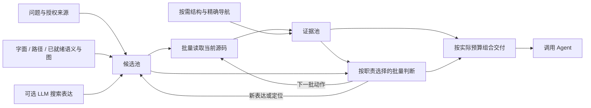

# Agent harness — 检索：三层，两个归属

Status: 模块专卷；§6.1 的增量执行、职责补位和完整组交付已接入。真实 provider 下的质量/延迟收益尚未实测。§6.2–6.4 与既有来源/权限合同继续有效。
Last updated: 2026-10-01
交付事实见 [../status.md](../status.md)，计划骨架见 [../plan/agent-harness-plan.md](../plan/agent-harness-plan.md)。

## 6. 检索：三层，两个归属

**Web/科研扩展入口（D-315，部分已实施）。** 本章现有代码检索继续有效；
[专门设计](web-research-search-design.md) 复用通用 `retrieval`、科研 `investigation` 和普通派发，
增加学术资料与共享阅读、Web/学术快速决策消费者。通用检索子线程已经存在，不重新创建一套搜索团队。
自然语言报告与按需 `submit_facts` 沿同一 Thread；论文发现/详情/关系、固定文档阅读、材料集合和快速决策的当前合同统一见该专卷，不在本章重复阶段进度。

代码检索既有精确的符号、路径与错误信息，也有“不知道实现叫什么”的自然语言问题。词法、结构和向量各自产生有用线索，
在同一当前来源中读取原文；语义召回独立发现候选，不要求先被词法找到。任何单一来源暂不可用时，其他来源仍正常工作。
衡量的是主 agent 取得有用材料的时间与质量，索引覆盖或某个来源排名不能代替最终可读结果（D-173）。

**检索范围是一等参数，工作区只是范围的一种**（D-162/D-173）。当前 code profile 的范围是工作区，包含尚未打开或修改的实现；
访问与变更事实只影响后台建设顺序。文件知识工作可选择跨目录根、工作集或集合，不能把这种可选范围悄悄变成代码检索的热点白名单。
范围键保留 `workspace / roots / working-set / collection / user` 的接缝，当前仅实现 workspace；索引以
`{ scopeKind, scopeId, documentId, revision }` 定位来源，documentId 不假定为文件路径。邮件等外部来源仍不在本轮交付范围。

文件名/元数据、全文词法、语义表示各自按其消费者建设，不为快速检索先索引整台电脑。已知路径可直接读取，开放概念可并行咨询
可用词法与语义；工具选择不要求前一路失败。工作区之外的范围与来源继续随 `knowledge-work-in-files` 消费者实施。

3.15 负责查询与呈现，3.16 负责嵌入后端、索引与覆盖层；按真实依赖推进。AFT 的批推理与增量复用提供参考，其符号开头摘要
有正文盲区；Varin 的全文切块也只有在有效编码、及时发布并被查询正确使用时才有价值。两者都不能仅凭表示形状宣称召回更好。

### 6.1 第一层：文件里有什么

**2026-10-01 实施：主体机制已接入公开 Explore。** 同一 Host query 在后台推进，`query.views({seen,inputBytes})` 取得现成材料，`query.wait({afterSequence})` 单独等待进展；`plan/followup` 只接纳工作，`select` 返回实际接受的范围。未新增检索线程或训练依赖。通用快速决策合同见[快速决策模型与渐进检索](fast-decision-model-design.md)。

读取额度已与输出 limit 分开；原文读取与可选结构使用独立执行槽位，普通切片只用 warm 结构，模型可明确选择 `prepare-structure`。语义维度发现后的整库扫描转为既有后台任务，查询默认消费已发布索引。LLM/决策/嵌入/重排的16种配置已通过公开工具—Host的模拟服务联调；这项证据不代表真实服务或任务质量已经胜出。

`auto` 将动作与选材分配给不同职责：有 LLM 时联合选材，可同时由决策模型选动作；无 LLM 时由决策或重排判断材料。模型输入不再固定裁成48 KiB/8192字符，使用配置容量分页，携带已选原文；过大单项保留独立身份，不伪装已完整评估。最终按实际可见预算整体交付必需范围组。

配置存在与模型实际参与是两个事实。`auto` 的选材顺序是 LLM、快速决策、重排、来源排名；同一次查询不会重复调用多个选材模型。快速决策可与 LLM 并行负责后续动作，只有形成可判断的动作时才请求服务。查询结果同时报告职责、实际阶段状态与缺口；绑定失败发生在请求之前，返回具体的配置错误码。暂时不可用的绑定会在后续查询重新检查，配置变更仅影响新查询。向量查询缓存命中也不会再向嵌入服务发出相同请求。

公开工具的职责保持区别：

| 工具 | 适合的工作 | 返回 |
| --- | --- | --- |
| `read/grep/ls` 等直接工具 | 已知具体操作、精确匹配、查看指定原文 | 直接操作结果 |
| `explore` | 合并发现、读取、导航、局部判断与选材，减少底层调用往返 | 紧凑的当前代码、引用、关系依据与具体缺口 |
| `retrieval` 子线程 | 更开放的假设调查、持续阅读、试验和复杂语义综合 | 真实线程的调查交付；不由快速工具隐式创建 |

模型/provider 选择与凭据保持 Pi authority；Application Host 拥有查询状态、Documents、搜索、结构/索引和交付，Rust 保持既有文件与计算权威。生成式模型发起短输入任务，不建立长期思维链会话，不把检索内部状态逐轮灌给调用者。

#### 6.1.1 产品目标与取舍

Explore 位于 `read/grep/ls` 等直接工具和 LLM 检索子 Agent 之间：一次调用合并多路发现、批量读取、必要导航、局部判断和选材，向调用者交付紧凑、相关、足够推进任务的当前源码。

主要优化对象是**调用者拿到可用证据的总等待、实际输入的无关正文，以及后续补查**。辅助模型的调用费只是成本之一；允许多做一些廉价内部读取，不能把这些材料全部转嫁给调用者。

- LLM、决策模型、嵌入、重排均可不配置，任何组合都应有可运行路径。
- Flash 和决策模型可以批量参与；不把快速工具实现成逐文件等待生成模型的受限子 Agent。
- 输入允许宽问题，工具不强迫调用者先拆成狭窄子目标；返回能力有边界，不承诺独立查明任意根因。
- 模型服务于产品收益，不要求训练或安装专用模型；不能因为已有模型投入而制造必须使用它的职责。
- 保留 Documents、Router、Rust kernel、Pi 模型/凭据和派生存储的既有权威。研究执行器不替代产品底层。
- 不新增拍脑袋的文件数、轮数、并发数或模型调用数硬上限。现有请求预算和真实 provider 容量仍需遵守。

推荐的核心改变：**共享一个查询执行器，模型按职责补位；早期排序可纠正；已就绪材料可以被消费；交付前联合选择真实可展示的证据。**

#### 6.1.2 当前代码与已有修复

##### 6.1.2.1 值得保留的基础

- 一次公开 Explore 内使用短生命周期 query，绑定 actor、范围、来源和取消；Host 执行源码操作，Pi 发起模型调用。
- 原问题词法、可用图与语义召回已有并行入口；生成模型可以补充分组表达。
- 已有 `submitPlan / applySelection / followup`，可以复用真实 view/range/action ID。
- 结构解析在 Rust kernel；单文件语法解析、LSP、图目录和向量索引是不同能力，不能混成一个“索引就绪”状态。
- 语义索引已有切块、向量空间身份、缓存、前后台调度、部分覆盖、增量更新和草稿遮蔽。
- 用户配置和凭据沿原 Pi authority；无需另建推理网关或模型设置体系。

既有检索设计已要求按需模型判断、局部补查和紧凑原文交付。本次修订补齐执行机制，保留原 D-173–D-193、D-312 与资源化 Harness 的来源和执行权威。

##### 6.1.2.2 不再重复列为待修的问题

`b7520322` 已加入：晚到来源读取容量修正、同查询同范围/语言的失败 LSP 冷准备不再重复、可见片段与返回 metadata 对齐、输出预算计入 scope/handle、重复 finish 共用同一结果。这里确认的是代码变化，不宣称新版本的实际质量和速度已经测过。

##### 6.1.2.3 改造前的连接处（b7520322 基线记录）

| 现状（当前实现） | 影响 | 推荐改变 |
| --- | --- | --- |
| `maxMaterializeReads(candidateCount, excerptLimit)` 将普通读取额度与输出数量相联，默认对应 23 次；其他结构/显式动作另有路径 | 少返回材料会间接减少调查机会 | 调查调度使用工作预算、来源进展与执行能力；输出 limit 只管交付 |
| `waitForViews → collectViews → awaitPump`；读取 worker 仍等待 outline/classify | 正文先提交了，但判断者仍可能等完整阶段 | 分开“取得当前材料”和“等待进展”，分开读取与可选增强任务 |
| `freezeViews` 按规则排序后装入 48 KiB | 未装入材料在本批判断中不可见 | 明确批次身份、可继续取材、按真实模型输入容量构造批次 |
| `actionCandidates` 无 graph 时直接返回空 | 决策入口无法充分使用无索引的基础动作 | 目录/命中/已读范围也能产生动作；图仅增加关系动作 |
| `auto` 下 ready fast-decision 全局抑制 LLM select 和 rerank | “能判断动作”容易被扩大成“包办全部选材” | 每项职责选实现，不由一个 ready 状态占有全部职责 |
| 决策循环给 fresh views，文本有 8192 个 JS 字符单位裁剪；动作去重主要依赖 ID | 判断见到的正文、已选材料和上下文变化缺少统一身份 | 传实际可见范围与必要已有证据，按判断上下文复用结果 |
| 先选材料/片段数，formatter 再按字节取舍 | 即使 metadata 已真实，联合选材所需的整组依据仍可能装不下 | 选择可展示方案后一次交付，renderer 不再独立改变语义选择 |

动作循环并非永远不重评：当前 `followup` 有新 views 时会清理 `judgedActions`。新设计应统一这个机制，不能把“已经有部分重评”误报为完全不存在。

主要代码：
[公开工具](../../packages/pi-host/src/harness/explore-tool.ts)、
[查询执行器](../../packages/web/application-host/lib/harness/explore.ts)、
[查询服务](../../packages/web/application-host/lib/harness/explore-query-services.ts)、
[快速决策循环](../../packages/web/application-host/lib/harness/explore-fast-decision.ts)、
[生成模型输入输出](../../packages/pi-host/src/harness/explore-model.ts)。

#### 6.1.3 一个执行器，五项职责

不为 16 种配置组合实现 16 条检索流水线。所有组合共享候选、源码、动作、预算、缓存和交付；只替换需要语义能力的操作。

| 职责 | 无模型实现 | 可选实现 | 输出边界 |
| --- | --- | --- | --- |
| 搜索表达 | 问题/anchors 中的真实名称与字面变体 | LLM 分组改写 | 搜索假设，不是源码事实 |
| 候选发现 | 路径/字面搜索、已可用结构与关系 | 嵌入产生独立候选 | 当前范围中的路径与重点位置 |
| 动作选择 | 明确定位与可解释的初始调度 | 决策模型批量选择；LLM 批量指派 | 合法动作或待验证搜索表达 |
| 材料相关性 | 当前片段的词面/来源排名、精确去重 | 重排、合适的决策模型或 LLM | 对实际送入材料的判断 |
| 组合与呈现 | 确定性范围合并、已有关系分组、真实预算装配 | LLM 联合选材，或具备相应任务能力的决策模型 | 必需/辅助范围及具体缺口 |

运输协议支持 judge/choose 不等于一个专训权重适合全部职责。消费端同时记录“接口能表达什么”和“这个绑定用于什么任务”。Explore-only 权重不能被当成 Retain。

##### 6.1.3.1 推荐的自动分工

| 配置 | 默认安排 |
| --- | --- |
| 无 LLM、无决策模型 | 来源排名与机械导航；相关性可由已配重排提供；最终确定性装配 |
| 仅有 LLM | 有需要时改写表达；一次批量返回选材与后续操作，不逐候选单独提问 |
| 仅有决策模型 | 在支持的任务上批量判断材料/动作；不能生成新搜索词时使用已知线索 |
| LLM 与决策模型都有 | 决策模型承担合适的局部选择；LLM 负责表达或需要联合比较的材料组合，不强制两者每轮都调用 |

嵌入与重排独立组合：

| 配置 | 增强 |
| --- | --- |
| 两者都无 | 基础发现与已选判断能力照常工作 |
| 仅嵌入 | 加入语义候选；其他来源不等待索引整库完成 |
| 仅重排 | 对字面/结构取得的真实材料批量排序，不需要向量索引 |
| 两者都有 | 语义负责发现，重排负责适用的材料排序；不因此关闭其他来源 |

两张表的交叉覆盖四类模型的全部组合。缺模型降低相应能力，不让整个工具返回 unavailable。

##### 6.1.3.2 一项判断只选一个负责人

- 区分“相关吗”“下一步做什么”“这些材料合起来是否互补”。不同职责可以用不同模型，同一职责不默认串跑三个模型。
- LLM 已经完成同批联合选材，通常不再补一次普通 rerank。
- 若候选多到无法直接联合比较，可以先批量相关性筛选，再做组合；未进入后批的材料保留为未评估/延后，不能变成已判无关。
- 不拿不同模型/不同判断批次的数值直接相加。增量比较带入需要竞争的已选材料，或使用同批相对选择。
- LLM 补位使用分组表达、动作列表、范围 ID；不模拟逐条 yes/no API，不伪造概率。
- 用户明确关闭或固定的判断路径优先。首步改进 `auto` 的职责分配；显式 `source/llm/fast-decision/rerank` 不暗中扩成另一付费路径。
- 配置缺失时自动选择已有能力，与运行失败后另发付费请求不同。第一版保留现有失败时交付已读材料的行为，避免失败后逐个供应商串行尝试；运行中补位属于后续明确策略，不是本设计的前置。

复用 `models.explore`、`harness.embedding/rerank/fastDecision` 及既有 UI。内部新增本次职责分配记录即可，不要求用户逐项填写矩阵，不做会自行选供应商的通用调度平台。

本次改变Explore消费方式，不顺带改写Web、scholarly或memory的决策流程。确需扩展通用能力字段时核对这些真实消费者；不能为检索补位破坏它们已有的默认/用途覆盖/关闭语义。

#### 6.1.4 查询状态与源码身份

在现有 query owner 中组织以下数据；这是逻辑边界，不意味着建立新服务或数据库。

1. **Request**：原问题、明确线索、授权范围、固定输入来源、截止条件、交付要求、本次模型绑定。
2. **Candidates**：候选目标、到达来源、原排名、真实命中/关系依据、可续取游标、待展开状态。
3. **Evidence**：实际读到的原文、路径/文档身份、revision、行范围、非连续省略与可展开范围。
4. **Operations**：动作、依据、依赖、执行/在途/完成/失败状态；去重键绑定实际目标、范围和来源版本。
5. **Assessments**：被判断的输入集合与范围、选用能力、模型绑定、问题/已选材料版本、输出与缺项。
6. **DeliveryPlan**：最终材料组、必需与辅助范围、精确渲染方案、实际成本和未完成项。

“候选已发现”“文件已读”“正确范围已展示给判断模型”“实际交付给调用者”分别记录。一个文件已读不表示其中所有实现都被模型看到。

已读证据可以改变动作优先级。相同动作在上下文改变后可以重新考虑，但不重新执行已有有效缓存；不因每条无关事件重评全池。

#### 6.1.5 从阶段屏障改为可消费的进展



##### 6.1.5.1 谁调度，谁判断

Host 保有单一查询状态和执行权；Pi 调用已有 LLM/决策/重排 adapter，返回结构化结果。模型没有文件权限或任意执行工具，也不启动另一条持久 Agent 会话。

确定性基线也是同一执行器的策略。模型提供更好的语义选择时才替换相应操作；不能让无模型路径因缺少一个回调而失去机械展开能力。

##### 6.1.5.2 内部接口草案

保留公开 `explore(question, anchors?, paths?, budgetMs?, limit?)` 的简单入口。以下是替换现有内部阶段等待的草案，不是已实现 API：

```ts
collect(queryId, { afterSequence, cursor?, inputCapacity })
  -> { sequence, candidates, views, pendingSources, remaining }

waitForProgress(queryId, afterSequence, signal)
  -> sequence

submit(queryId, { basedOn, operations, selections })
  -> { accepted, reused, rejected }

finish(queryId, { deliveryRevision })
  -> deliveredPacket
```

- `collect` 只读当前可用状态，不顺带等待所有来源/结构任务完成。
- `waitForProgress` 检查序号与登记 waiter 必须原子衔接，避免错过事件；取消必须解除等待。
- `submit` 接纳操作后即可返回；收集结果走 `collect`，不把一次补查隐式变成 `awaitPump` 全阶段屏障。
- `basedOn` 绑定判断实际看见的证据与动作。其他候选刚到达不使整份选择失效；被引用源码已变或权限失效则拒绝对应项。
- `finish` 仍幂等，返回冻结后的同一交付；晚到结果不改已返回的正文。
- 内部替换同时更新真实消费者和测试，删除退役路径，不长期维护两套 query 或兼容 facade。

##### 6.1.5.3 模型何时调用

不按文件触发，也不定死“一次/两次/四轮”。形成一批可比较材料，或出现需要语义选择的下一批工作时，才准备判断。

执行器可在当前可运行读取完成、决策输入容量已形成有效批次、明确补查结果到达、或需要收口时发起判断。尚有未处理来源不等于必须等齐；正在运行的模型只看到提交时的快照。

模型运行期间，继续已有授权的独立读取和召回；新材料进入下一快照。源数据与选材发生真实变化才需要新判断，没有新材料不反复反思。晚到的辅助材料不自动触发再跑一遍全池。

调度按来源家族保留可参与的队列，改写表达不各自获得一份份额。已有读取槽位先处理可运行工作，后到来源加入尚未执行的选择，不抢占已读事实；同一文件多路到达合并依据。b7520322的后到来源修复保留其意图，但不继续通过输出片段数推导全局读取容量。模型输入分页也应轮转保留未见候选，较长材料可拆成有身份的实际范围或单独成批，不能因为一次装不下而永远跳过。

判断前已读材料仍不充分时，可以选择补读/取下一页，而非对不知道的正文编造低分。明确查到目标时可以提前交付；开放问题的结束是对本次探索的判断，不是全仓充分性证明。

##### 6.1.5.4 实际闭环而非固定排名

初始排序允许先读最有希望的来源。读取后出现新的名称、路径、语法形状或已解析关系，就新增动作及形成依据。批量判断比较新机会与尚未展开的旧机会，实际选择改变待执行顺序。

基础动作不能要求图已建好：已发现路径可读、命中范围可展开、已见名称可字面搜索、已有列表可翻页。语法提取的名称是候选，只有解析服务确认才标为 resolved；不扫出每个标识符就无差别建一条必执行动作。

无模型时继续明确导航和来源排名，不伪装具备开放语义规划。既没有可靠新线索又无法消除歧义时，返回已取得材料与具体未完成项，而不是无界遍历全部出边。

##### 6.1.5.5 读取更多与继续探索分开

现有OutputStore句柄用于读取已经存下的材料，不能冒充继续执行搜索。若后续需要跨工具调用续查，可增加可选`continueFrom`引用：公开调用仍接收自然语言，Host创建新query和新的调用预算，复用获准的源码缓存及候选快照；不存在调用结束后偷偷运行的后台检索。

新调用重新确认actor、范围、当前来源和能力绑定。问题改变时可复用有效源码事实，不能直接沿用旧问题的判断；源码改变时重取相应材料。该引用属于会话局部状态，失效明确报告，不因此新建持久Agent。这个可选接口不是完成单次快速检索的前置条件。

#### 6.1.6 早期筛选：保留必要取舍，消除隐性否决

| 规则 | 处理 |
| --- | --- |
| 授权、当前版本、真实可读取性、精确重复 | 保留确定性约束 |
| 词法/向量源内排名、RRF、明确锚点优先 | 作为初始排序；不能把低位候选永久删除或标负 |
| 同源多个改写反复加票 | 按来源家族合并，保留各命中依据 |
| 输出 limit 决定读多少文件 | 删除这一耦合 |
| 文档/测试/源码类型作为排除墙 | 不采用；用户明确限定范围除外 |
| 关系出现就必定相关 | 不采用；保留关系依据供选择 |
| 模型未见的候选记无关、失败记零分 | 不采用 |

候选过多时依然需要分页。分页是本批视野，不是“未入页都不值得看”。Host 保存可续取身份与来源覆盖；源接口不支持续页时如实记录 incomplete，不伪造完整候选池。

模型输入按绑定真实上下文、问题、已选材料、输出余量组织。共享正文去重；同一函数的不同重点保留明确范围。需要分块就产生新的可见范围身份，不用 8192 字符隐式裁剪后继续把判断附在整份原文上。provider tokenizer 未知时只能声明估算，并处理容量拒绝，不能声称严格 token 合同。

不要把以上解释为“全部候选都进模型”。目标是让有限输入有可恢复的视野，避免前面的弱判断成为后续无法纠正的事实。

#### 6.1.7 轻量准备：四种不同的成本

| 能力 | 查询中的默认使用 | 冷态或缺失 |
| --- | --- | --- |
| 源码搜索/读取 | 原 Host/Rust 路径立即执行 | 实际读取错误按原契约返回 |
| 单文件语法解析 | 已具备 grammar 时按需解析，复用同 revision | 返回真实行窗口；不在查询中自动安装 grammar |
| 图与 LSP | 现成图作线索；warm LSP用于精确语义导航 | 普通切片不自动等待冷 LSP；确需消歧时作为显式可选操作 |
| 向量索引 | 使用已发布且兼容的部分，与其他来源并行 | 建设独立推进；本次可不用尚未就绪部分 |

##### 6.1.7.1 LSP 与读取分开

已将 outline/classify/关系核实从占用读取 worker 的整体 await 中拆开。相同路径、revision、定位证据和准备策略的增强合并请求，完成后补充证据，不重新读正文；旧证据的迟到增强不能覆盖新的定位结果。

本设计推荐普通 Explore 切片只消费现成的局部解析或 warm LSP。需要精确定义/类型消歧的操作可以请求准备语言服务，沿既有安装/启动授权执行；其他来源与已读材料继续推进。任务结束仅释放该查询的 waiter，不停止其他读者共享的语言服务。

这是对当前“首个 unavailable 仍可冷启动 LSP”行为的明确调整；不是把 LSP 全局禁用，也不是修改编辑器的语言能力。

##### 6.1.7.2 索引建设不绑定单次查询

保留现有全文分块、空间身份、增量发布与前后台调度。语义源尚无可查数据时，可以在查询存续期间等待首次发布事件，但这个等待不阻塞主执行器取得其他结果；查询收口后不因索引到达再次唤醒。

现有 deferred-dimension 扫描和草稿覆盖嵌入中会发生的前台等待，需要转给已存在的 workspace runtime 建设任务：本次语义源明确 pending/incomplete，词法和读取使用当前原文。不能改成旧磁盘向量冒充新草稿。

首次打开陌生仓库先可检索；长期使用的大仓库继续从索引获益。热点影响建设顺序，不成为永远不索引陌生文件的白名单。无需新建全仓调用图来启动 Explore。

##### 6.1.7.3 缓存与并发

缓存可分别复用：同来源版本的正文、同解析配方的结构事实、同向量空间的编码文本、同问题与实际输入的模型判断。权限仍在消费时校验；相同源码事实可复用，不把别的查询私有材料加入当前输入。

模型批处理和共享前缀在 adapter 支持时使用，不假定所有远程 provider 都提供缓存。前台读取与模型队列、后台索引队列分开，取消到达等待和任务所有者；已进入不可抢占推理的实际结束状态须如实处理。

##### 6.1.7.4 保留的来源与索引合同

以下继承既有实现，不随调度重构改变：

- 输入来源由调用时的 Documents/WorkingBranch 视图固定。实际已读文档各有 revision/hash/span，不声称整个工作区是强一致快照。草稿捕获失败的脏路径不读旧磁盘冒充；已知写入沿原规则终结旧来源。
- 显式范围贯穿字面、图、语义、模型补查与返回。范围内取得 Top-K，不能先让范围外候选占满额度再过滤。派生路径仍通过 Router/真实路径授权。
- 语义块和图范围首先是定位线索；在当前原文核验后才能返回。只发生行平移可以用同块正文重新定位；内容实质改变后旧相似度不能为新正文背书。
- 虚拟线程保持固定基线加本分支变化；物化线程使用自己的 Documents 根，不遍历父目录的新状态。旧磁盘向量被当前草稿遮蔽，覆盖层尚未发布时报告语义缺口。
- 保留正文编码覆盖：按后端有效输入长度组织结构块或文本块，长行继续切分；实际未编码的正文不能因有一个行号就记作覆盖。文件名、签名和摘要可以补充导航，不能替代正文。
- 向量空间、索引配方、查询/重排配方分开。缓存按兼容空间、用途和实际编码文本复用；换 API key 或重排器不要求重嵌整库。
- 前台查询使用可插队的推理调度，后台建设也保留进展。按批发布实际文档版本，持久化与进度对应；旧异步结果不得覆盖更新版本。
- 索引生命周期、结构支持、文本编码覆盖和本次查询是否找到结果分别记录。完整枚举结束不把失败/未处理文件变成 complete；部分索引返回空也不证明未覆盖处没有实现。
- 缺嵌入绑定且未安装可选本地组件时，语义来源不可用，其他检索仍工作；配置远程后不在同一查询静默换本地模型。主包不隐式下载模型或新增另一套凭据。
- 编码/结构实例、资源与存储继续由原 Host/Rust/派生索引所有者管理；不建立第二正文权威、并行 AST writer 或新的数据库后端。

具体已实现行为见[语义索引模块](../../packages/web/application-host/lib/knowledge/semantic/DOCUMENTATION.md)与[结构来源模块](../../packages/web/application-host/lib/structure/DOCUMENTATION.md)。本节描述查询调度的目标，不替代模块对实现现状的说明。

#### 6.1.8 内部证据多，最终交付必须精

内部可保留较广候选，交付包按问题选择互补证据，不填满配额，也不按文件数量凑多样性。

##### 6.1.8.1 先形成可展示方案

为实际读到的代码提供可选范围：完整小单元、包含必要上下文的局部范围、带明确省略的较大单元。来源原文、签名、控制条件与位置可查；不建设承诺完整语义保真的通用程序切片器。

LLM 选择范围和材料组；决策模型选择其能力支持的范围/选项；reranker评估确定版本的具体视图。无模型时按来源与可核实关系组织原文，不生成没有依据的解释。

##### 6.1.8.2 联合选择与一次渲染

`DeliveryPlan` 在提交前核算正文、标题、引用、必要状态和句柄的实际成本。组内必需范围一起保留；共享原文只计算一次。

装不下时优先选择仍含必需依据的较小方案，或放弃/替换整组并记录缺口。已经改变所评估正文的语义范围时，不能沿用旧模型评分假装看过新视图。renderer仅输出已确定方案，不再独立决定删哪段关键依据。

b7520322已解决“metadata声称交付、正文却没显示”的问题。本项进一步解决“确实只交付了部分，但恰好破坏联合依据”的问题，两者不能混为一个待修 bug。

##### 6.1.8.3 对调用者的返回形状

- 简短定位说明：本次材料覆盖什么；说明只能依赖实际交付源码。
- 必要原文组：路径、revision、行范围、关键实现及必要依赖，省略明确标注。
- 真正影响后续工作的缺口：只描述本次未取得/未核实，不宣称全仓不存在。
- 次要材料的续取入口：不把关键证据只藏在 details 或 OutputStore。

同一个文件的不同机制可以一起返回；不同文件的重复内容不值得反复占上下文。没有证据时允许返回少量材料或空结果及原因，不能硬填 limit。

当前平台的输出边界与请求配置继续生效，实际 tokenize 能力可用于改进预算估计，不在本轮发明统一 4K/8K 上限。更多结果的存储不等于已经节省调用者输入；只有实际交付包和真实后续补查能说明收益。

#### 6.1.9 延迟、结束与补位

速度目标是减少关键路径上的串行等待，而不是最小化模型调用次数或最大化并发数。

- 原问题搜索与有需要的 LLM 改写可并行；不先让 LLM 判断该用哪个模型。
- 成批处理局部语义问题，输入保留原问题、必要已选原文和新材料，避免每次重放完整过程。
- 相同职责优先选择一个实现；只有输入/目标确实不同才追加判断。
- 已有一次判断足以做下一批操作，就继续执行；不按“每阶段都要一个模型”建设固定流水线。
- 在具备可用材料后为选材/渲染留出真实工作时间，不把预算耗完才第一次判断。
- 当前120秒公开预算、8秒预留是已有工作默认，不是延迟目标，也没有新 provider 下的定标证据。新设计不承诺某个毫秒数。

结束条件包括明确请求已满足、当前策略没有新的有效操作、可用来源和动作已结束、取消、工作预算结束。存在未完成来源时保留 partial；模型的结束判断只针对当前材料。

配置缺失、显式禁用、真实空结果、格式错误、取消和运行失败保持不同状态。无配置时自动补位；被显式禁用的能力不能被默认绑定重新打开。运行失败不无限尝试其他模型，不借用未授权的聊天主模型，不继续用失败模型分数。

#### 6.1.10 三个具体流程（设计示例）

##### 示例 A：无任何模型，陌生仓库

问题与真实 anchors启动路径/文本搜索；取得命中后并行读取并使用可用局部语法范围。明确路径、同文件定义、已知导入等可形成机械下一步；不要求关系数据库先建完。结果按实际命中与关系组织，精确去重。遇到纯概念别名或歧义未解，返回已有证据和具体缺口。

它将分开的搜索、读取和范围展开合并在一次工具调用中；实际省多少后续操作仍取决于材料是否有用，不承诺达到有语义模型时的质量。

##### 示例 B：只有 Flash

原问题搜索先运行，Flash在确需表达转换时提出分组搜索。取得一批当前代码后，Flash一次给出互补范围与下一批操作；Host批量执行。新材料影响选择时再作增量判断，直接定位到的明确材料无需每次重复完整规划。没有新线程、终端试验或逐文件思维链。

##### 示例 C：已有嵌入、重排和决策，LLM也可用

已发布语义召回并行贡献入口；决策模型可选择读取/关系动作。普通相关性任务由预先选定的一个判断者处理，不能再给同批材料连跑两个同目的评分器。需要联合选材或表达转换时才交Flash；重排可以参与容量较大的材料筛选，但不是必经前置。交付预算前确认必要代码组合。

同一配置下简单定位可能不需要模型，困难请求可能值得额外批次。这里没有承诺固定的调用次数或效果。

#### 6.1.11 改动归属与落地顺序

| 位置 | 改动 |
| --- | --- |
| `packages/protocol/src/harness.ts`、`harness-settings.ts` | 内部增量收集/提交、判断输入身份与职责计划；保留显式用户策略语义 |
| `packages/pi-host/src/harness/explore-tool.ts`、`explore-model.ts` | 按职责发批量任务，复用现有模型绑定；取消/交付沿同 query |
| `packages/web/application-host/lib/harness/explore.ts`、query-store/services | 分离来源生产、读取、增强和收集；读取与输出limit解耦；补基础动作 |
| `explore-fast-decision.ts`、`explore-rerank.ts` | 统一批次/实际可见范围/上下文身份；按职责消费，避免全局排他和重复判断 |
| `structure/source.ts`、LSP binder | 消费者区分 warm 增强与必要的精确导航准备，不全局关闭LSP |
| `knowledge/semantic/workspace-runtime.ts / runtime.ts` | 查询消费已发布部分，建设与覆盖层准备不阻塞其他来源 |
| `explore.ts / explore-query-services.ts` 的呈现路径 | 一次 DeliveryPlan 与幂等交付，必需材料组预算一致 |
| 既有设置 UI / 工具说明 | 说明实际能力与自动补位；不要求用户配置所有模型，不另建控制面板 |

建议分成三个可验收改动，而不是同时推倒全部：

1. **执行与交付基础**：可消费的增量证据、调查/输出解耦、一次交付计划。先保留现有判断实现，确认没有新模型也能完整工作。
2. **能力补位与动作闭环**：按职责解析配置，统一LLM/决策/重排的输入和选择应用，补不依赖graph的合法动作。
3. **准备成本与实际效果**：分离冷LSP/语义建设等待、完善缓存，使用真实provider核必要的少量场景，按实际瓶颈修正。

模型训练不在这三个改动的依赖中。实施计划见[快速检索改造](../archive/agent-harness-plan-2026-10-06.md#快速检索改造2026-10-01)；验证按实际改动选择，不以独立全量评测作为每个接线步骤的前置。

#### 6.1.12 验证应回答什么

首先复用已有 query-run、query-services、fast-decision、structure 和 semantic 测试，增加能发现结构性错误的情形：

- 慢语义源/慢LSP仍在等待时，已有源码可收集、判断和交付；取消后没有复活的查询。
- 输出limit改变不直接改变读取额度；大量同文件命中不能悄悄挤掉所有其他入口。
- 无graph仍可选择真实命中读取、已知名称搜索和窗口展开。
- 四类模型全部缺失仍返回有用原文；组合分工可用纯配置/模拟adapter覆盖全部16种，不发16组付费实验。
- 部分模型任务不支持时只补对应职责；显式关闭和固定选择保持有效。
- 被引用版本变化拒绝对应选择，其他新候选到达不使整批工作作废。
- 模型实际见过的范围、选择依据与调用者实际收到的范围一致；超预算的必需组不被半截交付。
- 同一上下文不重复判断，真实新证据允许重新考虑旧候选，不重复读取未变正文。

真实验证聚焦：冷仓库、热查询、编辑后的查询，以及一个跨文件解释请求。记录整次等待与串行模型批次、实际可见输入、必要证据/噪声、后续补查、后台资源和覆盖缺口。条件允许时把模型返回快慢与源码准备分开计时，不用单模型推理时间替代工具时间。

不用“结果更短”单独判胜：漏掉关键条件会制造更多补查。不用“候选更多”单独判胜：调用者可能承担更大上下文。必要源码覆盖和原任务推进能力先成立，再看等待与输入成本。

#### 6.1.13 取舍与未验证边界

无模型路径保留完整基础工作能力，但概念匹配、歧义消解与联合选材可能弱于合适的模型。辅助模型价格较低也不能证明它在当前网络、输入长度和并发下足够快。

本设计希望用便宜、可并行、可缓存的内部工作减少调用者等待与噪声输入；不承诺无需取舍。最需要真实观察的是有限批次是否取得互补的必要证据，以及增加的判断是否减少总补查。实现接线、来源核验和任务质量分别报告，不写未测的速度倍数或全任务正确率。

### 6.2 第二层：这段代码和什么有关

由知识库拥有。节点是文件与符号，边是 `defines` / `imports` / `connects` / `associates`（tree-sitter 写进同一张图）
加 `references` / `calls`——语言服务解析出的真实关系，由 relation collector 与 lsp 导航回写进入同一张图（D-240）。
这不是 Aider repo map + PageRank：多跳扩展和 rank 分数都还没做，也不在本刀范围。早期 TQL 草稿
（`EXPAND [:calls|references*1..2]` + `pagerank`）留作远期形状，不是当前契约。

图把名字、路径和连接字面量变成可追踪的关系，提供三类定位材料：

1. **定义位置。** 目录知道 `foo` 在哪儿定义、是什么 kind；一般文本命中只说明哪里提到了它。
2. **连线配对。** rg 给你散落的 N 行；图知道这个字面量的一端是 `register`、另一端是 `request`。
3. **反向依赖。** 「谁 import 了这个文件」不需要查询词。

这些关系可能带来词法未取得的入口，也可能与现有候选重合。比如连线的注册端没有进入 rg 候选、或需要读取未含问题词的调用方；
收益由实际查询决定，不预设“只有一种边增加召回”。导航与开放候选的读取规则见第 6.1 节，图来源本身没有永久排名优势。

当前图：Documents 写后事件 + 冷扫描把磁盘正文写进 `file → defines → symbol` 和 `file → imports|connects|associates → link`
（绑 `documentRevision`，共用 generation；D-087/D-105）。`references`/`calls` 行是另一类 link：来源是语言服务的解析
（`resolvedBy` 记录 `lsp.references`/`lsp.definition`/`lsp.callHierarchy.*`），按 relation key 重解析即替换，不叠重；
它随站点文件的 generation 消亡，不属于冷扫描抽取。LSP 暂不可用时保留最后图，权威空结果才清旧符号。
确认连接与同名字符串关联候选分开，候选必须真是同名（D-106/D-109）。冷目录覆盖带 `importQuery` 的语言
（TS/TSX/JS/JSX，D-115）；纯 Python 仓库对目录来说是 `empty`，不是坏了。轮廓收录模块级/类级值绑定（D-113）；
边查询被阻塞时照写 defines 并记 `linksIncomplete`（D-111）。

关联候选的 value/line/callee 与 file 的修订、generation 一起保存为紧凑抽取记录；未确认者不建 link 节点、不进文本索引。
同名确认和撤销只更新当前代际的关系，不再在扫描末尾重读、重解析并重发整份符号。显式重扫仍读取枚举文件的真实修订，
相同 revision 与 extractor 才跳过解析；没有收到 Documents 事件不能证明外部磁盘未变（D-236）。

显式重扫在完整枚举后对账旧路径。列表中缺席还不够：Documents 必须确认 missing，store 再按旧图 revision/generation 条件删除，
排队期间取消也不得删除。路径重现则重新采集，连接消失后撤销相关关联；枚举失败、截断或未知时保留旧图（D-237）。
这是派生图对账，不是对任意外部进程的文件系统事务。

**读者。** `explore.search` 把图当第二路路径候选（定义 / 连线另一端 / 反向 import，D-136，取代 D-108 的「不扩候选池」；
另有已解析的 references / calls 边，按显式 relation 预算进候选），并继续用 `details.relations` 注解已经选中的摘录（D-112）。
`related` 是真实注册的工具：对一个路径或符号名回答它定义了什么、import 了什么、谁 import 了它、它在哪些连线上以及另一端
在哪——并在语言服务可用时回答**已解析的** reference 站点与 call 边（谁调它、它调谁，D-240）。每一项都能表达「没有」和
「不完整」（`linksIncomplete`、specifier 未解析、目录不覆盖该语言、relation 段 `unavailable`/`unsupported`/`partial`）。
`related` **不是**更差的 `lsp.references`：references 按精确位置回答「谁引用这个符号」；related 围绕锚点的定义做有界
解析，且不要求语言服务在跑——没有时只回答文件级拓扑与已存的 resolved 行。

反向 import 在**查询期**解析：相对 specifier 相对于该文件所在目录加上常见扩展名（含 `.js`→`.ts` 孪生）；
非相对（包名、别名）保持未解析。解析不了可见地报，不猜（D-135）。解析结果按目录形状缓存一份反向索引，
任一写入整份失效——新增一个文件会让别的文件原本解析不了的 specifier 突然解析得了（D-139）。store 读路径只用
已经打开的库，未开返回 `unavailable`，不开数据库（D-112/D-138）。

图查询的成本按**热路径上的调用次数**衡量，不按单次墙钟：一次 `explore` 会对每个种子路径问一次反向 import、
对每个 distinctive 词问一次定义，所以「单次 42 ms」和「一次调用 892 ms」是两回事（D-139 的复验数字进 status）。
`related` 正文自己按段设可见上限、`details` 保持完整，和 `explore` 一样不把「装不下什么」交给最后的通用截断器。
结果带查询期 `roles`（路径、角色、依据），正文写明这不是图上的事实。

图只选路径。`documentRevision` 可能过期或为 `null`；范围只能当定位提示，物化后必须在当前正文里重新确认名字。
确认不了就不输出这个窗口。目录只有冷扫描 + Documents mutation 那么新，shell 和外部进程的写入不被观察——
路径级召回 + 当前正文物化就是为此设计的，不另做第二套过期检测。

`references` 与解析后的跨文件 `calls` 已接（D-240）：relation collector 对查询锚点做**有界**解析——每个定义一次
references + 一次 definition + 一条 callHierarchy 链——lsp 导航也把已拿到的结果写回。两处都只持久化磁盘绑定的答案：
锚点文件按绑定 revision 固定，跨文件站点是语言服务器自己的读盘结果、一律 `pinned: false`；目标文件 revision 移动后
行报 `staleTarget`，目标被删除时指向它的行随文件删除一起移除，站点文件重新采集时旧 relation 行随 generation 消亡。
图库由 owning workspace 持有，Documents/LSP/路径由 execution workspace 持有（D-254）。`explore` 只把 owning 图当候选并在
固定 execution 正文中重新定位；`related` 会直接陈述图中位置，所以 owning≠execution 或本轮含未保存草稿时明确 unavailable。
公开 LSP 的文本、raw value 与图写后行都先按 actor scope 过滤；权威空结果按 anchor + relation kind 清掉旧行。
绝不对每个 symbol 无界请求 references 来伪装完成；PageRank 仍未接。仓库级词法索引仍等观察到「找不到入口」再定。

图是**已提交事实**：范围只从磁盘正文采集，并逐文件记录该 document revision（D-087）。脏缓冲算出的范围不入图——它既不是磁盘状态，
也不是任何一轮输入的固定草稿。消费者据修订判断范围是否仍然成立，不成立时按来源状态降级，而不是拿一份无身份的范围继续用。

### 6.3 第三层：我们之前做过什么

Host 按真实来源保存可检索观察，并按[上下文合同](harness-context.md#811-d-301环境增量留史团队现状作为请求尾部快照d-305-已实施)
把实际送达的环境增量追加进 Pi 历史；没有新事实时不重复注入。Bot 知识通过相关指针与 `recall` 按需读取，
普通 Agent 的显式笔记由 personalization 装配，不向模型开放 Bot recall。数据归属见[知识合同](harness-knowledge.md)。

### 6.4 语言服务视图：谁的正文、哪个修订（D-087）

第 5 节的导航与诊断工具、6.1 的结构展开、6.2 的符号图都从同一个语言服务器取答案。**一条会话不能同时是编辑器的实时缓冲和
agent 本回合的固定正文**：正文由最后一个写者决定，版本号又是编辑器的 `localEditRevision`，于是符号范围无法归因到任何一份可取得的
正文。在这种结构上补一个 revision 字段只是给来源不明的内容贴标签。

会话键因此是 `(workspaceId, languageId, viewId)`：

| 视图 | 拥有者 | 正文 | 版本与修订 |
| --- | --- | --- | --- |
| `surface` | UI | 编辑器实时缓冲 | 沿用 `localEditRevision`，行为不变 |
| `agent` | Application Host | 导航：D-082 的 `AgentInputContext`（脏路径取固定草稿，其余取磁盘）；符号采集与诊断：只取磁盘 | 版本号 Host 按 (视图, 资源) 单调分配；修订为 `surface-draft:<ref>:<localEditRevision>` 或磁盘 `revision` |

三条约束：

- **惰性。** 首次发生 agent 查询或符号采集才为该语言起进程，空闲超时与 workspace dispose 释放，进程数/开文档数/空闲时长可查询。
  只有一侧活动时仍是一个进程，编辑器与 agent 同时活动才是两个——这份成本如实记账，不藏在"视图"这个词后面。
- **绑定到哪一层就说到哪一层。** 被查询文档是精确绑定，请求前后都断言修订。跨文件位置由语言服务器自己读盘算出，LSP 不报告它用的
  版本，所以一律标 `unpinned` 并说明原因；不给它们编造修订，也不用覆盖不全的信号（Documents mutation 观察不含 Pi 原生写入）去判
  "未变化"。
- **视图各管自己的文档。** 用户关闭标签页不销毁 agent 视图，agent 视图打开的文档按 LRU 设上限、空闲释放，不再单向增长、不再在
  服务器重启时全量重放。语言身份由 Host 单一静态解析器给出；运行时由编辑器注册表贡献的语言仍只在 renderer 可见，agent 侧明确不可用。

诊断是"刚写完的反馈"，因此 `lsp.diagnostics` 绑定当前磁盘正文并等待同一修订的发布，权威空列表即 clean，超时为 `pending`；导航则跟随
本轮固定来源，与 `read`/`grep` 对齐。两者各自声明来源，不混为一谈。

隔离线程另有自己的 workspaceId 与目录，因此本就是独立视图（第 9.2.5b 节）；那份"每个运行中线程一个语言服务器"的成本单独度量。
