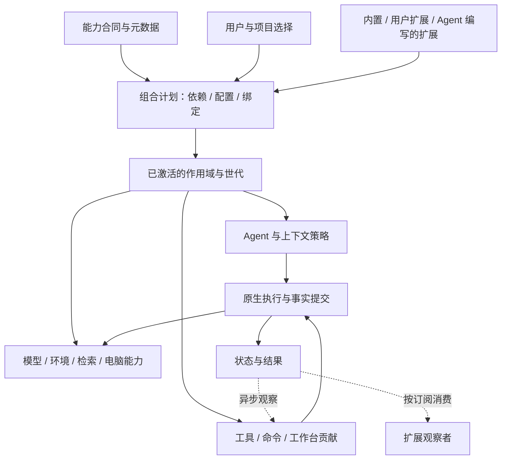

# Varin 原生运行时：能力组合与扩展设计

状态：设计草案，未实施。与[原生 Agent 运行时设计](agent-runtime-design.md)共同定义目标；本文中的新接口名称和 SDK 示例均为拟议合同。

日期：2026-10-09（Asia/Singapore）。Varin 实现核对基线：`3881c0ab`；DeepSeek Harness 参考基线：`5badb15009ae1756c3afe0ae0cef1faafc290ccc`。
参考来自本地源码阅读，没有运行两者的性能对比。以下目标不构成已实现的性能结论。

## 1. 推荐结构

扩展可以提供能力、组合能力、决定 Agent 的推进策略，并提供对应界面。Varin 核心负责执行事实与受管资源的正确提交。
用户可以选择默认完整产品，也可以按项目、任务和环境换掉其中一部分。

推荐保留现有扩展平台的 Host/Surface、服务合同、作用域路由、资源归属及候选更新，接入原生运行核心。
增加的核心机制是 **CompositionPlan**：把选定扩展、配置和依赖在启用时解析成一份可直接执行的组合计划。
日常调用使用这份计划中的绑定，不重新猜测由哪个插件处理。



“完整可扩展”不要求每段代码都成为插件。身份、持久事实、授权及资源提交属于稳定机制；具体算法、工作方式、模型和界面属于可替换实现。
模块调用仍可直接发生在一个进程内，能力边界不自动变成微服务边界。

## 2. 从 DeepSeek Harness 取什么

| 已核对的机制 | 对 Varin 的设计价值 | 源码依据 |
| --- | --- | --- |
| 能力由 Definition、Provider、Consumer 三个角色组成；文件和进程处于一致的 execution world | 工具依赖能力接口；替换环境时同步改变其文件、Shell、PTY、语言服务所见资源 | [能力边界说明][ds-seams] |
| Cordis service 支持声明依赖、隔离作用域及继承配置 | 不把所有项目固定到一个全局实现；缺失必需依赖在启用时显现 | [Context][ds-context]、[Service][ds-service] |
| 注册、订阅及依赖跟随所属生命周期释放 | 插件作者不用为每个注册手写反注册；卸载不残留工具和监听器 | [服务生命周期][ds-reflect] |
| AgentFactory 有独立接口，agent-loop 以工厂实现注册 | 深层扩展包括 Agent 工作方式，而非只有附加工具 | [AgentFactory][ds-agent]、[工厂注册][ds-factory] |
| Host/Client 动态包、可发现的 UI slots、只读运行时接口查询 | Agent 可以查清当前接口后编写扩展，也能扩展对应界面 | [运行时查询工具][ds-inspect]、[槽位合同][ds-slots] |

需要结合 Varin 的目标作出不同选择：

- Cordis 提供同步 emit、串行、并行及 waterfall 等不同事件语义；部分生命周期明确等待监听器。Varin 将观察与执行依赖分开，避免普通监听器进入关键路径。[事件实现][ds-events]
- 该版本动态 Host 更新先 retract 旧实例，再启动新实例；Client 也先 teardown 再 mount。Varin 延续已有候选切换合同：候选失败保留旧组合，在途调用保留原绑定。[Host 更新][ds-host-update]、[Client 更新][ds-client-update]
- 该版本 SDK 的 initialize 等待当前插件树 settle，让首个 prompt 看见准备好的能力。Varin 只等待当前工作明确需要的能力，其他服务独立预热。[SDK 初始化合同][ds-sdk]
- DeepSeek 的工厂卸载会收尾活跃 Agent。Varin 将持久工作归原生核心，插件世代的寿命与任务寿命分开。[工厂释放][ds-factory-dispose]

这些是当前源码中的取舍，不能据此推导 Cordis 或 DeepSeek 的整体速度、可靠性优劣。

## 3. Varin 已有基础与实际缺口

现有[扩展平台设计](varin-extension-platform.md)已经包含作用域服务选择、内置贡献、Host/Surface 分离、资源释放和候选激活。
现有 [HostServiceRegistry](../../packages/extension-host/src/service-registry.ts)也已实现 provider 世代、draining、在途计数及准备替换。
因此不再建立另一个安装器、配置库或生命周期管理器。

当前 `invoke()` 会解析请求、遍历 provider 集合选择实现，并递归检查/复制 JSON 返回值。这适合其现有通用边界，
但不应成为原生可信模块之间的唯一调用方式。目标是把跨边界入口和内部类型化调用分开，提前解析稳定绑定。
这只是可以消除的工作量，尚无测量证明它是当前产品的主要瓶颈。

[BrokeredHostSupervisor](../../packages/extension-host/src/broker-supervisor.ts)目前用同一条 Promise 队列串行处理 reconcile、准备、启用和停用，
其中会等待扩展启动与释放。原生化保留它的归属和候选合同，但将耗时准备/收尾移出公共队列，仅对相同实例或真实依赖关系排序。
这个发现属于扩展生命周期范围，不能据此认定它就是此前 dispatch 卡住的原因。

本次深化补足：原生绑定、Agent 策略接口、明确的扩展参与方式、局部组合更新、契约发现和任务/扩展寿命分离。
既有实现仍按原文档运行；下文描述原生化后的目标语义。

## 4. 能力合同与可替换范围

一个能力合同声明稳定 ID、版本、方法/流、输入输出类型、错误语义及资源/生命周期要求。
Provider 实现合同；Consumer 只依赖合同。包可以同时承担多个角色，不强迫一个小工具拆成三个包。

| 能力 | 可以替换的实现或策略 | 核心保留的职责 |
| --- | --- | --- |
| 模型 | API 适配、认证接入、模型发现和选用策略 | ModelStep 身份、历史关联、用量事实及合法工具交换 |
| 执行环境 | 本机、SSH、容器、远程工作区、虚拟机的文件和进程访问 | 环境身份、操作归属和受管资源提交 |
| 代码智能 | LSP 后端、结构索引、关键词/向量检索、重排/选材算法 | SourceView、结果来源与取消关联 |
| 上下文 | 材料选择、记忆检索、压缩算法、角色提示组成 | 原文、来源角色、稳定请求快照及提交边界 |
| Agent 工作方式 | 默认工具循环、计划执行、研究流程、多个模型与子任务编排 | 行动受理、真实状态、事件投递和分支提交 |
| Computer Use | 本地/远端桌面驱动、应用适配、观察与效果呈现 | 每个真实桌面的控制归属、取消、接管及动作回执 |
| 工具/命令 | 新的领域工具、工具组合、直接用户命令、codemode 接口 | 单份注册合同、调用身份及既有授权 |
| 工作台 | 面板、任务卡片、工具呈现、菜单、快捷键及整套 shell | 持久工作与共享文档/终端事实 |

共享机制可以演化，但插件不通过直接改数据库、猴子补丁或第二份任务状态获得控制权。
一个检索扩展替换选材策略时，仍可沿用现有工具及结果呈现；一个工具新增 UI 时，也不用改 Agent 循环。

### 4.1 合同的单一来源

跨边界的公开合同生成 Rust/TypeScript 类型、边界验证器和可查询元数据；内部私有类型无需全部放入协议。
内置工具 schema、说明、效果和资源合同从同一注册声明生成。动态扩展的 schema 在注册时编译，不在每个 token 或内部调用上重建。

内部模块同步升级，不维持已淘汰的兼容路径。公开扩展接口在形成外部依赖后遵循明确版本；配置和用户扩展资产保留。
新接口版本不靠静默降级或逐个尝试旧方法猜测兼容性。

## 5. 组合计划与作用域

### 5.1 计划的内容

`CompositionPlan` 是一次组合结果，包含：

- 选定的能力实现与已解析配置；必需、可选及集合依赖。
- 按固定顺序组合的变换、明确的决策入口、独立观察订阅。
- 工具/命令/界面贡献目录、schema 世代以及各自可见范围。
- 直接原生函数句柄、受管 worker 端点或远端协议端点。
- 实例共享范围、准备依赖、所属扩展版本及释放条件。

这里的“编译”是解析配置、依赖与绑定，不是把用户脚本即时编译成 Rust。未变的子图复用，局部修改只重建受影响组合。
调用经选定句柄进入实现，不扫描全部已安装服务。动态资源身份仍在调用时从真实参数解析。

### 5.2 配置范围与实例共享分别表达

沿用发行默认 → 用户/工作台配置 → 项目 → Thread/Agent 的覆盖关系；显式单次调用覆盖只改变该次绑定。
环境、模型、工作阶段等选择维度继续由已有服务路由解析。优先级相同且互相矛盾的选择在装配时报告，不取“最后安装”的插件。

作用域决定选什么，实例共享键决定复用什么。例如：

| 服务 | 合理的实例身份 |
| --- | --- |
| 无状态原生变换 | 进程内不可变实现，可多任务共享 |
| LSP | 执行环境 + 工程 + 语言/配置 + 一致的源码视图 |
| 持久脚本 | 显式脚本环境身份，单元格共享其绑定 |
| Computer Use | 机器/桌面身份，多个任务引用同一个控制协调者 |
| UI 贡献 | 对应 Surface/窗口与其贡献 owner |

不为每个 Thread 克隆整棵服务树，也不为了共享而混用不同来源或凭据的服务。
配置作用域不授予权限，子任务继承可见能力仍遵守已有授权与资源协调。

### 5.3 环境是一组相互一致的能力

环境描述文件路径空间、进程执行位置、源视图以及可用能力。一个远端环境中的 Shell、read 和 LSP 必须引用相同环境资源。
各能力可以由不同包提供，但适配器必须明确完成资源映射；不能只换文件 provider 后让 Shell 继续读同名本地路径。
未提供语言服务的环境仍可运行文件/Shell 工具；只有依赖语言服务的功能等待或报告缺失。

### 5.4 依赖就绪与预热

必需依赖缺失使对应贡献保持未就绪；可选依赖在合同中明确缺省行为；多实现目录和选定实现分别表达。
依赖环在组装时指明实际环路，互相协作的服务可通过运行期消息或共同上层编排连接，不把启用阶段互等作为设计。

服务注册完成与外部服务启动完成是不同事实。语言能力可先注册，由其 prepare 操作启动 LSP；普通聊天不等待它。
进入项目触发选定能力预热，调用共享同一准备身份。目录中有几百个未使用能力，不增加每轮初始化范围。
一个扩展准备或释放缓慢时，无依赖的另一扩展仍可启用/停用。公共 owner 只发布短小的选择/注册变化，
不同实例并行准备，同一依赖的准备合并；不把 `await activate()` 放进全局 lifecycle 队列。

## 6. 四种扩展参与方式

| 方式 | 合同 | 是否影响当前执行 |
| --- | --- | --- |
| Provider | 实现一个明确能力；按作用域选定一个实现或一个有意编排的集合 | 调用它的工作等待其结果 |
| Transform | 接收不可变输入，返回新片段/结构化补丁；无外部副作用 | 该项输入构造等待它，稳定输入可缓存 |
| Decision | 在命名边界返回明确选择，如下一步行动、压缩方案 | 只影响依赖该决定的工作 |
| Observer | 消费已经成立的事实，不修改原事实、不否决已完成操作 | 生产者不等待观察者完成 |

“每次调用前/后运行任意 async 回调”的万能接口会重新制造公共屏障，不作为默认扩展方式。
真正的中间件需求可以由具体能力声明 around 合同，写清返回值与异常/取消语义；不能让忘记调用 `next()` 隐式吞掉任意任务。

### 6.1 Observer 的交付

核心提交完成后交付订阅。需要恢复的订阅使用原事实游标；光标、token 和检索进度等临时流按显示需要合并。
观察者慢只影响其消费进度，不推迟原工具回执。过期游标重取快照；必须保留完整内容的日志使用独立输出存储。
不因每个观察插件存在就为每个 token 追加一条持久队列记录。

生产者只将事实交给运行时订阅通道，不在控制线程调用扩展代码。第三方回调沿既有 broker 实例执行，按需创建并跨调用复用。
共享一个 JavaScript worker 的同步回调仍可能互相阻塞；共享只在可接受的共同故障范围内使用，不用“不 await”冒充执行隔离。

观察者需要发起业务工作时，提交带自身来源的新命令；不能偷偷把动作挂在原工具的成功路径上。
会改变事实或必须在副作用前参与决策的扩展，应声明相应能力/决策接口，不能伪装成观察者。

### 6.2 Transform 与 Decision 的成本

纯变换按声明顺序合成，冲突在组装时解决，实际更改哪些字段可检查；不能任意修改共享历史对象。
网络检索、模型评分和大规模计算属于显式能力调用/Operation，不包装成“轻量前置 hook”。
它们耗时确实会影响依赖它们的请求，但不会占住控制线程，也不会阻止别的工具执行。

## 7. 可替换的 Agent 策略

拟议 `AgentPolicy` 接收运行快照与本次事件，返回下一步行动及其策略状态。行动包括请求模型、提交工具图/子任务、
等待已登记事件、交付结果、暂停或结束。默认实现保持现有用户习惯，领域扩展可定义其他工作流程。

核心只解释合法行动、推进独立工作、提交结果；它不把“必须先计划”“每步必须反思”等策略写死。
策略要调用自己的规划模型时，用普通模型 Operation 表达；等待期间让出执行机会。

三类状态分开：

1. 原文、Run、ModelStep、工具结果及用户输入属于核心，换策略仍能读取。
2. 策略自己的检查点归该实现，记录版本并与产生行动的边界关联；不为每个临时计算写库。
3. 模型的 opaque 续接项归对应协议适配器，其他策略不能改写成伪造的普通文本。

插件更新时，当前决策/模型交换按原绑定收尾，新策略在下一合法边界生效。策略私有状态不能兼容时，
旧实例继续完成已绑定工作，或由用户按明确方式重新开始；不声称任意 Agent 循环能够热迁移。
停用某策略不销毁 Thread 原文和已受理的独立子任务。

## 8. 作者接口与 Agent 自助扩展

一个简单扩展只需要清楚声明依赖并注册贡献。下面是拟议 SDK 形状，不是当前可运行示例；`repositorySearch@1` 为示例能力合同：

```ts
export default defineExtension({
  id: "example.code-search",
  requires: { search: repositorySearchV1 },
  host(ctx) {
    const search = ctx.use("search"); // 必需依赖已在激活前绑定
    ctx.tools.register({
      id: "example.code-search.query",
      input: { query: schema.string() },
      completion: "result",
      operation: "read",
      async execute({ query }, call) {
        return search.query({ query, sourceView: call.sourceView }, call);
      },
    });
  },
  surface(ctx) {
    ctx.views.register({
      slot: "tool.result",
      key: "example.code-search.query",
      render: SearchResultView,
    });
  },
});
```

SDK 注册自动归属 owner，无需手动保存每个 disposer。`call` 传递本次环境、取消和来源等必要上下文，
实现不再从全局“当前会话”推断。真实外部资源经 `ctx.effect()` 注册其释放动作。
例中的 `operation: "read"` 是实现合同声明，不能为非可信包自动授予权限或证明直接系统调用无副作用。

服务替换使用相同能力声明及现有路由选择；纯 UI 扩展不必声明工具，纯后端工具不必带 UI。
提供 TypeScript 类型、普通包结构及可直接复用的 UI 组件/主题合同，不要求作者通过运行时拼源码或阅读内部对象猜 API。

### 8.1 从同一份合同查询能力

参考 DeepSeek 的 inspect 能力，提供只读目录/精确查询：

- 当前作用域可用的 service、method、tool、事件模式和 UI slot。
- 输入/输出 schema、作用域、必需依赖、选中的实现及准备状态。
- 与当前合同版本匹配的精简示例、源文件位置；按需读取具体实现源码。
- UI 的单选/列表/按键贡献方式、props 类型、承载 owner 以及显式替换关系。

Agent 按需查合同，不把完整目录、调用阶段、插件说明统一注入系统提示词或每次工具结果。
接口元数据由注册合同生成，避免另养一套经常过期的描述。工具展示配置由同一 registry 驱动。

### 8.2 Agent 编写的扩展与普通扩展同路

采用稳定 extension ID、不可变内容版本、一次激活实例三个身份。脚本/包先形成可检查的候选，再由既有启用权限与意图决定生效。
已授权的编辑更新沿同一流程推进，不新增每次都要确认的泛化弹窗；也不让工具生成的代码绕过当前授权直接执行。

依赖、可查询合同、候选准备、界面挂载和释放均用同一平台。Agent 可以只新增一个局部工具，也可以生成项目工作台；
失败原因定位到实际贡献/依赖，普通结果只报告有用的问题，不自动打印整份内部装配图。

## 9. 更新、卸载与任务寿命

### 9.1 候选准备、发布、旧实例退役

1. 解析候选 manifest/合同与受影响依赖，保留当前活动组合。
2. 候选在隔离的注册范围准备实现与贡献；登记可以暂存，不能提前修改用户文件或发送外部动作。
3. 达到该更新合同的就绪条件后，在协调 owner 处切换所选组合世代。后续调用取得新绑定。
4. 在途调用保留实际使用的旧实现引用，按原调用身份完成；旧世代停止接受新工作，引用释放后退役。

变化的状态在发布点做修订核对，以防候选期间用户又改了选择。依赖解析/schema 不因此在每个内部函数重复执行。
内置函数直接引用、扩展端点句柄和共享资源引用都带清楚寿命；不依靠每次调用重新扫描注册表维持安全性。
因正常更新而退休的世代仍可提交其在途结果；显式撤权、取消或 worker 重启使某次执行失效时，才按执行身份拒绝相应迟到写入。

已经冻结的模型请求可能稍后返回旧 schema 的工具调用。相关描述和绑定保留到该 ModelStep 的调用集合结算；
用户明确禁用/撤权仍立即影响执行。后续模型请求再切换到新工具目录，避免名称相同而参数意义突然变化。

### 9.2 Host 与 Surface

后端工具默认可在无 UI Host 启用。Surface 是可选消费者时，关闭浏览器不停止后端工作。
某功能明确需要 Host 与 Surface 成组更新时，只把该组登记为就绪依赖；不等待所有窗口或所有已安装扩展。
活跃 Surface 的调用携带其合同/组合版本；跨进程发布通过已提交选择与版本握手收敛，不承诺所有进程在同一纳秒切换。
候选准备失败仍保留旧组合；提交后进程退出按已提交世代恢复，不能再把它误判为尚未发布的候选。

### 9.3 无法同时运行的新旧实现

持有独占端口、设备或特殊原生模块的实现，不一定能同时启动两份。优先由原生资源服务持有稳定资源，插件替换算法/策略绑定。
确实需要整体接管时，准备能并存的部分，到明确静止点完成资源交接，期间只暂停该能力的新调用。
只有完成资源就绪才能提交选择；无法回退的外部迁移、不可卸载的可信原生模块遵守既有迁移/重启语义。

不以“热更新”掩盖这些实际成本，也不默认重启全部会话。

### 9.4 资源释放与持久工作

| 对象 | 寿命归属 |
| --- | --- |
| 注册、监听、临时计时器、UI、扩展缓存 | 对应扩展实例，释放时自动撤回 |
| 在途 provider 调用 | 调用持有实现引用；取消或完成后释放 |
| 核心已受理的 Shell、子任务、提问、日历任务 | 所声明的 call/run/thread/environment owner，不归调用它的临时插件对象 |
| 插件自己的计算/连接/私有进程 | 扩展 owner，卸载时按其合同收尾；已有调用需要先 drain 或明确取消 |

卸载是一次显式状态变化。用户要求立即禁用时，按实际范围取消相关执行；普通更新不连带取消整个任务树。
释放失败只归属实际资源，不能留下“已卸载”但仍能接受新调用的实例，也不能无限阻塞无关扩展。

## 10. 部署与性能

| 实现方式 | 适合范围 | 调用成本与边界 |
| --- | --- | --- |
| 内置 Rust 模块 | 控制、文件、进程、状态及其他成熟原生能力 | 类型化直接调用/共享引用；没有内部 JSON 中转 |
| 受管 JavaScript worker/进程 | 用户扩展、领域算法、持久脚本 | 跨真正的进程边界编解码，进程内已绑定服务直接调用；显式生命周期 |
| 现有 Surface 模块 | 页面、卡片、菜单、工作台 | 在其既定执行模式内呈现，通过共享客户端访问后端 |
| 远端/MCP/独立程序 | 现有生态、远程能力与隔离执行 | 遵守对方协议、实际网络/进程及取消能力 |

不为第三方 Rust 动态库自建稳定 ABI，也不因“以后可能用到”加入另一种插件虚拟机。
已有明确能力需要其他执行技术时，只增对应绑定，能力合同无需跟随宿主语言更换。

### 10.1 让扩展规模不拖累每次调用

- 昂贵 schema 编译、依赖排序、路由选择发生在注册/配置变化时。调用使用绑定，按输入规模校验一次外部参数。
- 未使用能力不实例化。项目/任务复用父级未变子图，作用域覆盖只保存差异；相同服务实例按明确共享键复用。
- 内置调用不经过 JS；JS 扩展直接连到对应原生能力入口，避免 `UI → Host → Pi worker → Host → Rust` 的重复转发。
- Observer 不进入 awaited 调用链，慢订阅有自己的游标和读取进度；重型决策被登记为实际工作。
- 大内容、截图及日志用引用/流传递，不因经过工具包装或 UI renderer 就复制完整载荷。
- 生命周期引用按实际使用的实现持有，不让一次长作业把全部不相关旧插件永远留在内存。

为工具增加扩展点后，成本应能指出“多了一次选择/调用/编码/存储中的哪一种”。
无法解释成本和调用者的抽象不进入默认路径；不靠“Rust 更快”替代成本核算。

### 10.2 避免防御性编程的落地规则

外部数据在边界校验，内部使用已验证类型和已绑定依赖。必需对象缺失在启用阶段失败，可选对象用明确类型表达。
调用方不重复探测同一个必需 service 是否存在；变更由世代切换与其持有者处理。

错误只在能够恢复、负责释放或转换外部协议的位置捕获。内部错误不层层 `catch → wrap → retry`；
服务准备失败不会默默变成空结果，也不会自动轮流调用多个付费模型。

保留真实边界上的权限与版本核对：准备后资源可能变化、调用方可能非可信、worker 可能重启。
相同可信范围内的多个函数调用不重复承担这些职责。新增限制或兜底需对应具体故障，并写明归属，不建设通用“防故障中间件”。

## 11. 几条完整使用路径

| 场景 | 组合与执行结果 |
| --- | --- |
| 项目使用另一套检索选材算法 | 换 retrieval 的选定 provider，工具与结果视图继续工作；LSP/Shell 不重新启用 |
| 指定子任务到远程容器 | Thread 绑定该环境；read、Shell、LSP 统一引用其资源；本地主任务独立运行 |
| 用户更换压缩策略 | 候选使用固定原文范围准备摘要，在压缩提交边界切换；记忆快照和原文按统一合同处理 |
| Agent 加一个领域工具和任务卡片 | 查询当前合同，生成候选包，按现有授权启用工具与对应视图；没有界面时后端结果仍可用 |
| 模型生成途中更新工具包 | 当前请求保留旧 schema/绑定；后续请求使用新目录；明确禁用仍能停止新副作用 |
| 慢日志插件与快速读取同时运行 | 读取结果正常交付，日志订阅落后由自身游标处理 |
| 更新 provider 失败 | 原选择和在途工作继续；候选错误关联到实际依赖，不重启整个 Agent |
| 一个扩展的 activate 一直未完成 | 它及其必需消费者保持准备中；无依赖扩展的启用、停用与普通调用继续 |
| 停用发起过后台 Shell 的工具包 | 新工具入口撤回；Shell 按其声明的作业 owner 存续或明确取消，不因 JS 对象释放而丢失 |

## 12. 实施边界与待验证项

原生化按总设计完成全部能力，以下是结构依赖顺序：先确定公共能力与执行合同，再连接现有扩展路由，
形成可执行组合、接入策略与发现接口，最后迁移领域实现并移除 Pi 及重复中转。先后顺序不缩减最终范围。

实际需要验证的是：候选切换与在途调用、无 UI 启用、同名资源的环境映射、观察者背压、策略状态边界以及组合复用的成本。
性能比较区分冷启动、已有环境的新任务、稳定调用及扩展更新；不预填没有依据的毫秒目标或倍数收益。
本轮仅做源码核对与设计修订，没有运行测试、应用、桌面操作或付费模型。

[ds-seams]: https://github.com/deepseek-ai/deepseek-harness/blob/5badb15009ae1756c3afe0ae0cef1faafc290ccc/docs/architecture.md#L131-L135
[ds-context]: https://github.com/deepseek-ai/deepseek-harness/blob/5badb15009ae1756c3afe0ae0cef1faafc290ccc/vendor/cordis/src/context.ts#L90-L145
[ds-service]: https://github.com/deepseek-ai/deepseek-harness/blob/5badb15009ae1756c3afe0ae0cef1faafc290ccc/vendor/cordis/src/service.ts#L32-L101
[ds-reflect]: https://github.com/deepseek-ai/deepseek-harness/blob/5badb15009ae1756c3afe0ae0cef1faafc290ccc/vendor/cordis/src/reflect.ts#L277-L335
[ds-agent]: https://github.com/deepseek-ai/deepseek-harness/blob/5badb15009ae1756c3afe0ae0cef1faafc290ccc/packages/core/agent/src/index.ts#L165-L202
[ds-factory]: https://github.com/deepseek-ai/deepseek-harness/blob/5badb15009ae1756c3afe0ae0cef1faafc290ccc/packages/core/agent-loop/src/index.ts#L366-L370
[ds-events]: https://github.com/deepseek-ai/deepseek-harness/blob/5badb15009ae1756c3afe0ae0cef1faafc290ccc/vendor/cordis/src/events.ts#L165-L243
[ds-host-update]: https://github.com/deepseek-ai/deepseek-harness/blob/5badb15009ae1756c3afe0ae0cef1faafc290ccc/packages/extensions/cordis-host-runner/src/index.ts#L851-L879
[ds-client-update]: https://github.com/deepseek-ai/deepseek-harness/blob/5badb15009ae1756c3afe0ae0cef1faafc290ccc/packages/extensions/cordis-client-runner/src/client/runtime.ts#L288-L299
[ds-inspect]: https://github.com/deepseek-ai/deepseek-harness/blob/5badb15009ae1756c3afe0ae0cef1faafc290ccc/packages/extensions/tool-cordis/src/index.ts#L21-L69
[ds-slots]: https://github.com/deepseek-ai/deepseek-harness/blob/5badb15009ae1756c3afe0ae0cef1faafc290ccc/packages/extensions/cordis-client-runner/src/client/slot-catalog.ts#L29-L74
[ds-sdk]: https://github.com/deepseek-ai/deepseek-harness/blob/5badb15009ae1756c3afe0ae0cef1faafc290ccc/packages/sdk/server/README.md#L46-L48
[ds-factory-dispose]: https://github.com/deepseek-ai/deepseek-harness/blob/5badb15009ae1756c3afe0ae0cef1faafc290ccc/packages/core/agent-loop/src/index.ts#L97-L147
