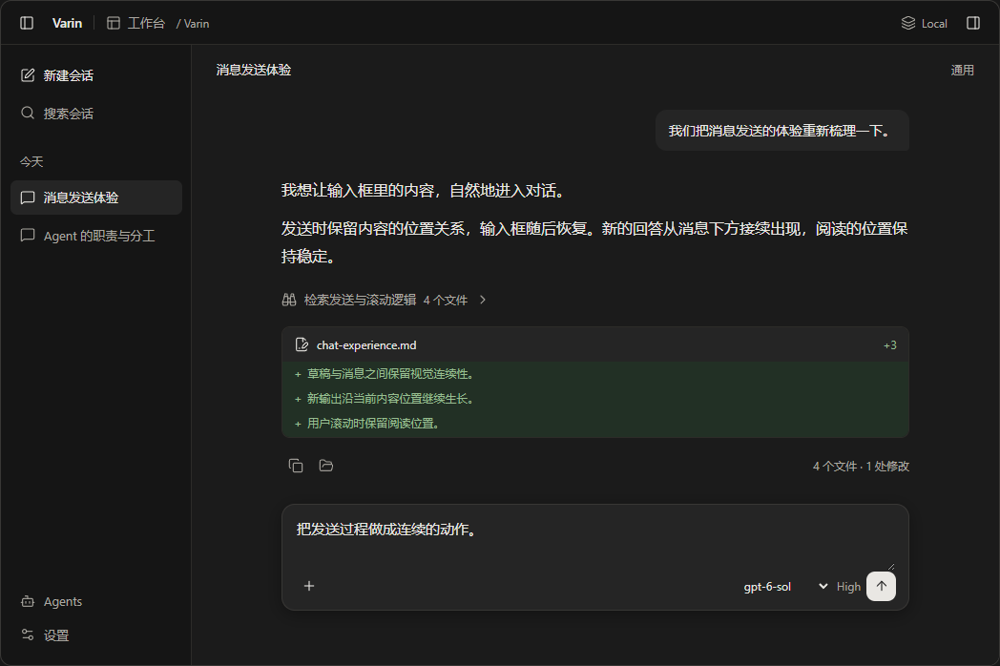
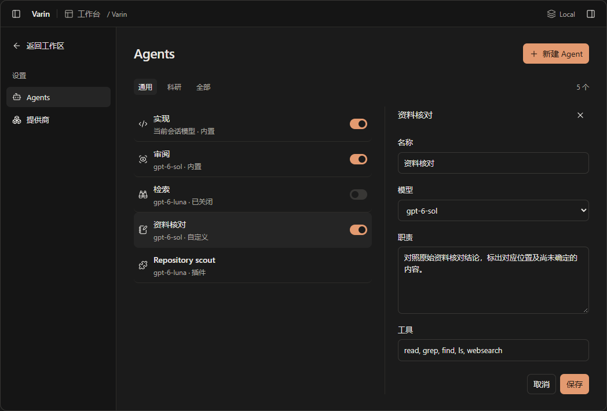
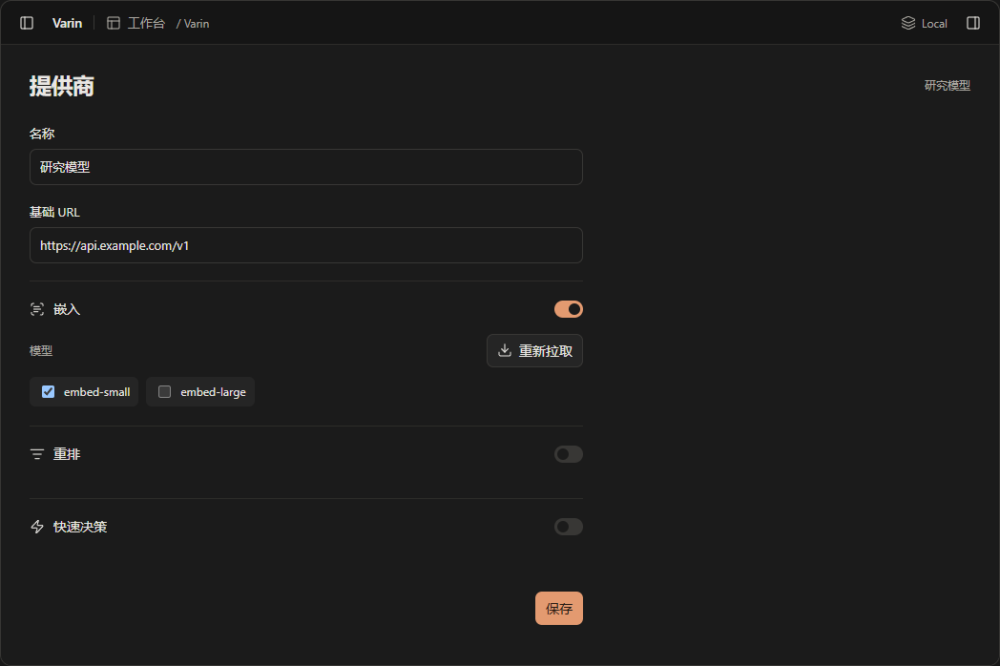

# Varin 视觉与交互设计 · 第一版

Status: design proposal — 待体验评审，尚未应用到产品界面

日期：2026-10-03

## 1. 设计方向

Varin 是一个持续工作的空间：用户在这里提出问题、看 Agent 推进、查看文件和产物，并随时接过操作。
这一版让内容成为视觉重心，用稳定的空间关系和连续的状态变化连接这些活动。

视觉基调：中性底色、清楚的正文、紧凑的工具区、少量铜色强调。页面通过排版、距离和表面层次建立秩序。
动效表达对象的来去、归属和状态；同一对象在输入、排队、执行、完成过程中保持可追踪。

用户应能直接看清：当前对象、主要内容、下一步操作、操作结果。默认界面中的解释文字只保留影响当前决定的部分。

本提案覆盖官方工作台、IDE、Varin bot，以及科研侧重下的内容组织。工作侧重、工作台外壳和运行环境继续沿用现有独立概念。
第三方 Shell 保持自己的表现自由；共同的数据与操作合同沿既有 owner。

第一版聊天样板（模拟内容）：

## 2. 应用框架：稳定的外层，聚焦的工作区域

### 2.1 四个区域

| 区域 | 内容与视觉权重 | 行为 |
| --- | --- | --- |
| 标题栏 | 模式、项目/当前上下文；连接与窗口操作靠右 | 紧凑、稳定，模式菜单保持工作台 / IDE / Varin bot 三个入口；工作侧重单独选择 |
| 导航栏 | 会话或 Bot、项目分组、新建、搜索；设置与定时入口靠下 | 选中态清楚，悬停操作轻；窄窗可收起，恢复用户选择的位置与宽度 |
| 主工作区域 | 对话、代码、文档、任务或设置主体 | 占据主要对比度和空间，标题与主要操作在同一稳定区域 |
| 辅助面板 | 文件、变更、任务、材料或对象详情 | 有明确标题与关闭方式，宽度服务内容；打开时保留发起操作的对象关系 |

在工作台中，默认让阅读区完整展开。用户主动打开文件或材料时，再呈现辅助面板。
IDE 以编辑器为主体，聊天成为并列工作区域；Bot 保留自己的导航和工作身份。
同一个文件、任务和 Agent 在不同区域使用相同的名称、状态、图标和操作语义。

### 2.2 尺寸起点

以下为第一版设计样板的参考尺寸，实际布局按可用区域与字体缩放调整，不作为运行能力限制。

- 标题栏约 44px；原生窗口按钮与安全区域优先。
- 导航默认 240–256px；较窄桌面可以收至约 208px，已有手动宽度保留。
- 对话正文与输入框共用中心线，常规阅读宽度约 720–800px；代码、表格和文件预览可按内容展开。
- 辅助详情通常需要 300–360px。主内容不足以舒适阅读时改用覆盖面板；再窄时使用独立详情页并提供返回。
- 工作区外侧留白约 24–40px，区块之间 24–32px，关联内容之间 8–12px，图标与文字之间 6–8px。
- 桌面控件常规高度 32–36px；触屏使用约 44px 的有效目标，正文和输入字体随系统偏好缩放。

响应式按内容能否排下决定：标题先换行，工具栏先折行，次要操作进入菜单。正文不随整个桌面等比缩小。
窄屏保留当前对象和主要操作，导航与详情分步打开；草稿、筛选、焦点和滚动位置持续存在。

## 3. 视觉语言

### 3.1 表面与颜色

| 语义 | 深色候选 | 浅色候选 | 使用位置 |
| --- | --- | --- | --- |
| 应用底层 | `#151515` | `#F2F2EF` | 外层窗口与导航基底 |
| 主工作表面 | `#1B1B1B` | `#FAFAF8` | 阅读、编辑和主要内容 |
| 控件/选中表面 | `#252525` | `#EAEAE6` | 输入框、当前行、局部容器 |
| 浮层 | `#2C2C2C` | `#FFFFFF` | 菜单、弹出选择器、覆盖详情 |
| 正文 | `#E9E7E3` | `#252522` | 正文、对象名称、操作 |
| 辅助文字 | `#ABA8A1` | `#65645E` | 来源、时间、简短元信息 |
| 普通边界 | `#383735` | `#DAD9D2` | 输入边界、确有需要的区域分隔 |
| 强调 | `#E39A70` | `#93502A` | 主要操作、焦点、局部选择标记 |

这些值映射到现有 semantic theme tokens。自定义主题仍可替换颜色；组件依赖语义。
浮层通过实色背景、细边界和克制阴影区别于工作区；普通内容块主要用距离和对齐分组。
成功、错误、警告和代码增删保持各自语义，并同时提供图标或文字。
实现阶段需核对实际字体下的正文对比度、焦点可见性、浅色与高对比主题。

### 3.2 排版与密度

| 用途 | 参考字号 / 行高 | 处理 |
| --- | --- | --- |
| 设置与管理页面标题 | 22px / 30px | 清晰的主标题，通常一行；页面操作与它对齐 |
| 区块标题 / 对象名称 | 14–16px / 22–24px | 中等字重；靠间距建立分组 |
| 对话正文 | 16px / 27px | 长文可读，段落间约 12px；列表层级清楚 |
| 控件与导航 | 14px / 20px | 紧凑但易读；按钮宽度由标签决定 |
| 元信息 | 12–13px / 18px | 次要对比度，避免所有行都附带多层说明 |
| 代码 | 13–14px / 21–22px | 沿现有等宽字体与高亮；长行有清楚的阅读方式 |

密度首先调整行高、间距和辅助信息披露。常规文字大小稳定，避免通过缩小字体容纳更多控件。
使用现有字体配置与图标系统；统一 16/18/20px 图标档位、基线和有效点击区域。
同一种对象保持图标一致，状态变化在同一图标槽内完成。

## 4. 四种页面结构

### 4.1 对话与产物

用户消息作为一轮的起点，使用低对比度的局部背景；Agent 正文直接落在阅读表面。
过程信息用紧凑行呈现，展开后才展示细节；文件变化继续使用现有流式增删预览。
同一轮结束处保留一组操作，统计信息靠右，宽度不足时换行。

输入框与正文共用宽度及中心线。附件、排队消息、待处理问题组成有顺序的附属区域。
模型、权限与发送操作保持稳定位置，更多配置按需展开。
自动跟随落在内容边缘；手动进入额外底部留白后，新输出逐步填入，沿用现有单一滚动 owner。

### 4.2 对象列表与详情

用于 Agents、Bot、会话管理、连接和插件等。列表以对象名称为主，摘要只显示帮助区分对象的字段。
来源、模型、状态根据对象类型选择，不给每行叠加同一套说明。

选中对象后，宽屏在邻近区域打开详情；原行保留选中态。窄屏进入详情，返回恢复原列表位置。
新建从明确的主按钮开始；保存后新对象进入列表并被定位。删除提供准确对象名称与后续可行操作。

Agents 示例：

- 默认按当前工作侧重过滤；筛选是查看条件，不改变会话工作侧重。
- 内置、自定义、插件身份以简短来源标记区分。
- 启停在该行回应，处理中只约束冲突操作，其他对象可继续查看和管理。
- 模型、职责指令和工具在详情内编辑。当前值足够表达的内容不再附加重复说明。
- 新建和复杂编辑使用显式保存；切换对象时保护尚未提交的编辑。

### 4.3 配置表单

用于提供商、代码检索、知识、权限等。顶部只保留页面名称和必要操作。
基础字段先呈现；高级覆盖、诊断、协议细节按需展开。每项设置放在其功能所属页面。

简单开关即时应用，在控件附近反馈。多字段连接配置以一次保存提交，字段校验靠近输入。
模型拉取按钮原位进入进行状态，结果在对应能力下出现；读取失败保留用户已填内容。
自动保存与显式保存的语义在一个编辑单元内保持一致。

### 4.4 编辑工作区

用于 IDE、文件审阅和科研材料。标签、工具栏、编辑内容与结果面板有固定的层次。
文件打开、标签切换、定位代码应迅速；异步加载保留区域尺寸并明确当前目标。
从聊天打开产物时，源卡片与目标标题使用相同标识，用户能看懂操作去向。
科研分支、材料、实验状态按任务关系组织，默认展示当前问题所需的内容。

## 5. 文字：把解释成本留在设计里

产品文字分为：对象名称、操作标签、状态、当前决定所需的帮助。每处只承担必要的一项职责。

| 场景 | 默认呈现 | 按需呈现 |
| --- | --- | --- |
| Agents 列表 | 名称、模型/简短职责、状态、操作 | 完整指令、工具、配置作用范围 |
| 功能模型 | 模型字段、开关 | 模型用途的短帮助与高级连接覆盖 |
| 操作成功 | 对象的新状态；必要时短暂勾选 | 详细执行记录 |
| 配置失败 | 失败对象、可操作原因、重试入口 | 原始响应和日志 |
| 空列表 | “还没有 Agent”与“新建 Agent” | 创建指南 |
| 文件变化 | 文件名、增删、实际内容 | 原始工具参数与执行记录 |

清除默认页面中的重复解释、实现细节、泛泛保证和防御性辨析。既有帮助内容可收进相关字段的帮助入口。
语义不清楚的名称先重命名；操作关系不清楚的布局先重排。
帮助不能替代必要的标签、错误说明、未保存提示或实际授权问题。

## 6. 动效语言

### 6.1 一组稳定的动作

| 动作 | 用途 | 第一版节奏起点 |
| --- | --- | --- |
| 按下与释放 | 按钮、开关、可操作行 | 约 90–130ms，底色/边界响应；位移很小 |
| 状态交接 | 发送→停止、进行→完成、复制→已复制 | 约 140–180ms，同一槽位轻微位移与交叉过渡 |
| 展开与收拢 | 工具细节、字段组、排队区 | 约 180–220ms，高度与内容同步变化 |
| 面板进入与退出 | 辅助面板、详情、设置 | 约 200–260ms，方向对应区域位置 |
| 对象交接 | 草稿→消息、队列→聊天、新对象→列表 | 约 240–320ms，先快后缓，沿实际源/目标位置移动 |
| 局部内容更新 | 缓存视图、新数据替换 | 保持容器和阅读锚点，必要时短暂过渡 |

这些时长是样板起点。按真实设备、移动距离和内容量调整；业务提交不等待动效计时。
用同一组 easing 表达快响应与轻收尾，普通工具界面不增加反复弹跳。
持续运动用于确实仍在进行的状态；完成后自然停下。

### 6.2 发送消息的完整动作

1. 按下发送时，按钮当帧回应。提交事务保留草稿、附件和真实会话身份。
2. 本地提交记录进入现有 `submission` 后，聊天中为新消息建立目标位置。
3. 取输入内容的当前位置与目标位置，显示短暂的视觉投影：内容被轻背景承接，移动并收拢到用户消息。
4. 输入框平稳恢复，新消息接过显示。输入区继续接受后续输入。
5. 服务端确认合并到同一个提交身份，界面保持同一条消息；视觉投影完成后立即释放。
6. Agent 等待/输出状态衔接在这条消息后。实际流式内容到达即显示，持续增长时保持阅读锚点。

短消息完整移动；长文本以可见开头和附件摘要承接，目标消息保留全文。不要缩放长段正文制造扭曲。
源或目标不在视区、会话已切换时，采用目标位置的轻过渡；中断动画不改变提交结果。
长距离定位由既有滚动控制器安排，动画层只读取位置，避免多方同时写 scrollTop。

| 真实结果 | 界面处理 |
| --- | --- |
| 受理 | 同一消息从待确认转为已受理，稳定位置 |
| 明确失败 | 在相关消息旁给出重试/恢复入口；草稿按既有事务恢复，保护用户后来输入 |
| 结果未知 | 留在待确认状态，允许核对；不自动重发 |
| 忙碌时排队 | 内容进入输入框上方的队列行，保留实际队列身份 |
| 队列直接发送 | 同一条队列对象交接到当前任务，已消费状态决定后续展示 |
| 立即补充 | 按真实 steering 接收结果呈现；保持用户输入的连续性 |

### 6.3 图标和列表细节

形状相近的状态可用笔画变化；不同语义的图标在固定盒内轻移和交叉过渡。快速状态变化合并到最新目标，旧动画不能覆盖新状态。
停止操作当帧可用，不等发送图标过渡完成。按钮的名称和可访问状态随业务状态更新。

列表新增、删除与排序让相邻行自然让位。刷新保留旧内容；只标记正在更新的对象。
高频切换采用已缓存内容即时呈现，冷加载保留内容区域轮廓。错误在对应区域出现，用户可以继续使用其他区域。

## 7. 连续性、可访问性与性能

- 返回保留列表筛选、展开、选中、滚动和草稿；焦点回到发起操作的控件或新创建对象。
- 鼠标、键盘、触屏都能完成主要操作；行内操作在焦点和触屏场景同样可发现。
- 尊重减少动态效果偏好：去掉空间移动，保留即时状态、焦点与必要的轻过渡。
- 200% 字体/页面缩放后依然能操作；正文不依靠颜色或悬停才能理解。
- 流式输出和虚拟列表避免逐 token 重排所有内容。文字不重播“打字动画”。
- transform/opacity 用于短暂投影；必要的高度变化局限于受影响区域。稳定对象身份用于协调布局。
- 断网、慢响应、快速重复点击、切换会话、动画中断都必须回到真实状态。
- 进入详情和退出详情都有明确焦点路径；内容在视觉退出时不能留下不可见可点击层。

## 8. 示例路径的验收标准

| 路径 | 应能观察到的结果 |
| --- | --- |
| 发送短消息 / 多行 / 附件 | 来源和去向清楚，文本可读，无重复消息，下一条输入及时可用 |
| 输出中排队并直接发送 | 队列行和聊天消息身份连续，操作结果可辨认，失败可恢复 |
| 用户手动往上读 | 内容继续到达而视区不被抢走；回到最新后恢复跟随 |
| 切换热会话 / 冷会话 | 选中立即回应；缓存内容可用时马上显示；加载过程有稳定占位 |
| 打开文件 / 关闭面板 | 原操作对象仍可定位，正文空间合理变化，滚动位置稳定 |
| Agent 启停 / 编辑 / 新建 | 局部处理状态清楚，其他对象可操作，新对象保存后可找到 |
| 提供商拉取模型 / 失败重试 | 原位进度，结果归属准确，失败保留已填信息 |
| 窄窗 / 浅色 / 键盘 / 减少动效 | 主要任务完整可用，标签可读，焦点可见，状态表达一致 |

以上是体验验收，不以组件数量或新增动画数量计完成。截图用于排版评审；连续操作与慢响应回放用于交互评审。

## 9. 与现有实现的关系

这一轮沿用现有主题、排版、组件、消息投影、设置 owner 和工作台内核。
官方 Surface 内的过渡遵守 [Motion 平台](varin-motion-platform.md) 的 ownership；全局 Shell 场景保持独立。
消息动效依托 [聊天体验](chat-experience.md) 的 submission、turn projection、队列身份及单一滚动 owner。
Agent 管理沿用 [设置管理](agent-settings-design.md) 的目录和 revision。动画只投影状态，不创建新的保存、队列或派发 authority。

主要接入位置：

- `packages/ui/src/styles/typography.css` 与主题 tokens：排版、密度、表面和动效语义。
- `components/layout` 与官方 `workbenches`：外层空间、导航、面板、窄屏布局。
- `components/sections/shared`：表单布局、字段状态、保存反馈。
- `components/sections/agents`：对象列表、选中详情、局部 mutation 反馈。
- `components/chat` 与会话 store：发送交接、图标变化、过程披露、滚动连续性。

样板里的图标由预览环境提供；产品继续沿已有图标注册系统实现。样板交互使用模拟内容，不调用模型或外部接口。

## 10. 实施顺序

1. **确定整体样板**：评审工作台、Agents 和提供商三种结构，同时看深浅色、窄宽窗和关键动作。
2. **落实共享基础**：主题层次、排版、间距、图标状态、面板和局部反馈；清理默认说明文字。
3. **完成主要路径**：发送与排队、会话切换、文件打开、Agent 管理、提供商配置。每条路径包含等待、失败、返回。
4. **推广至其他区域**：Bot、科研、知识、权限、定时任务、远程环境等按页面类型接入。
5. **真实体验验收**：在常用窗口和实际数据下连续操作，检查性能、键盘、缩放、减少动效与异常状态。

交互样板用于确定第一版方向；实现中按具体反馈调整尺寸和节奏。尚未批准的视觉提案不改写现有文档中的已交付事实。
