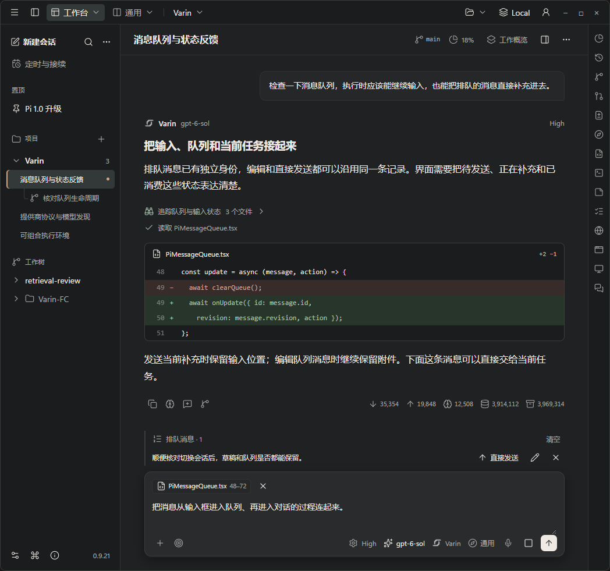
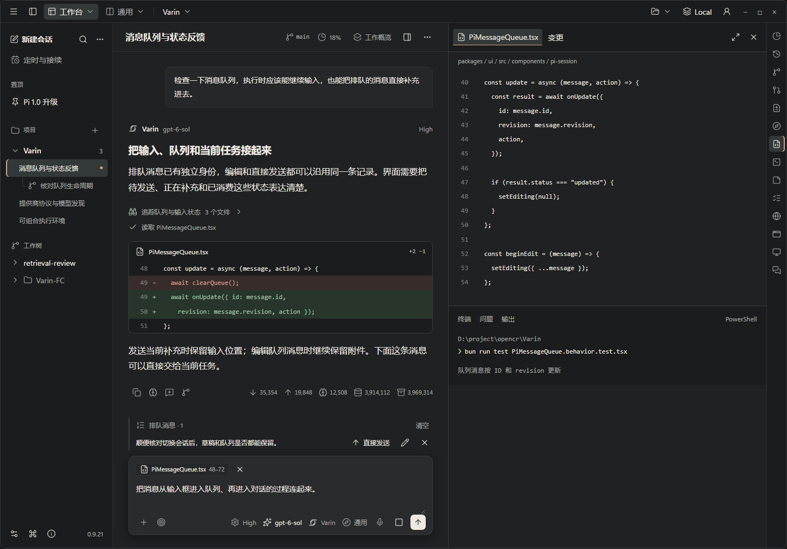
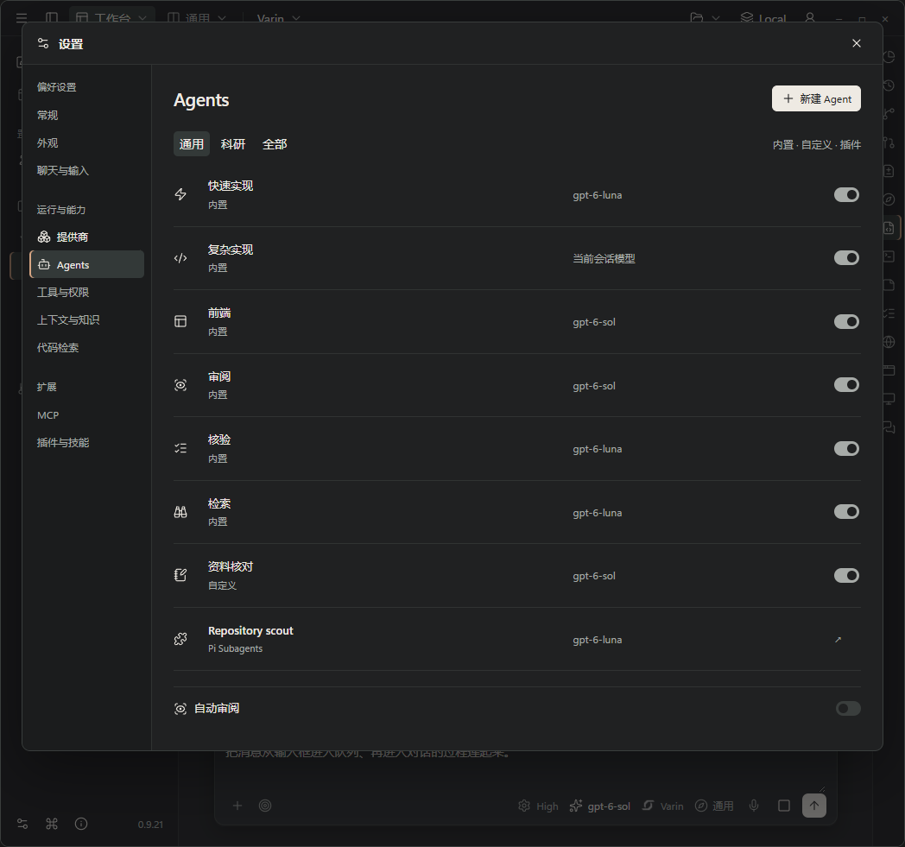
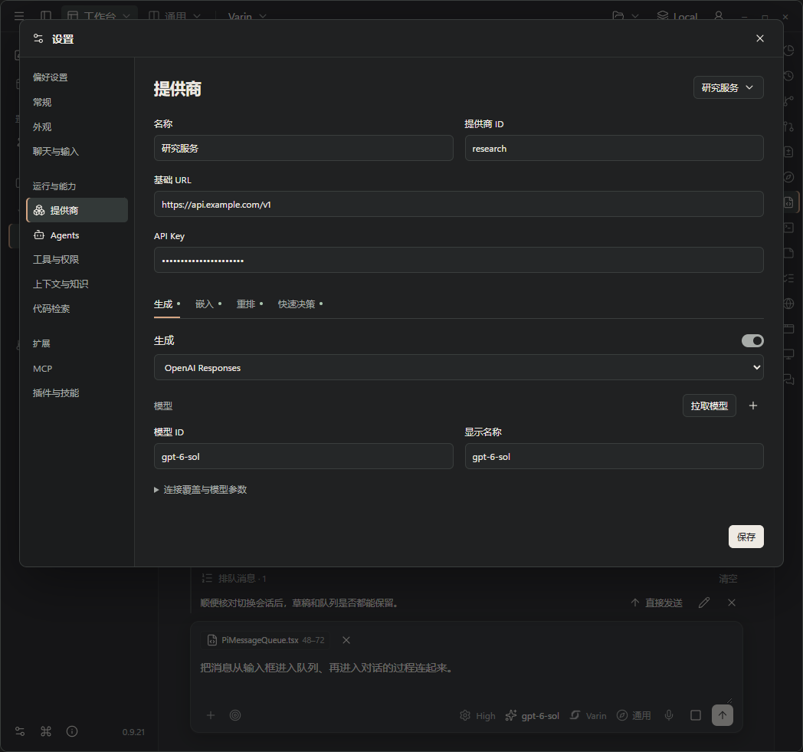

# Varin 视觉与交互设计 · 工作台方案

Status: design candidate — 完整功能基础上的布局、排版与交互重设计；待评审，未应用到产品

日期：2026-10-03

## 1. 设计方向

本方案推荐两种密度共存：外层采用紧凑、明确的工作台布局，内容采用舒展、有层次的阅读排版。
导航、执行控制和编辑工具保持效率；任务标题、回答小标题、正文、代码、工具过程与元信息有明确区别。
深浅色都使用低饱和表面，强调色集中于选择、焦点和必要状态。折形标记、实际对象和操作过程形成 Varin 的辨识度。

功能和数据关系作为核对依据。位置、分组、字号、颜色比例、间距、控件形态和交互方式可以重设计。
这一版作出四项明确调整：

1. **全局环境与当前任务分层**：顶部保留模式、工作台布局、项目与连接；会话标题、分支、用量和任务操作归入工作区自己的标题层。
2. **对话建立阅读节奏**：正文 16px，回答小标题约 19px，过程与元信息约 12px；工具行紧凑，文件变化有明确的文件头和代码区域。
3. **输入区按操作阶段组织**：材料、草稿、控制分层；队列位于其上方，和消息交接保持同一对象的连续性。
4. **设置按决策组织**：Agents 使用职责/模型/状态对齐的列表；提供商把共同连接放在上方，四类能力通过局部分页切换，保留独立配置与启停。

多余说明文字单独清理。识别对象、执行操作和处理当前结果所需的标签与状态保留；完整解释按需查看。

本轮设计图与动效研究使用示例内容，用于评审空间、排版和过渡。未连接模型、认证、保存或真实任务执行。
首稿简化图已经撤回；本稿中的现状基线不冻结原有界面组织。

## 2. 应用框架：重新安排全局、任务与资源

### 2.1 推荐布局

| 区域 | 内容与视觉权重 | 行为 |
| --- | --- | --- |
| 全局栏 | 应用菜单、会话栏开关、模式、工作台布局、项目、外部应用、服务/连接、GitHub、窗口控制 | 保持单行紧凑；分区有少量间隔，窗口拖动与系统控件保持原生行为 |
| 导航栏 | 会话/Bot、项目和工作树层级、搜索、新建、管理入口 | 保留分组与层级表达；定时与接续仍在新建下方；缩进、选中、运行和悬停状态形成一致规则 |
| 当前任务栏 | 会话标题、分支、上下文用量、工作概览、资源区域开关、会话操作菜单 | 与文件工作区的标签栏对齐；标题在所属区域内稳定显示，相关操作靠近任务 |
| 对话区域 | 用户轮次、Agent 正文、思考、工具、检索、文件变化、输入控制 | 正文沿稳定阅读列排列；内容与过程有不同密度，各种输出仍可展开和操作 |
| 资源工作区 | 标签、编辑器、终端、浏览器、电脑等真实工作区域及其操作栏 | 保留多标签、按内容分配的宽度、手动调整和展开能力；图标栏与实际激活区域同步表达状态 |

**这版主动增加任务层级。** 当前全局标题栏同时承担模式、项目、会话、分支和服务信息，局部还通过小字号容纳第二行。
把当前任务移到内容区后，全局栏更稳定，任务名称可以正常阅读，工作概览/面板按钮也有明确归属。
任务栏与资源标签栏使用同一水平基线，对照文件时两侧形成连续工作区域。

代价是纯对话状态多占约一行高度；收益是避免信息持续挤在全局栏与悬浮角落。本方案推荐这项交换。
窄窗先压缩间距与折叠导航，任务名称可以换行，操作进入所属菜单，保留可发现的入口。

工作概览汇总计划、任务、来源和产物进展，从任务栏展开；资源工作区承载实际查看、编辑和操作，沿工作区右边界出现。
两者各自保持真实状态，打开和关闭的方向对应其来源位置。

资源面板打开状态沿用用户现有选择。文件、diff、终端、电脑等内容有各自的空间需求，采用已注册的宽度比例与手动尺寸。
例如源码注册的编辑器/diff/终端默认占可用区域的 3/5，笔记占 1/3；统一改成 300px 抽屉会破坏这些工作方式。

IDE 保留编辑组与并列聊天。Bot 保留档案、记忆、工作和生命周期控制。科研保留主线、分支、材料与来源。
视觉的一致性体现在控件、状态、对齐与动作关系，不要求这些形态使用同一个页面模板。

### 2.2 空间比例

参考尺寸：全局栏约 40–42px，任务/资源标题层约 48–52px，导航约 220–256px；紧凑窗口可收至约 200px。
正文常规阅读列约 720–800px，左右留白跟随工作区可用宽度；字体缩放和宽版阅读偏好继续可用。
这些是本版的视觉起点，实际尺寸按内容和平台适配。

布局打磨的具体对象：

- 全局栏中的环境选择与任务栏中的会话/分支信息分别成组，统一基线与点击目标。
- 项目、工作树、会话、子线程之间用缩进、展开图标、行高和状态位置表达关系，保留当前显示偏好。
- 轮次正文、工具过程、预览卡片与页脚统计共用清楚的对齐线，减少各自独立的边距体系。
- 输入框中的操作组、模型/思考级别/Agent/工作侧重组和发送组，各有稳定位置；窄窗按组换行。
- 宽窗中资源区和聊天并排，共用标题基线；窄窗中资源区覆盖足够可操作的空间，并可展开。保留阅读锚点、编辑光标和标签。
- 设置按原有 single/split 页面与内容需要布局。提供商列表、模型目录和多字段编辑保留足够宽度。

响应式需要核对完整信息负载：长会话名、多项目、附件、队列、多个模型控制、右侧终端或浏览器同时存在。
隐藏低频功能入口或清空面板不能替代这种验证。

## 3. 视觉语言

### 3.1 推荐风格：低饱和工作表面，清晰的内容与操作

保留 `VarinLogo` 折形标记的识别，重新设计其周围的视觉关系。
推荐深色以略有明度差的石墨表面组织区域，文字偏暖白，图标与边界用低饱和中性色；浅色对应纸白内容和浅灰框架。
主操作以清晰的明暗对比形成重量，强调色主要标记当前对象、焦点、进展和待处理状态。
配色通过现有语义 tokens 接入，其他主题继续采用各自强调色。

形状分工也保持清楚：框架区域使用连续边界，导航行和普通按钮较方正，文件卡片中等圆角，输入框更柔和。
建议按钮/选择行约 5–6px、文件区域约 8px、输入框约 12px 的圆角起点；对应不同使用角色，避免所有元素同样圆润。
阴影主要用于浮层与输入焦点附近，普通文字和工具过程直接排列在工作表面。

要统一的是颜色的职责：

| 内容 | 视觉处理 |
| --- | --- |
| 外层导航与工具框架 | 重新建立区域明度关系；细边界、行背景与局部选中标记共同表达层次 |
| 当前阅读/编辑内容 | 正文保持足够对比度；背景连续，段落和代码块组织清楚 |
| 输入与可编辑字段 | 边界、焦点和编辑状态可辨认；已保存、正在提交、失败有各自反馈 |
| 过程与元信息 | 通过字号、间距和对齐退后；用户要求的用量、模型、执行状态仍可读 |
| 工作概览、菜单、弹窗 | 按已有浮层归属使用表面、边界和阴影，避免多个并列模块都像悬浮卡片 |
| 运行、等待、需处理、失败、增删 | 使用既有状态语义，配合图标或简短状态，用户能辨认实际发生的事 |

这套风格的特点是密度有分工、对象有归属、文字有轻重。完整工作状态下仍能认出当前任务和可操作区域。
实现阶段逐个核对浅色、深色及自定义主题中的文本、焦点和状态可读性。

### 3.2 排版与密度

| 用途 | 参考字号 / 行高 | 处理 |
| --- | --- | --- |
| 设置与管理页面标题 | 21–22px / 28–30px | 标题承载当前管理对象，操作与它对齐 |
| 当前任务标题 | 16px / 22px | 字重 600，位于任务栏；项目/分支信息用较轻档位 |
| 回答中的小标题 | 18–19px / 26–28px | 字重 600，前后留白与段落区别；沿 Markdown 实际结构呈现 |
| 区块标题 / 对象名称 | 14–15px / 22px | 字重 500；通过位置与间距明确分组 |
| 对话正文 | 16px / 28px | 常规字重，段落间约 12px；重点只在必要词句使用加粗 |
| 控件与导航 | 14px / 20px | 紧凑但易读；按钮宽度由标签决定 |
| 元信息 | 12–13px / 18px | 次要对比度，避免所有行都附带多层说明 |
| 代码 | 13–14px / 21–22px | 沿现有等宽字体与高亮；长行有清楚的阅读方式 |

阅读文字、代码、工具状态、目录与表单采用不同密度。以上字号构成推荐比例，按用户字体缩放整体适配。
中文正文保持自然字距，通过行距、段落距离与列宽改善阅读；英文模型名、路径、数值使用适合的字体与数字对齐。
工具过程收紧行距，展开详情后恢复其内容需要的节奏；元信息保持可读，避免靠过小字号处理拥挤。
沿现有图标系统统一尺寸档位、基线和有效点击区域。
同一种对象保持图标一致，状态变化在同一图标槽内完成。

## 4. 四种页面结构

### 4.1 对话与产物

保留 `PiTurnUserMessage` 的轮次锚点和桌面 sticky 行，以及 `PiTurnAssistantChrome` 的 Varin/Agent 身份、模型和工作状态。
现有用户消息已经右对齐并限制宽度；本方案继续让它作为轮次起点，调整背景、边界、圆角和内距，使其与输入框的交接自然。
轮次身份、模型与用量继续存在，具体视觉重量重新分配。
思考、工具、快速检索各有现成呈现；统一其状态切换和展开节奏，保留必要的过程内容。
文件变化继续使用流式红删绿增预览，并保留文件定位、展开和原始详情。
一轮结束处保留完整操作和真实用量：按钮左侧，统计右侧，宽度不足换行。文件计数不能替代 token/缓存统计。

输入框与正文继续沿现有布局配置。图片/PDF、编辑器附件、活跃文件建议、队列、Goal、续接、审阅与扩展 UI 保留。
重点处理这些区域同时出现时的顺序、间隔和展开行为。待处理的授权、错误与用户问题保持直接可见。
思考级别、模型、Agent、工作侧重、语音、Goal、附件/全屏和扩展操作继续可用；选择器的完整行为沿用实际组件。
自动跟随落在内容边缘；手动进入额外底部留白后，新输出逐步填入，沿用现有单一滚动 owner。

### 4.2 对象列表与详情

用于 Agents、Bot、会话管理、连接和插件等。各页面保留真实管理内容，按对象的工作方式组织摘要与操作。
如会话有父子关系和工作树分组，Bot 有工作和休眠状态，Agent 有职责、模型、来源与启停，分别处理这些差异。

Agents 的默认列表按职责、来源、模型与启停对齐。角色很多时保留过滤与搜索；行高支持完整名称和一层元信息。
选中对象后进入足够宽的编辑区域，窄窗采用返回式详情；无需让所有配置都挤进窄侧栏。返回保留筛选和原列表位置。
新建从明确的主按钮开始；保存后新对象进入列表并被定位。删除提供准确对象名称与后续可行操作。

Agents 示例：

- 默认按当前工作侧重过滤；筛选是查看条件，不改变会话工作侧重。
- 内置、自定义、插件身份以简短来源标记区分。
- 启停在该行回应，处理中只约束冲突操作，其他对象可继续查看和管理。
- 自定义 Agent 的名称、模型、指令、工具、工作侧重和工作区选择保留；内置角色与插件按实际 owner 暴露可编辑项。
- 新建和复杂编辑使用显式保存；切换对象时保护尚未提交的编辑。

### 4.3 配置表单

用于提供商、代码检索、知识、权限等。保留设置的页面目录、搜索定位和 single/split 结构。
已有字段按实际使用关系重组，展开与折叠的默认值需要对应具体使用情形。

提供商必须完整覆盖：连接、认证、生成协议、模型列表，以及嵌入、重排、快速决策各自的开关、
地址/路径/凭据覆盖、模型拉取与手工编辑。模型上下文、输出、思考能力等既有可编辑参数继续存在。

推荐把共同连接与身份放在表单上半部，下面用“生成 / 嵌入 / 重排 / 快速决策”的局部分页组织能力。
每类能力的启用状态在页签可辨认，当前页展示自己的模型目录、发现、手工添加与连接覆盖。
页签切换保留未保存值；提交仍沿原 owner 的配置事务。这样可以缩短纵向扫描距离，同时保留完整参数。

简单开关即时应用，在控件附近反馈。多字段连接配置以一次保存提交，字段校验靠近输入。
模型拉取按钮原位进入进行状态，结果在对应能力下出现；读取失败保留用户已填内容。
自动保存与显式保存的语义在一个编辑单元内保持一致。

### 4.4 编辑工作区

用于 IDE、文件审阅和科研材料。标签、工具栏、编辑内容与结果面板有固定的层次。
文件打开、标签切换、定位代码应迅速；异步加载保留区域尺寸并明确当前目标。
从聊天打开产物时，源卡片与目标标题使用相同标识，用户能看懂操作去向。
科研分支、材料、实验状态按任务关系组织，默认展示当前问题所需的内容。

### 4.5 改稿要覆盖的完整工作状态

后续视觉改稿使用现有组件与真实数据结构准备这些状态，逐项对照入口与可完成操作：

| 工作状态 | 需要同时出现的内容 | 这轮设计要处理的问题 |
| --- | --- | --- |
| 主线执行中 | 项目/工作树/子会话、完整标题栏、用户轮次、身份与模型、思考和工具、检索或文件变化、输入控制、工作概览入口 | 正文与过程如何区分，视线如何回到当前工作；完整控件同时存在时的层次 |
| 用户补充任务 | 多行草稿、图片/PDF/编辑器附件、已有队列、模型/思考级别/Agent/工作侧重、发送与停止 | 附属区域的顺序、换行和高度变化；提交、排队、补充之间的连续性 |
| 边聊边操作资源 | 聊天、多个资源标签、文件或 diff、终端/浏览器/电脑、图标栏、概览与面板开关 | 实际工作区域的空间分配、选中关系与返回位置；切换时保留操作现场 |
| 管理 Agent | 内置/自定义/插件条目、模式筛选、开关、模型、完整定义及 owner 支持的动作 | 列表的可扫描性、选中详情、保存冲突、局部忙碌与恢复 |
| 配置提供商 | 提供商列表、连接/认证、生成模型与协议、嵌入/重排/决策、独立发现与参数编辑 | 长表单分组、模型批量选择、连接变化后取消旧读取、错误保留编辑 |
| Bot 与科研 | Bot 工作和休眠进度；科研主线、分支、材料和待处理结果 | 专用工作身份在共同框架中的表达；保持既有入口和运行边界 |

绘制某一局部状态时可以突出相关区域，但完整产品图需要包含原有的信息负载。
每项拟议移动、收纳或删除都标明原入口、目的地和原因；未评审的变化不提前反映成“新默认”。

### 4.6 从现状推出的候选修改

| 代码中的具体情况 | 调整方向 | 保留的行为 |
| --- | --- | --- |
| `PiComposerAgentControl` 加载目录失败后 `setAgents([])`，选择菜单失去失败原因 | 区分加载、确实没有条目和加载失败；在同一选择器内提供重试 | 当前 Agent 与输入草稿不因列表读取失败改变 |
| `HarnessThreadsPanel` 的部分计数、说明使用 8–10px，且已存在悬浮层过渡 | 恢复可读的元信息档位，重新对齐状态、数量、操作，核对小窗口的完整内容 | 概览中的计划、产出、线程、来源与记忆全部保留 |
| `SettingsView` 直接按页面与 single/split 类型替换内容 | 保持导航锚点；内容区域准备和交接时保留结构，返回恢复所属页面状态 | 页面目录、搜索定位、分栏和插件注入继续存在 |
| 资源图标栏、概览/面板开关与资源标签分布在相邻区域，各自有状态 | 把激活态与所控制区域对应起来，统一边界和展开方向；先核对三者同时出现的布局 | 图标栏可排序、面板可独立打开、多标签和各表面尺寸保留 |
| 输入区多个可选状态与多个控制组共享可用宽度，高度随工作状态变化 | 对附件、队列和状态区做协调展开；底部按现有控制组换行；发送对象交接到真实轮次锚点 | Goal、语音、完整模型控制、扩展按钮、队列编辑及停止都能继续使用 |

这些是源码支持的设计候选，具体感官效果仍需在完整工作状态中评审。现有行为中的实际缺陷和视觉偏好分别处理。

## 5. 文字：把解释成本留在设计里

产品文字分为：对象名称、操作标签、状态、当前决定所需的帮助。每处只承担必要的一项职责。

| 场景 | 默认呈现 | 按需呈现 |
| --- | --- | --- |
| Agents 列表 | 名称、模型/简短职责、状态、操作 | 完整指令、工具、配置作用范围 |
| 功能模型 | 模型字段、开关 | 模型用途的短帮助与高级连接覆盖 |
| 操作成功 | 对象的新状态；必要时短暂勾选 | 详细执行记录 |
| 配置失败 | 失败对象、可操作原因、重试入口 | 原始响应和日志 |
| 空列表 | “还没有 Agent”与“新建 Agent” | 创建指南 |
| 文件变化 | 文件名、增删、实际内容 | 原始工具参数与执行记录 |

清除默认页面中的重复解释、实现细节、泛泛保证和防御性辨析。既有帮助内容可收进相关字段的帮助入口。
语义不清楚的名称先重命名；操作关系不清楚的布局先重排。
帮助不能替代必要的标签、错误说明、未保存提示或实际授权问题。

## 6. 动效语言

现有实现已包含侧栏与资源面板的宽度过渡、工作概览的 `AnimatePresence`、模式切换场景，
以及主题中的 fast/normal/slow 时间配置。先核对它们的进入、退出和中断状态，再统一节奏。
界面的某次硬切应落到具体状态变化调查；不能由几处空 fallback 推断全部页面缺少动效。

### 6.1 一组稳定的动作

| 动作 | 用途 | 第一版节奏起点 |
| --- | --- | --- |
| 按下与释放 | 按钮、开关、可操作行 | 约 90–130ms，底色/边界响应；位移很小 |
| 状态交接 | 发送→停止、进行→完成、复制→已复制 | 约 140–180ms，同一槽位轻微位移与交叉过渡 |
| 展开与收拢 | 工具细节、字段组、排队区 | 约 180–220ms，高度与内容同步变化 |
| 面板进入与退出 | 辅助面板、详情、设置 | 约 200–260ms，方向对应区域位置 |
| 对象交接 | 草稿→消息、队列→聊天、新对象→列表 | 约 240–320ms，先快后缓，沿实际源/目标位置移动 |
| 局部内容更新 | 缓存视图、新数据替换 | 保持容器和阅读锚点，必要时短暂过渡 |

这些时长是样板起点。按真实设备、移动距离和内容量调整；业务提交不等待动效计时。
用同一组 easing 表达快响应与轻收尾，普通工具界面不增加反复弹跳。
持续运动用于确实仍在进行的状态；完成后自然停下。

### 6.2 发送消息的完整动作

1. 按下发送时，按钮当帧回应。提交事务保留草稿、附件和真实会话身份。
2. 本地提交记录进入现有 `submission` 后，沿 `PiTimeline` 的用户轮次锚点建立目标位置。
3. 取输入内容的当前位置与目标位置，显示短暂的视觉投影：内容被轻背景承接，移动并收拢到用户消息。
4. 输入框平稳恢复，新消息接过显示。输入区继续接受后续输入。
5. 服务端确认合并到同一个提交身份，界面保持同一条消息；视觉投影完成后立即释放。
6. Agent 等待/输出状态衔接在这条消息后。实际流式内容到达即显示，持续增长时保持阅读锚点。

短消息完整移动；长文本以可见开头和附件摘要承接，目标消息保留全文。不要缩放长段正文制造扭曲。
源或目标不在视区、会话已切换时，采用目标位置的轻过渡；中断动画不改变提交结果。
长距离定位由既有滚动控制器安排，动画层只读取位置，避免多方同时写 scrollTop。

| 真实结果 | 界面处理 |
| --- | --- |
| 受理 | 同一消息从待确认转为已受理，稳定位置 |
| 明确失败 | 在相关消息旁给出重试/恢复入口；草稿按既有事务恢复，保护用户后来输入 |
| 结果未知 | 留在待确认状态，允许核对；不自动重发 |
| 忙碌时排队 | 内容进入输入框上方的队列行，保留实际队列身份 |
| 队列直接发送 | 同一条队列对象交接到当前任务，已消费状态决定后续展示 |
| 立即补充 | 按真实 steering 接收结果呈现；保持用户输入的连续性 |

### 6.3 图标和列表细节

形状相近的状态可用笔画变化；不同语义的图标在固定盒内轻移和交叉过渡。快速状态变化合并到最新目标，旧动画不能覆盖新状态。
停止操作当帧可用，不等发送图标过渡完成。按钮的名称和可访问状态随业务状态更新。

发送控件沿现有 `projectPiComposerActions`：运行中没有可发送草稿时，主按钮是停止；有草稿时，主按钮发送，
并保留旁边的停止按钮。动画需要覆盖这个实际双按钮变化，以及 aborting 状态，而不是永久画两个固定按钮。
队列仍保留编辑、移除、清空、已消费和版本变化反馈；这些状态也参与高度与对象位置的交接。

列表新增、删除与排序让相邻行自然让位。刷新保留旧内容；只标记正在更新的对象。
高频切换采用已缓存内容即时呈现，冷加载保留内容区域轮廓。错误在对应区域出现，用户可以继续使用其他区域。

## 7. 连续性、可访问性与性能

- 返回保留列表筛选、展开、选中、滚动和草稿；焦点回到发起操作的控件或新创建对象。
- 鼠标、键盘、触屏都能完成主要操作；行内操作在焦点和触屏场景同样可发现。
- 尊重减少动态效果偏好：去掉空间移动，保留即时状态、焦点与必要的轻过渡。
- 200% 字体/页面缩放后依然能操作；正文不依靠颜色或悬停才能理解。
- 流式输出和虚拟列表避免逐 token 重排所有内容。文字不重播“打字动画”。
- transform/opacity 用于短暂投影；必要的高度变化局限于受影响区域。稳定对象身份用于协调布局。
- 断网、慢响应、快速重复点击、切换会话、动画中断都必须回到真实状态。
- 进入详情和退出详情都有明确焦点路径；内容在视觉退出时不能留下不可见可点击层。

## 8. 示例路径的验收标准

| 路径 | 应能观察到的结果 |
| --- | --- |
| 发送短消息 / 多行 / 附件 | 来源和去向清楚，文本可读，无重复消息，下一条输入及时可用 |
| 输出中排队并直接发送 | 队列行和聊天消息身份连续，操作结果可辨认，失败可恢复 |
| 用户手动往上读 | 内容继续到达而视区不被抢走；回到最新后恢复跟随 |
| 切换热会话 / 冷会话 | 选中立即回应；缓存内容可用时马上显示；加载过程有稳定占位 |
| 打开文件 / 关闭面板 | 原操作对象仍可定位，正文空间合理变化，滚动位置稳定 |
| Agent 启停 / 编辑 / 新建 | 局部处理状态清楚，其他对象可操作，新对象保存后可找到 |
| 提供商拉取模型 / 失败重试 | 原位进度，结果归属准确，失败保留已填信息 |
| 原有功能与信息对照 | 模式、导航分组、输入控制、统计、右键、概览、资源工作区、专用模式与设置能力保持完整 |
| 窄窗 / 浅色 / 键盘 / 减少动效 | 主要任务完整可用，标签可读，焦点可见，状态表达一致 |

以上是体验验收，不以组件数量或新增动画数量计完成。截图用于排版评审；连续操作与慢响应回放用于交互评审。

## 9. 与现有实现的关系

这一轮沿用现有主题、排版、组件、消息投影、设置 owner 和工作台内核。
官方 Surface 内的过渡遵守 [Motion 平台](varin-motion-platform.md) 的 ownership；全局 Shell 场景保持独立。
消息动效依托 [聊天体验](chat-experience.md) 的 submission、turn projection、队列身份及单一滚动 owner。
Agent 管理沿用 [设置管理](agent-settings-design.md) 的目录和 revision。动画只投影状态，不创建新的保存、队列或派发 authority。

主要接入位置：

- `packages/ui/src/styles/typography.css` 与主题 tokens：排版、密度、表面和动效语义。
- `components/layout` 与官方 `workbenches`：外层空间、导航、面板、窄屏布局。
- `components/sections/shared`：表单布局、字段状态、保存反馈。
- `components/sections/agents`：对象列表、选中详情、局部 mutation 反馈。
- `components/pi-session/PiComposer.tsx`、`PiTimeline.tsx`、`PiFileChangePreview.tsx`、`PiExploreCard.tsx` 与会话 store：发送交接、过程呈现和滚动连续性。

首稿的简化样板已撤回。本轮重新设计了候选布局与交互研究，使用示例内容评审视觉关系；
控件、页面和业务状态的真正接线需要在产品组件中实施。设计预览中的状态不作为真实模型发现、保存或任务执行的证据。

## 10. 实施顺序

1. **评审本版的明确取舍**：任务栏与全局栏分层、阅读排版、工作区比例、输入材料/草稿/控制组织、能力分页。结合附录的功能合同核对完整性。
2. **实施视觉与布局规则**：在现有组件中落下区域层次、排版、间距、控件分组和状态表现；允许按方案重新组织页面，同时保留数据与操作能力。
3. **完成主要路径**：发送与排队、会话切换、文件打开、Agent 管理、提供商配置。每条路径包含等待、失败、返回。
4. **推广至其他区域**：Bot、科研、知识、权限、定时任务、远程环境等按页面类型接入。
5. **真实体验验收**：在常用窗口和实际数据下连续操作，检查性能、键盘、缩放、减少动效与异常状态。

本轮交付新的视觉候选、工作状态图和局部交互研究。正式 UI 实施与实机体验验收待设计评审后进行。

## 附录 A：源码现状与功能对照

| 区域 | 已有功能与状态 | 源码依据 |
| --- | --- | --- |
| 标题栏 | 应用菜单、侧栏开关、工作模式、工作台布局选择、会话标题及菜单、项目/分支、上下文用量、外部应用、服务/连接、GitHub、资源栏、窗口控制 | [Header](../../packages/ui/src/components/layout/Header.tsx)、[模式选择](../../packages/ui/src/components/layout/WorkbenchProfileSwitcher.tsx) |
| 会话导航 | 新建、搜索、定时与接续、项目/工作树分组、父子会话、置顶、批量管理、归档、排序与显示偏好、设置和快捷键 | [PiSessionSidebar](../../packages/ui/src/components/pi-session/PiSessionSidebar.tsx) |
| 输入区域 | 富文本代码编辑、图片/PDF、文件与 Agent 提及、命令/技能/片段、编辑器上下文、Goal、思考级别、模型、Agent、工作侧重、语音、发送/停止、扩展操作 | [PiComposer](../../packages/ui/src/components/pi-session/PiComposer.tsx) |
| 对话 | 用户轮次锚点、Varin/Agent 身份及模型、思考/工具/检索/文件变化、整轮操作与完整用量、右键引用/提取记忆/分支/恢复、压缩状态与应用 | [PiTimeline](../../packages/ui/src/components/pi-session/PiTimeline.tsx)、[右键菜单](../../packages/ui/src/components/pi-session/ChatContextMenu.tsx) |
| 输入前状态 | 原生消息队列、逐条发送/编辑/移除、清空、下一步建议、Goal、续接、审阅、连接状态、扩展 UI | [PiChatView](../../packages/ui/src/components/pi-session/PiChatView.tsx)、[PiMessageQueue](../../packages/ui/src/components/pi-session/PiMessageQueue.tsx) |
| 工作概览 | 计划、产出、子任务及接纳状态、来源、记忆进展；任务历史与相关操作 | [HarnessThreadsPanel](../../packages/ui/src/components/pi-session/HarnessThreadsPanel.tsx) |
| 资源工作区 | 14 类表面：上下文、恢复、Git、PR、diff、walkthrough、文件、终端、笔记、计划、浏览器、预览、电脑、并列聊天；可排序图标栏、标签、宽度、展开状态 | [资源注册](../../packages/ui/src/lib/surfaces/registry.ts)、[ContextPanel](../../packages/ui/src/components/layout/ContextPanel.tsx) |
| 设置 | 动态注册页面、搜索定位、单页/分栏布局；提供商认证、生成与三种推理能力、模型发现/编辑；内置/自定义/插件 Agent | [SettingsView](../../packages/ui/src/components/views/SettingsView.tsx)、[提供商编辑](../../packages/ui/src/components/sections/providers/CustomProviderEditor.tsx)、[Agents](../../packages/ui/src/components/sections/agents/AgentsPage.tsx) |
| 专用形态 | IDE 的编辑组、搜索、Git、运行与面板；科研主线/分支/材料；Bot 的档案、记忆、工作、休眠/唤醒、归档及独立会话归属 | [IDE](../../packages/ui/src/workbenches/ide/IdeWorkbenchShell.tsx)、[科研](../../packages/ui/src/workbenches/research/ResearchWorkbenchShell.tsx)、[Bot](../../packages/ui/src/workbenches/bot/BotWorkspaceShell.tsx) |

以上确认了主要工作区的组成与调用关系。源码可以确认状态与布局逻辑；具体机器上的帧率、卡顿时长和感官节奏仍需实际运行核对。

### A.1 已确定的行为合同

- 工作台、IDE、Varin bot 使用带图标的模式下拉；Bot 会话保持独立归属，Bot 聊天不显示当前工作目录。
- 顶部工作台布局与输入区工作侧重是两个独立配置。科研布局、科研运行、Agent 目录过滤各用自己的真实状态。
- 消息辅助操作按整轮出现；按钮左、统计右，行宽不足才换行。完整 token、缓存与速率信息继续保留。
- 选中文本的记忆提取归右键菜单；普通工具行、流式文件增删预览和快速检索过程保留已有表达。
- 手动可进入底部留白；输出先填补空白，再沿内容边缘跟随。用户上翻阅读时保持锚点。
- 队列在输入区上方，支持直接发送、编辑、删除和清空；忙碌时的排队/补充偏好与停止操作保持可用。
- Agents 统一目录、每角色开关、原生自定义和插件管理保留；功能模型继续归代码检索、知识、网页等所属页面。
