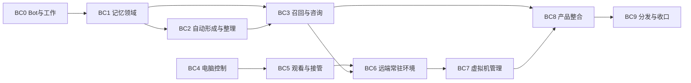

# Bot、长期记忆与 Computer Use 实施计划

Status: partially implemented；BC0–BC4 已接入生产路径，BC0–BC2 的来源分段、容量与模型继承缺口已补齐；BC3–BC4 的源码补齐仍有原生平台、安装包与崩溃输入归属的验收边界；BC5–BC9 未实施。缺口与修复见 [验收记录](bot-computer-use-acceptance.md)。

Last updated: 2026-09-29

源码核查基线：`3dbbc6e7`。本计划落实 [Bot 工作台设计](../design/bot-operated-workbench-design.md)
和 [Computer Use 设计](../design/computer-use-design.md)，同时承接 [办公连续性](../design/office-work-continuity-design.md)
需要的共享基础。使用阶段前缀 **BC**，与已有 B（更名）、C（压缩）和其他 Harness 阶段分开。

本文件负责实施顺序、职责、替换范围与交付条件；实际进度和未完成项更新 [status.md](../status.md)。
开始执行时核对受影响源码的新变化，不把本文的基线事实当作永久现状。最初编写本计划时未启动产品实现或创建真实电脑资源；后续实施事实以状态与验收记录为准。

## 1. 最终交付与范围

完成后，用户可以使用一个长期 Bot 组织多项工作。Bot 有跨会话身份，能够主动与自动形成和使用记忆，
调用现有执行 Agent，在本机或独立电脑上操作应用；用户通过现有工作台查看相同任务、成果与实时桌面，并直接参与。
远端常驻 Host 能在用户本机关闭后继续协调，观看端不承担运行职责。

计划覆盖三类产品能力：

1. **长期 Bot 与记忆。** 持久身份、工作关联、主动记忆、后台整理、自动召回、执行者咨询、人工纠正和正常设置入口。
2. **共享 Computer Use。** 本机 Windows/macOS/Linux 平台驱动，结构化观察与截图、输入、脚本编排、实时桌面与人工交接。
3. **独立电脑。** 接入已有本机虚拟机/远程电脑；提供正式的 Linux 持久桌面准备和 Linux/libvirt 虚拟机生命周期后端，
   结合常驻 Host、连接与成果服务实现持续工作。

首个受管虚拟机后端推荐 Linux/libvirt，原因是可在用户自己的服务器上管理真实虚拟机与持久磁盘，
不依赖特定商业云账户。已有 Windows/macOS 电脑及其他平台预先创建的虚拟机，通过目标连接接入。
本轮不声称已提供 Hyper-V、macOS 原生虚拟化或所有商业云的自动创建适配；这些后端有明确需求时复用同一合同扩展。
**连接已有虚拟机与在 Varin 中创建虚拟机分别列出能力，不能以其中一个冒充另一个。**

多 Bot 集群、额外消息平台、完整 Office 文件格式编辑器和全厂商云管理不在本轮强制范围。
普通工作台任务同样可用 Computer Use；办公消费本轮基础，不等待另建 Office Agent 或办公专用执行器。

## 2. 建设方式

- 直接修改生产 owner、实际协议、工具、设置和工作台。没有单场景原型阶段，没有演示专用后端。
- 每阶段连通真实消费者和可用入口，不能仅交付接口、空 provider、假终态或需要开发者手动注入的 helper。
- 按实际依赖逐步建设；平台能力可逐项交付，未完成项保持明确，不能因此将某个平台永久伪装为支持。
- 沿 Pi 管理模型与会话、Host 管理产品编排、Rust/既有存储服务管理其资源的分工，不复制权威。
- 新限制需要真实依据，不顺手增加目录白名单、固定任务数、逐动作确认或统一超时。
- 验证用于暴露实际错误，按改动选择直接行为证据。已有证据充分就推进，不每阶段重复全仓测试。
- 内部旧合同直接替换并清理，保护用户文件、Pi 原生历史和已有有效知识；不建设新旧系统双写或长期兼容分支。

## 3. 当前基线：可复用什么，实际缺什么

以下是本轮源码定位结果，不是运行质量或全平台验收结论。

| 范围 | 已有事实与入口 | 本计划的实际增量 |
| --- | --- | --- |
| Thread/Run | [harness-threads.ts](../../packages/protocol/src/harness-threads.ts) 区分耐久 Thread、单次 Run、attached-root / spawned-child；[research-root-runtime.ts](../../packages/web/application-host/lib/harness/research-root-runtime.ts) 只在 research work focus 且 workspace 绑定时附着用户根会话 | 增加 Bot 身份与工作关联；抽取通用根会话附着，解除 Bot 对 research/项目目录的依赖 |
| 无目录 owner | [owner-scope.ts](../../packages/web/application-host/lib/harness/owner-scope.ts) 已有 session scope；[Host 装配](../../packages/web/application-host/index.ts) 按 scope 打开知识存储 | 增加 Bot 长期 scope，统一存储键与调用身份解析，不制造假项目 |
| TDB | [Knowledge 模块](../../packages/web/application-host/lib/knowledge/DOCUMENTATION.md) 与 [store-contract.ts](../../packages/web/application-host/lib/knowledge/store-contract.ts)：私有 Node 存储进程、单写入路径、事件/知识/关系与提交回执 | 扩展记忆来源、性质、关系、修订与处理覆盖；复用同一存储 facade/worker，不能在主 Host 新开原生 TDB 句柄 |
| 现有知识写入 | [knowledge-suggestion-extension.ts](../../packages/pi-host/src/harness/knowledge-suggestion-extension.ts) 在用户输入时异步生成建议；[knowledge-suggestions.ts](../../packages/web/application-host/lib/harness/knowledge-suggestions.ts) 默认人工接受 | 改为统一主动/自动记忆流程；取消日常连续性依赖逐条审阅的旧默认路径 |
| 上下文与召回 | [context-runtime.ts](../../packages/web/application-host/lib/knowledge/context-runtime.ts) 已有事件与召回缓存；[context-preparation.ts](../../packages/pi-host/src/harness/context-preparation.ts) 接现有请求前边界及独立压缩 worker | 结合 Bot/工作关系召回，按有效修订增量交付；保持原生历史及现有压缩语义 |
| 快速决策 | [typesafe-systemone.ts](../../packages/pi-host/src/harness/typesafe-systemone.ts) 已实现 Jev wire adapter；[harness-fast-decision.ts](../../packages/protocol/src/harness-fast-decision.ts) 已注册 `explore/web/scholarly` | 新增记忆实际消费者与设置；不重复开发 Jev 适配器，不把记忆生成塞进选择接口 |
| 后台推理 | [background-inference.ts](../../packages/pi-host/src/harness/background-inference.ts) 已支持独立于前台聊天的 embedding/rerank/fastDecision；[workspace-inference.ts](../../packages/web/application-host/lib/knowledge/semantic/workspace-inference.ts) 仍通过 cwd 请求 | 增加 Bot owner 的解析和生成式记忆任务入口；不能声称已有接口已经能生成事件叙事 |
| 通信与等待 | [thread-services.ts](../../packages/web/application-host/lib/harness/thread-services.ts)、[followup-delivery.ts](../../packages/web/application-host/lib/harness/followup-delivery.ts)、[followups.ts](../../packages/web/application-host/lib/harness/followups.ts) 已提供投递与续接核心 | Bot 跨工作咨询和结果汇合接同一通路，增加持久关系，不另建消息轮询器 |
| 受管远程 | [managed-remote-service.ts](../../packages/web/application-host/lib/harness/managed-remote-service.ts)、[managed-remote-routes.ts](../../packages/web/application-host/lib/harness/managed-remote-routes.ts) 已有身份、材料、作业及 kernel 记录 | 增加真实桌面能力；现有实验作业协议不强行承担 GUI 动作 |
| SSH 入口 | [desktopSsh.ts](../../packages/ui/src/lib/desktopSsh.ts)、[useDesktopSshStore.ts](../../packages/ui/src/stores/useDesktopSshStore.ts) 经 Electron invoke 管理连接 | 将共享连接生命周期与配置移至 Host owner；本机密钥/系统能力保留平台 adapter，远端 Host 可独立持有自己的连接 |
| 工作台与客户端 | [application-client](../../packages/application-client/README.md) 拥有 RuntimeAPIs；[register-shells.ts](../../packages/ui/src/workbenches/register-shells.ts) 复用共享 Shell 注册 | Bot 入口、记忆设置与桌面 view 接既有产品，不新增与 Agent/IDE 平行的硬编码应用 |
| Computer Use | 当前已定位的浏览器截图面不等于通用系统控制；参考项目本地基线 `51f3a59` 提供平台驱动与 REPL，Windows/Linux 尚有缺口 | 驱动、实时传输、控制交接、桌面生命周期及打包需要正式实现 |

基线核查纠正：快速决策旧设计中“仅 explore / Jev 尚未接入”的表述落后于源码，本轮同步更正。
受管远程的已有代码与科研阶段整体是否完全交付分别判断；本计划只复用表中确认的路径，不据旧阶段标题推导完整桌面能力。

## 4. 先确定跨阶段共有的职责

### 4.1 Bot、工作与执行

- Bot 保存稳定 `botId`、所属协调 Host、模型/协作配置及关联工作；不以一条永不结束的聊天充当身份。
- 一项耐久工作继续由 Thread 承载，一次执行继续由 Run 承载。Bot 与工作、会话的关系可持久查询，不新建复制任务状态的 Bot Job 表。
- 普通对话可以直接完成，不强制创建工作记录；需要跨会话继续或派发时再关联真实 Thread。
- Bot 可以保留入口对话并组织多个工作会话。新输入按明确工作关系送达；意图确实有歧义时才向用户澄清，不仅凭窗口焦点选任务。
- 附着现有 Pi 会话与派生子会话保持不同生命周期，不能在任务归档时误删入口聊天。执行者咨询回执关联原 request 和目标 Run。

Bot 元数据和工作关联使用现有 kernel catalog 记录能力，由 Host 写入；Pi 继续保存原生对话。
一个 Bot 只由一个协调 Host 推进。首版可以直接在目标常驻 Host 创建 Bot，不把无感跨 Host 迁移或双活切换作为前置。

### 4.2 记忆权威与更新

TDB 保存记忆正文、来源引用、关系、有效修订、人工纠正/遗忘及处理覆盖；原始文件、对话、任务和回执仍在原 owner。
记忆的最小领域信息包括：所属范围、内容性质、事件/记录时间、来源与修订、适用工作、取代/补充关系。
具体类型沿现有 store-contract 扩展，不另建 SQL 主库或第二份可写知识正文。

主动写入和后台整理共用一个 memory service。完整提交后才推进来源覆盖；已经审阅但无需形成记忆也记录覆盖。
并发和恢复通过同一写入队列及可恢复操作记录处理，不把“模型已经返回”视作记忆已耐久写入。
后台调度记录引用这份处理进度，不独立维护一份会与 TDB 冲突的完成真相。

保留已有有效知识的节点、正文与来源；新领域字段和调用合同直接演进。语义索引仍为可重建派生数据，换模型不重写正文。
遗忘需要同时使正文、关系和派生召回失效，并保存必要的来源抑制，避免后台立即重新记起用户刚删除的条目。

### 4.3 模型配置与任务触发

记忆叙事生成复用现有 Pi provider/auth 和后台 worker 生命周期。设置可选择独立整理模型，或明确显示“继承 Bot 主模型”；
继承是可见的产品设置，不能偷偷借用第一个活动聊天。按任务冻结有效配置，故障不静默切到另一个付费模型。

快速决策新增 `memory-organization` 与 `memory-recall` 两个真实用途，沿通用默认/用途覆盖/关闭解析。
同批材料的类型、关系与价值判断可合并。生成式模型写叙事、提出新检索问题；Jev 从实际候选中选择与判断。

自动记忆在完整交流、任务结果、人工纠正等有意义的边界合并处理，不对每个 token、截图或工具日志单独发起整理。
来源事件可在无前台聊天时唤醒后台任务。模型缺失或调用失败保留待处理范围，显示具体状态，不推进成“无值得记忆”。

### 4.4 电脑、桌面与控制

电脑目录复用实际机器/连接身份，桌面会话独立记录；操作绑定执行目标，不跟随 UI 当前页签。
观察返回目标、显示/窗口、图像几何和观察引用；动作记录受理、结果与必要的不确定状态。
GUI 结果不能普遍事务化，未知提交需观察现场后再决定下一步。

同一桌面的受管输入只有当前控制者能够提交。控制交接在执行端收敛，并作用于原生调用、脚本批次与人工远程输入；
不只在前端禁用按钮。观察者可以有多个，观看不抢占控制。不同桌面和无关后台作业保持并行。

持续画面是媒体/远程桌面通路，Agent 观察是工具通路。二者共用实际桌面，但不共用会被观看刷新覆盖的元素索引。
客户端缩放仅改变呈现；改变客体分辨率是实际桌面操作，需要重新解释随后坐标和观察。

## 5. 阶段依赖与推进顺序

| 阶段 | 正式交付 | 依赖 |
| --- | --- | --- |
| BC0 | 单 Bot 身份、工作关联与实际对话/派发入口 | 现有 Thread/Run、Pi、Host、工作台 |
| BC1 | 统一记忆领域、主动工具与用户管理入口 | BC0 |
| BC2 | 后台记忆形成、关系整理与快速决策消费者 | BC1 |
| BC3 | 自动召回、主动追查、执行者咨询和缓存稳定交付 | BC1；与 BC2 共同收口记忆闭环 |
| BC4 | 共享 Computer Use 服务、原生驱动与正式 Agent 工具 | 现有 Host/资源合同；不依赖记忆模型完成 |
| BC5 | 共享实时桌面 view、人工接管与脚本取消 | BC4 |
| BC6 | Host 连接管理、远程持久桌面与常驻协调接入 | BC4、BC5；Bot 常驻部分消费 BC0–BC3 |
| BC7 | 真实虚拟机生命周期与受管桌面环境准备 | BC6 |
| BC8 | Bot/工作台/办公入口与跨环境成果的完整整合 | BC0–BC7 |
| BC9 | 正式分发、旧路径清理和交付记录 | 各阶段随实现进行，最后统一核对 |

单执行者默认按 BC0→BC3、BC4→BC7、BC8→BC9 推进。需要并行时，记忆与平台驱动可按写入职责拆分，
共享协议、RuntimeAPIs、Host 装配和设置由明确的整合者负责；不因文件不同就同时改同一行为合同。
不要求机械派满 Agent 或每阶段重复审查。BC8 负责跨功能收口，不是把所有 UI 和真实消费者拖到最后的理由。

## 6. BC0：长期 Bot 使用真实工作台

**修改范围**：Host catalog 与 owner scope、Thread/Run 绑定、Pi 会话装配、application-client、现有会话入口与工作概览。

1. 增加 Bot 配置和会话/工作关联记录，提供读取、编辑和默认 Bot 入口。界面先聚焦一个 Bot，数据不以固定单例名字代替身份。
2. 将 research-root 中通用的附着、运行统计和结束处理提取到共享根会话生命周期，保留科研 purpose 的实际差异。
   Bot 普通会话可在没有项目目录时派发和继续工作，不将 research work focus 当作 Bot 启用条件。
3. 拓展 owner scope 与 store key 解析，Bot 私有记录不随某次入口 session 删除。目录参数只用于具体执行，不承担身份。
4. Bot 使用既有线程管理、消息与 follow-up 工具；根工作与子执行的可见关系来自真实关联，不靠相同 cwd 推断。
5. UI 的 Bot 对话、已有工作列表与进入任务按钮直连同一对象。用户切换工作台或项目不触发新的模型执行。

**交付条件**：用户能从 Bot 入口创建并继续一项已有工作，打开其实际执行会话；入口聊天重开后仍找得到工作。
只增加 `botId` 类型或保存一份人格配置不算完成。

**关注验证**：普通会话与科研根生命周期没有混用；关联恢复、跨会话派发和原聊天保留。

## 7. BC1：记忆领域与主动能力

**修改范围**：knowledge store contract/facade/worker/engine、Host memory service、Pi 工具、Context & Knowledge 设置与现有记忆 UI。

1. 扩展统一记忆模型，覆盖事件经历、决定/偏好/判断的性质、来源引用、有效修订和工作关联。
   Bot、用户与项目是逻辑归属，存储分区沿既有 scope 设施确定，不因临时桌面或文件夹创建知识库。
2. 提供自然的记忆查找、读取来源、记录、补充、纠正、遗忘能力；工具名与参数围绕真实用途收敛，不要求模型填写内部审计表。
3. 所有写入使用共同服务，明确已接收与已提交。用户直接要求记住的信息与 Bot 明确记录都可持久化，
   不再经过逐条人工批准才能生效的默认托盘。推断性质和来源保留，不把它提升为用户指令。
4. 将现有 `knowledge.suggest`、用户标记按钮、审阅托盘及 settings 的读写接到统一记忆职责；替换的旧分支同阶段移除。
   原始材料和已接受有效知识保留，不做整库删除或清空重建来省略替换工作。
5. 用户可在现有“上下文与知识”中查看/查找记忆、修改或删除、打开来源，看到自动记忆、召回及模型的有效设置。

**交付条件**：Bot 主动记住的决定能跨会话查回，人工纠正立即影响当前有效记录，删除后不再以旧正文参与召回。
界面与 Agent 工具共用同一结果，存储进程关闭/重新打开后仍保留已确认数据。

**关注验证**：主动/人工并发修改、持久回执、来源可达性、遗忘对派生索引的实际影响。

## 8. BC2：后台形成记忆与快速决策

**修改范围**：现有 Host 事件来源、统一 memory service、TDB 处理记录、Pi 后台任务与模型设置、fastDecision 用途。

1. 从持久对话片段、任务结果、明确决定及人工修改读取来源，建立可恢复处理进度。普通输出增长不逐次调用模型。
2. 后台整理与主动写入共享来源覆盖。用现有记录表示“待处理、处理中、已形成/已补充、已审阅无新增、失败”，
   来源修订变化后仅重做受影响部分；不新建通用工作流框架或额外调度数据库。
   提案提交前核对实际来源修订和纠正/遗忘状态，用户已删除或取代的内容不能被迟到整理结果重新激活。
3. 通过 Pi 的 provider/auth 与后台 worker 设施增加生成式整理入口。它产出来源明确的记忆提案，Host 负责真实提交。
   当前 BackgroundInference 只有非生成式能力，需真实扩展或复用既有生成式 worker，不能直接把 Jev 当摘要模型。
4. 注册 `memory-organization`，对是否新事件、是否补充/修正、关系与适用范围作局部判断。已有确定性重复与版本比较直接计算。
   需要叙事时才调用生成模型，同一轮不让多个模型重复评判相同问题。
5. 新信息与旧经历关联、取代时保留理由来源；仍未完成的承诺引用真实工作/follow-up，不能只变成一段可被检索遗漏的文本。
6. 任务在前台关闭后仍由其协调 Host 管理。失败保留可继续的来源范围；设置关闭停止新增自动处理，明确用户记忆操作仍可用。

**交付条件**：Agent 没有主动写记忆时，后台能形成有来源的经历；已主动处理的片段不会重复生成。
重启可继续未完成整理，模型故障不变成空记忆成功，处理耗时不阻塞发送当前消息。

**关注验证**：同源重复、来源修订、处理中断、已审阅无新增、明确要求与模型推断的区分。

## 9. BC3：召回、咨询与上下文交付

**修改范围**：TDB recall 与图关系、knowledge context runtime、Zone 2 / Pi 请求边界、线程通信、记忆与模型设置。

1. 召回先使用工作关联找回当前决定、材料和未完成事项，再由文本/向量/图发现相关经历。
   查询条件包含目标与必要的新事实，不只使用最后一句消息，也不将整个记忆库交给决策模型扫描。
2. 注册 `memory-recall`，判断候选对当前决定的贡献、互补性和后续探索价值。没找到关键材料时可沿来源深入，
   主动查询可提出新方向；已配置快速决策参与适合的判断，未配置时保留真实可用检索，不另设实验开关。
3. 自动召回和主动读取走同一选材/来源服务。只对目标、材料或条件改变的判断重做，用户明确读取原文不被“已经读过”拦截。
4. 结果经已有上下文增量机制交付，记录真正进入模型请求的记忆修订。仍在历史中的相同材料不重复注入；
   压缩移出后可以按需要重新提供。纠正追加明确更新，普通召回不重排 system 或改写旧历史。
5. 执行者可以直接查询相关记忆，也可以向 Bot 发起需要权衡的咨询。扩展现有 thread.send/response 关联，
   不复制 infOS 的“借主聊天做临时轮次后全部丢弃”作为唯一方式。内部交流可不刷主聊天，但有效决定进入对应工作。
6. 同一 Bot 的工作新结果、用户补充和咨询按真实目标进入现有运行/等待通路；避免执行者等待 Bot、Bot 又等待同一执行者的阻塞环。
   需要独立处理时，咨询使用关联该工作的 discussion Thread，仍属于同一 Bot，读取同一有效记忆与工作引用；
   它可以先回答局部问题，不等待请求者完成。改变工作决定仍写回同一记录，不能靠开启另一个不共享记录的 Bot 来解死锁。

**交付条件**：一句“继续上次的工作”能找回正确现场；执行者能取得既有决定及必要解释；人工纠正能在后续请求起效。
正常工具续接和记忆变化不造成无意义的前缀重写。

**关注验证**：直接关联与联想召回是否各尽其职、咨询归属、取消/迟到结果、真实 provider 请求的前缀变化。
缓存效果优先使用已有 usage 与请求证据，未测服务端命中不编数字，也不新建独立评测平台。

## 10. BC4：共享 Computer Use 与平台驱动

**修改范围**：application-client / protocol、Host computer services、Pi 工具与脚本桥、平台受管组件、设置与目标选择入口。

1. 增加电脑/桌面目录、真实能力查询、应用发现、观察和动作服务，绑定机器、桌面、窗口与观察引用。
   本机驱动即可供普通工作台 Agent 正常调用，不要求先进入 Bot 模式或等待远程环境功能。
2. 平台助手常驻于实际桌面会话，通过受管连接接收动作；避免每次输入重新启动 PowerShell/Python 解释器。
   重用 OCU 可用驱动源码与 app-bound 思路，适配进正式平台组件，不直接依赖用户手工全局安装一个外部 MCP。
3. Windows 采用 UIA 语义操作，补齐真实键鼠输入与窗口/显示采集，解决参考实现缺少通用坐标输入和屏幕裁剪遮挡的问题。
   macOS 复用 Accessibility/ScreenCaptureKit 的平台助手，沿真实 bundle 权限与分发身份运行。
   Linux 独立桌面采用 X11/AT-SPI 与其实际输入通路；本机 Wayland 通过桌面支持的 portal 接入，不能把黑截图当成功。
4. 结构化操作和 JavaScript 编排调用相同服务。持久 REPL 沿 Pi/Host 执行生命周期管理，绝不在 renderer 执行模型脚本。
   观察与读取无需每次重建工具定义；脚本可组合已确定动作，决策点返回必要结果。
5. 原生 driver、脚本桥与 Host 的取消向同一动作边界传递；超时/取消不证明 GUI 副作用没有发生。
   输入返回真实受理/观察结果，拒绝把发送成功拼成“业务任务已完成”。

**交付条件**：正式 Agent 工具能选择目标、观察并操作真实应用，取得可解释的新状态；既可元素定位，也可在需要时使用视觉坐标。
平台能力表与实际实现一致，UI 控件能选择环境而非依赖隐藏环境变量。

**关注验证**：缩放与多显示器坐标、目标窗口变化、中文输入/组合键/拖拽、取消后的按键释放，及真实桌面 session 的可用性。
平台系统权限按官方机制处理，不借此引入项目级文件访问限制或逐点击审批。

## 11. BC5：实时观看与人工控制

**修改范围**：电脑内画面服务、Host 观看与输入端点、共享桌面 view、控制交接与脚本队列。

1. 使用成熟桌面传输组件承载连续画面；Linux 独立桌面采用 Xvnc/noVNC 路线，本机平台采集接到同一观看合同。
   传输可有平台实现差异，不能要求 Agent 连续截图来驱动用户预览。
2. 在现有 Workbench 注册桌面 view，Agent/IDE/科研及 Bot 入口引用同一目标。
   页面挂载只订阅画面；页签关闭不取消任务、不停止电脑。手机和 Web 同样连接 Host，具体输入交互按设备调整。
3. 执行端维护当前控制归属和输入代际。接管先阻断新自动输入、撤销旧队列并清理本次按键/鼠标状态，再确认交接完成。
   旧脚本批次不能在下一次交还后继续偷跑。
4. 人工输入也经相同控制归属核对。VNC/媒体端的可写能力要在服务侧生效，只设置 noVNC 前端 `viewOnly` 不足以完成交接合同。
5. 交还重新读取必要现场；观看连接断开与人工控制归属分开。持有控制时失联保持可见的待恢复归属，不自动假定用户已完成。

**交付条件**：人看到的正是 Agent 的桌面；接管能够实际停止受管输入，交还后按新现场继续。
两个观看者、分辨率改变或切换工作台不改变其他任务的执行目标。

**关注验证**：正在执行和排队动作的交接、多客户端读写、断线重连、按键释放、观察索引不被观看刷新覆盖。

## 12. BC6：常驻远端与共享连接管理

**修改范围**：Host 连接服务、Electron SSH 适配、现有 managed-remote 目标、远端桌面准备、观看隧道、Bot 运行入口。

1. 将共享连接定义与生命周期从 Electron 专用调用中抽到 Host owner。Electron 保留本机 SSH agent/系统密钥访问适配，
   Web/远端 Host 能用自己的连接与凭据完成同一业务；不能把本机密钥静默复制到远端。
2. 扩展远端能力发现，接入目标平台助手与桌面服务。驱动运行在真实图形 session，不能部署到看不到窗口的无桌面服务进程后报 ready。
3. 给已有 Linux 目标提供正式桌面环境准备、启动、连接与状态入口，部署 Xvnc 桌面、需要的浏览器及持久用户数据位置。
   真实 Windows/macOS 目标复用对应驱动与现有登录会话，不假称仅 SSH 连通就能创建任意平台桌面。
4. 画面与控制走已有可信连接/隧道及 Host 鉴权，回到同一工作台；目标变化、桌面重启与流断开有各自状态。
5. Bot 可直接在常驻远程 Varin Host 创建和运行，用户本机成为客户端。无客户端时模型、记忆整理和 follow-up 仍可推进。
   不为关闭本机自动复制整个 Bot 队列到另一个 Host；协调位置和当前运行状态明确可见。
6. 远端下载、截图证据和成果引用接现有资源服务。原始大文件可保留远端，用户显式取得本地副本时再传输。

**交付条件**：用户关闭观看端后远端工作继续，重新连接仍进入同一桌面和任务；远端协调模式不依赖 Electron 进程存活。
只让现有实验命令在 SSH 中运行，不算本阶段的图形与 Bot 常驻交付。

**关注验证**：客户端退出、连接短断、桌面服务重启、Host 重启后的不同恢复结果，以及响应丢失时不重复 GUI 提交。

## 13. BC7：真实虚拟机管理与准备

**修改范围**：Host 环境后端、Linux/libvirt provider、镜像/持久盘准备、电脑目录与环境设置 UI。

1. 实现可用的 Linux/libvirt 后端，使用实际 domain UUID 和存储卷识别虚拟机；提供创建、查看、启动、正常关闭、重启、删除的真实行为。
   可经已有连接管理位于服务器上的 libvirt，不要求用户先安装某家商业云插件。
2. 建立可重复的 Linux guest 镜像/准备配方：系统、桌面、浏览器、驱动/Host 接入版本明确，用户数据与可替换运行组件分开。
   准备按真实完成状态报告，失败可继续或清理由本次操作创建的资源，不覆盖用户已有磁盘。
3. 创建操作记录 provider 身份、domain/volume 引用和已完成步骤；网络响应丢失先查询实际资源，不重复创建整台虚拟机。
4. 停止不删除持久盘，销毁是否包含磁盘有明确操作语义。浏览器登录与下载跨普通任务/电脑重启保留，虚拟机快照不承诺恢复任意外部交易。
5. 没有虚拟化能力的服务器仍能接入实际存在的桌面，但不能把容器/虚拟显示重新标成虚拟机。
   已有本机或其他云虚拟机继续走 BC6 接入，生命周期能力来自其真实 provider。

**交付条件**：在配置的实际后端创建出来的电脑可进入 BC4/BC5/BC6 的同一操作与观看路径，重启后持久数据存在。
只有 provider interface 或让用户在终端自行造机，不算自动创建能力完成。

**关注验证**：中途失败与重复请求、持久盘保留、目标身份、创建后实际桌面可用性。真实环境不可用时保留明确未测项，
继续完成可实现工作，不用模拟 provider 结果宣称真实虚拟机已经验收。

## 14. BC8：共享产品整合与办公使用

本阶段收口跨模块体验，不承担前面阶段故意留下的空工具、空视图或无配置入口。

1. Bot 对话可进入正在使用的任务、电脑和成果；普通工作台任务也可直接选择电脑，无需切换为 Bot 专用模式。
2. 同一工作可以穿过文件/API/终端/Computer Use。外部应用修改文档后沿 Documents/资源修订反映到编辑器，
   不用一次后台同步把人的未保存草稿覆盖成磁盘版本。
3. 人工接管所作的重要变化以当前现场和必要增量进入执行；Bot 记忆保存有价值的经历与引用，不逐帧提炼，也不保存密码/cookie。
4. 完成后的可用文件和外部结果回到真实工作记录。执行结束、产物可用和对外动作确认分别表达，聊天摘要不能替代回执。
5. 办公入口消费这些共享能力。已有文件格式能力能够直接使用，未实现的编辑器不以 Computer Use 演示假称完成整个 Office 阶段。
6. 设置统一展示 Bot 模型/记忆、快速决策、电脑默认值、协调位置及实际状态；复用设置目录与 i18n，不让用户改源码或隐藏 JSON 才能使用。

**交付条件**：用户能够委托、离开、回来参与并继续，任务关系、文件与电脑现场保持一致；
某一个网页流程偶然跑通不作为整个系统完成的证据，也不为它新增专用状态机。

## 15. BC9：分发、清理与交付记录

1. 平台驱动、脚本运行依赖和桌面组件进入正式打包/安装/升级路径，路径不依赖源码 checkout、开发工具或全局 npm 包。
   原生权限与 macOS bundle/签名身份稳定；Windows/Linux 按真实架构产出并声明能力。
2. 用户自行管理的远端与 Varin 管理的虚拟机区分升级责任；升级运行组件不删除用户文件、浏览器数据或 Bot 记忆。
3. 清理被替代的建议生成、review-only 写入、Electron 专有业务入口、临时状态副本及无消费者配置。
   不清理仍有用户用途的普通知识/会话功能，也不误删原始 Pi 历史或外部参考仓库。
4. 同步领域文档、模块说明和状态矩阵，分别记录代码接线、真实运行、未测平台/模型与剩余能力。
5. 按实际修改补必要打包与平台行为检查；不增加每次提交全量跑桌面自动化的固定门槛。
   提交推送遵循仓库约定，不默认启动发布、部署或 CI 轮询。

## 16. 替换清单与实现责任

| 旧路径/易产生的重复实现 | 替换方向 | 完成阶段 |
| --- | --- | --- |
| research-root 私有实现中可复用的根会话生命周期 | 通用附着核心 + 科研/普通 Bot 真实差异 | BC0 |
| 根据 session/workspace 猜长期 Bot 身份 | 稳定 Bot owner 与工作关联，目录仅作资源参数 | BC0–BC1 |
| 每条记忆必须建议→人工接受 | 统一主动/自动记忆写入，来源与性质可见、人工纠正可操作 | BC1–BC2 |
| `knowledgeSuggestions` 用户输入单点提炼 | 共用来源覆盖与后台记忆任务；模型配置同步替换 | BC2 |
| 只按最后一句消息/固定相似度组织回忆 | 工作关联 + TDB 候选 + 真实快速决策 + 主动追查 | BC3 |
| 把记忆刷新塞进 system 前部 | 已交付修订记录与原生历史后的增量交付 | BC3 |
| 将 OCU CLI 每次启动和动作后截图照搬为产品 | 常驻平台驱动，共享动作服务与独立实时流 | BC4–BC5 |
| Electron 保存共享 SSH 业务状态 | Host owner，平台密钥与本机能力仍经 adapter | BC6 |
| 电脑状态复制为 Bot 任务状态或桌面页面 state | 实际机器/桌面记录 + Thread/Run 关联 + UI 投影 | BC4–BC8 |
| 一次场景验证专用产品路径 | 直接使用正式 owner、配置、工具、工作台与分发 | 全阶段 |

共享协议、状态归属和配置由同一集成责任人维护；平台驱动和记忆内部实现可按独立范围分工。
任何阶段发现既有抽象无法正确承载真实行为，应修改它的现有消费者并移除失效路径，不能以“先兼容”长期叠加第二套系统。

## 17. 验证如何支持交付

没有统一测试次数或新增测试数量要求。选择能够改变交付判断的证据：

| 改动 | 应回答的实际问题 |
| --- | --- |
| Bot 身份与关联 | 重开对话和换项目后是否仍指向正确工作，是否误删或重复启动 |
| 记忆更新与后台处理 | 已确认内容能否恢复，来源是否重复处理，纠正/删除是否真的影响召回 |
| 召回与快速决策 | 是否找回关键经历并减少错误选材；未找到、模型失败和真正无结果能否区分 |
| 咨询与上下文 | 回答是否回到正确执行者，有效决定能否找回，普通请求是否无故改写前缀 |
| 电脑控制与交接 | 点击目标与图像几何是否一致，真实输入能否停止，用户修改后能否继续 |
| 远端与虚拟机 | 查看断开不终止工作，创建/动作未知不盲目重放，磁盘和账号现场是否按约定保留 |
| 打包交付 | 安装后的正式程序能否启动真实组件与必要能力，而非只有源码环境能运行 |

测试使用既有夹具或必要的局部控制源，但真实产品始终走正式入口。验证数据和流程不另成产品架构。
涉及真实付费模型、机器或特定系统权限时，用真实环境才记录相应通过；无环境时保留证据边界，
不能放宽断言伪造成功，也不能因此反复跑无关测试或停止其他可完成工作。

## 18. 启动实施时的第一项工作

从 BC0 的 Bot 记录、通用根会话附着和真实入口开始，在现有 Host、ThreadRegistry 与 UI 中形成第一批正式修改。
同时固定这批修改要使用的 owner/工作关联合同，再进入 BC1；Computer Use 按 BC4 的共享服务边界建设。
本计划已经给出整体方向，不再先建设另一套调查平台、演示工具或全仓审计阶段。
具体文件名可按模块职责调整，本文列出的入口是导航，不是要求继续扩大已有大文件。

技术选型依据：已有代码与两份设计为主；外部平台细节按实现时官方 API 核对。
[libvirt domain](https://libvirt.org/formatdomain.html) / [virsh](https://libvirt.org/manpages/virsh.html)、
[noVNC](https://github.com/novnc/noVNC)、[Windows 输入](https://learn.microsoft.com/en-us/windows/win32/api/winuser/nf-winuser-sendinput)、
[Windows 捕获](https://learn.microsoft.com/en-us/windows/apps/develop/media-authoring-processing/screen-capture)、
[XDG RemoteDesktop](https://flatpak.github.io/xdg-desktop-portal/docs/doc-org.freedesktop.portal.RemoteDesktop.html)
于 2026-09-28 查阅；它们支持对应实现路线，不构成 Varin 已运行或已打包的证据。
